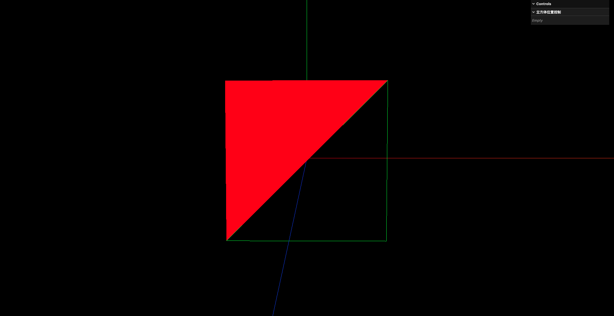

# 10. 几何体划分顶点组设置不同材质

1个物体可以按照面,设置不同的材质.将索引划分为不同的组即可实现

```javascript
// 创建四边形平面
const geometry = new THREE.BufferGeometry()

// 设置顶点数据
const vertices = new Float32Array([
    -1.0, -1.0, 1.0,    // 点A
    1.0, -1.0, 1.0,     // 点B
    1.0, 1.0, 1.0,      // 点C
    -1.0, 1.0, 1.0,     // 点D
])

geometry.setAttribute( 'position', new THREE.BufferAttribute(vertices, 3))

// 使用索引绘制
const indices = new Uint16Array([
    0, 1, 2,
    2, 3, 0,
])
geometry.setIndex(new THREE.BufferAttribute(indices, 1))

// 设置顶点组
// start: 从第几个索引开始 这里的第几个 是指索引数组中的元素索引 也就是indices数组中的索引
// count: 一共使用多少个索引 start = 0 count = 3 表示 从indices数组的第0个索引开始 使用3个索引 也就是使用 indices[0], indices[1], indices[2]
// materialIndex: 使用第几个材质 在创建THREE.Mesh时 可以传入一个材质数组 mesh = new THREE.Mesh(geometry, [material0, material1]) 这里的编号就是指使用这个数组中的第几个材质
geometry.addGroup(0, 3, 0)
geometry.addGroup(3, 3, 1)

// 创建材质
// 材质0 绿色线框材质
const material0 = new THREE.MeshBasicMaterial( {color: 0x00ff00})
material0.wireframe = true

// 材质1 红色实心材质
const material1 = new THREE.MeshBasicMaterial( {color: 0xff0000})
material1.wireframe = false

// 创建网格模型
const mesh = new THREE.Mesh(geometry, [material0, material1])
scene.add(mesh)
```



注意: 划分顶点组时,使用的是索引进行划分,而不是使用顶点进行划分

`BufferGeometry.groups`属性描述了几何体被分为了多少个顶点组