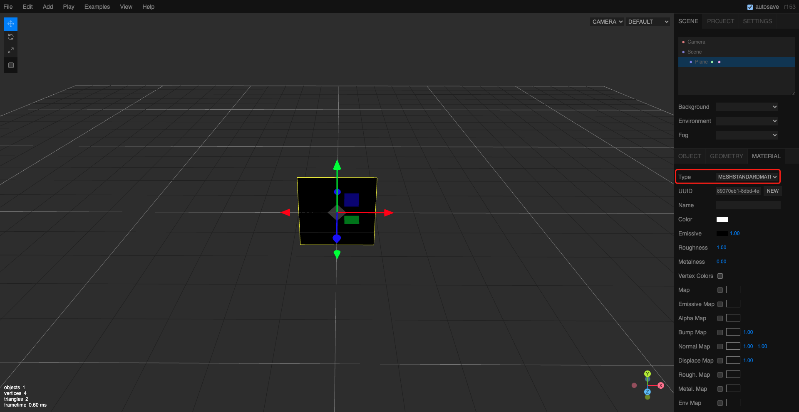
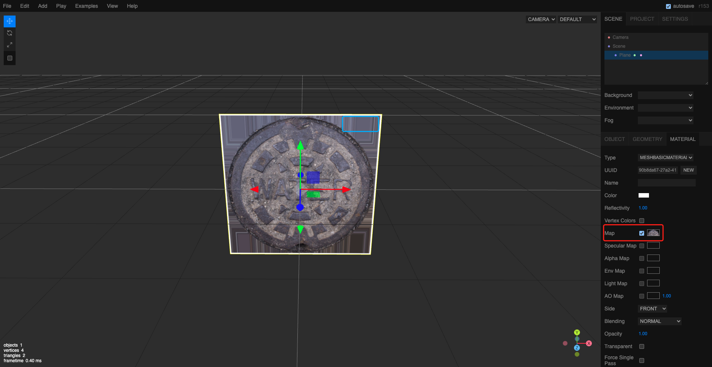
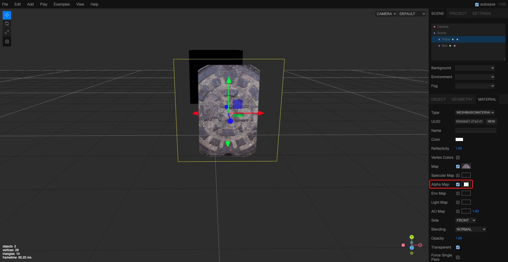
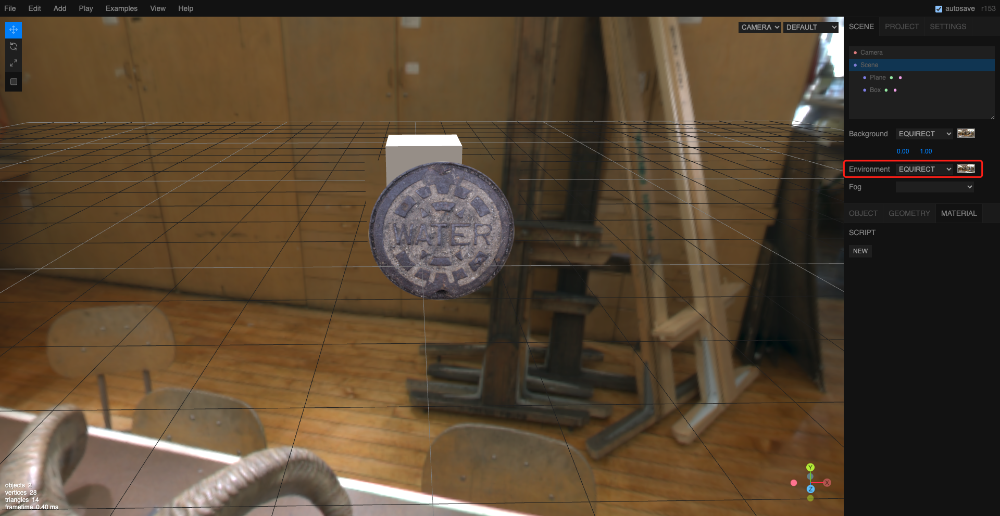
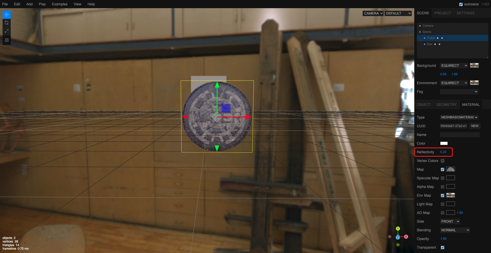
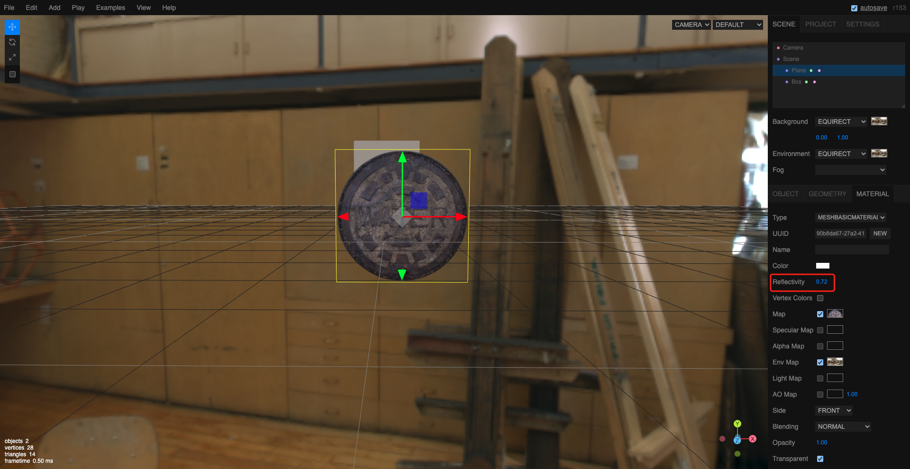
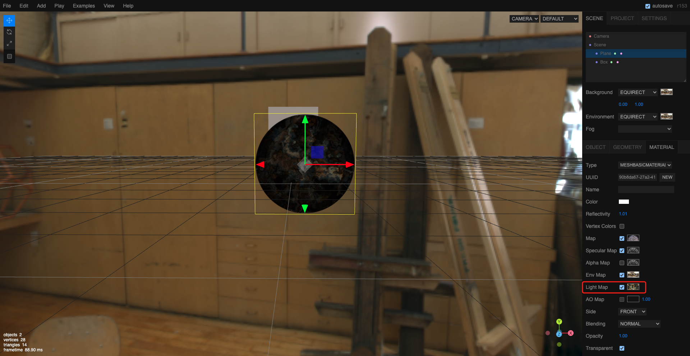
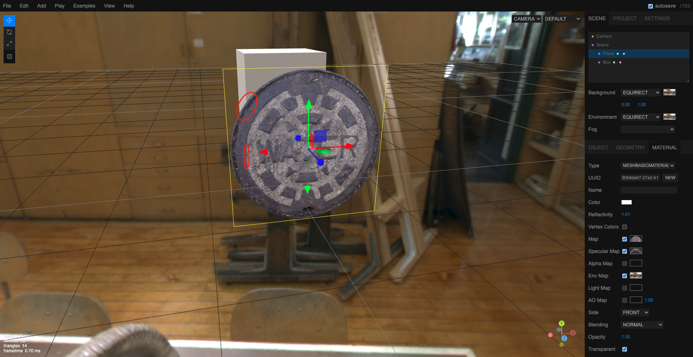
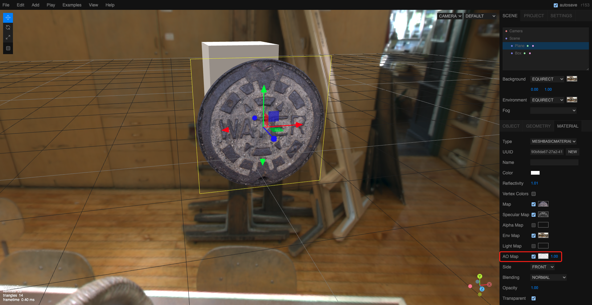

# 12. 基础材质-贴图-高光-透明-环境-光照-环境遮蔽贴图的用途

## 1. 基础材质

这里使用编辑器来演示材质和贴图的效果:

这里平面之所以是黑色的,就是因为其材质是标准材质,这种材质会根据光照的影响来显示颜色,而当前场景中没有光源,所以是黑色的.

修改为基础材质后,则不受光照的影响,显示其本身的颜色:

## 2. 贴图

给材质添加贴图后,可以显示贴图的内容:

这里注意图片中蓝框的部分,原本的图片是透明的:

但是这张图片在材质中显示时,透明的部分延展成了其他颜色,这是因为材质没有设置允许透明:

注意这里说的透明,是真的可以透视过去的,比如在平面后方添加一个物体:

## 3. 透明度贴图

如果想要更精细地控制透明效果,可以使用透明度贴图(Alpha Map),这种贴图一般是黑白的,白色部分表示不透明,黑色部分表示完全透明,灰色部分表示半透明.
或者可以说和亮度有关,亮度越高的区域越不透明,亮度越低的区域越透明.

以这张图片为例:

黑色部分表示透明,白色部分表示不透明.应用到刚才的平面上的效果:

## 4. 环境贴图

环境贴图一般是HDR格式的图片,这种图片包含了高动态范围的信息,可以更真实地模拟光照效果.比如下面这张环境贴图,就是使用人眼相机拍摄的全景图:

设置环境贴图后,物体可以反射环境中的光照,从而显示出更真实的效果.反射率设置的越低,物体表面看起来就越暗淡;反射率设置的越高,物体表面看起来就越亮.

但这里我设置出来结果相反: 反射率越低物体越亮,反射率越高物体越暗淡.我不知道这是为什么:

## 5. 高光贴图

高光贴图(Gloss Map)用于控制材质表面的高光反射效果.高光贴图一般也是黑白的,白色部分表示高光强度高(反射强度高),黑色部分表示高光强度低(反射强度低).

现在有一张高光贴图如下:

可以看到,蓝色部分和绿色部分对光照的反射强度是不同的

## 6. 光照贴图

光照贴图(Light Map)用于模拟环境光照对物体的影响.类似于在物体和光源之间添加了一层阴影.光照贴图一般也是黑白的,白色部分表示光照强度高(相当于没有阴影),
黑色部分表示光照强度低(相当于有阴影).

## 7. 环境光遮蔽贴图

环境光遮蔽贴图(Ambient Occlusion Map)用于模拟环境光在物体表面的遮蔽效果.环境光遮蔽贴图一般也是黑白的,白色部分表示环境光遮蔽强度低(相当于没有遮蔽),
黑色部分表示环境光遮蔽强度高(相当于有遮蔽).

以本例中的井盖为例:

环境光遮蔽贴图如下:

添加环境光遮蔽贴图后,可以看到缝隙处的阴影效果更加明显:

通过使用这些不同类型的贴图,可以更真实地模拟物体的材质和光照效果,从而提升3D场景的视觉质量.
