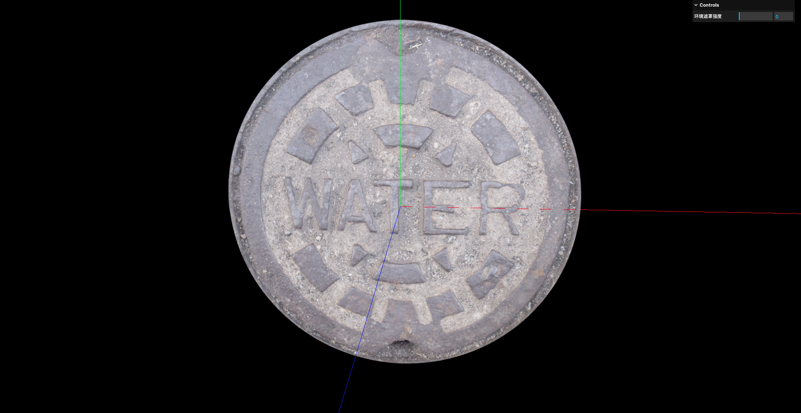

# 13. 贴图的加载与环境遮蔽贴图的设置

```javascript
// 创建平面几何体
let planeGeometry = new THREE.PlaneGeometry(1, 1)

// 创建纹理加载器
const textureLoader = new THREE.TextureLoader()
const texture = textureLoader.load('../assets/CityNewYork002_COL_VAR1_1K.png')

// 加载环境遮罩贴图(aoMap)
const aoMapTexture = textureLoader.load('../assets/CityNewYork002_AO_1K.jpg')

// 创建材质
const materialParams = {
    color: new THREE.Color(0xffffff),
    // 指定纹理
    map: texture,
    // 允许透明
    transparent: true,
    // 设置环境遮罩贴图
    aoMap: aoMapTexture,
}

// 使用基础材质
let planeMaterial = new THREE.MeshBasicMaterial(materialParams)
let plane = new THREE.Mesh(planeGeometry, planeMaterial)
scene.add(plane)
```

```javascript
// 创建GUI
const gui = new GUI()
// 环境遮罩强度越强,则环境光遮蔽效果越明显
gui.add(planeMaterial, 'aoMapIntensity').min(0).max(1).step(0.1).name('环境遮罩强度')
```

环境遮罩强度为0时,环境光遮蔽效果不明显:



环境遮罩强度为1时,环境光遮蔽效果明显:


