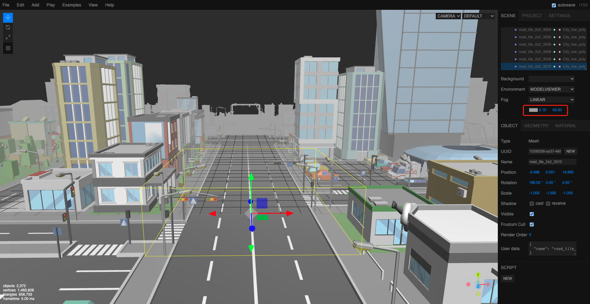
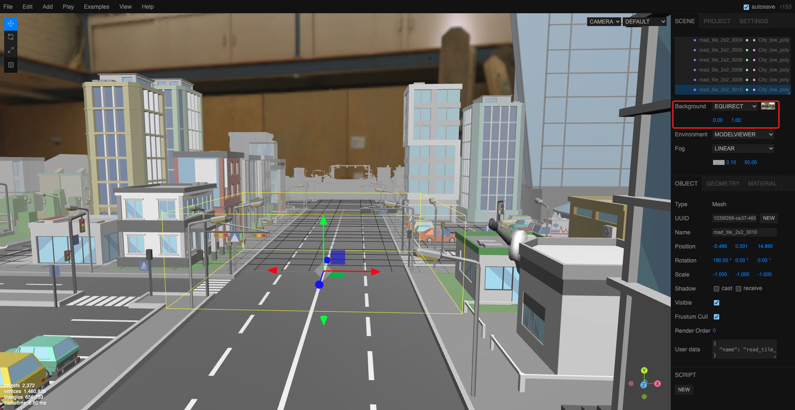
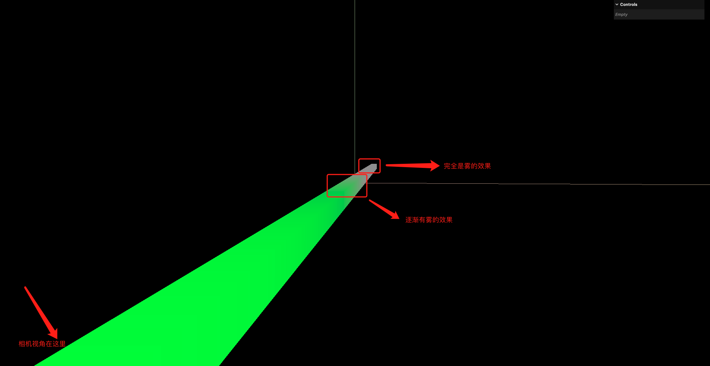
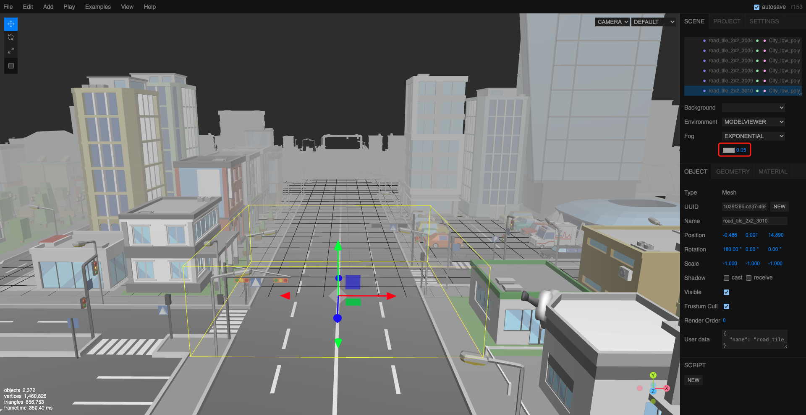
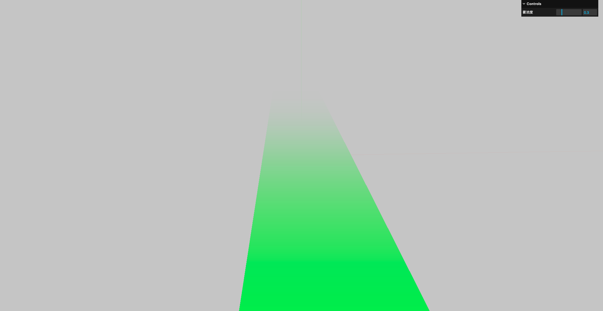

# 16. 场景的线性雾和指数雾

`Fog`类用于创建线性雾效果.是场景的一个属性.

## 1. 线性雾



- 0.1: 距离相机0.1个单位开始出现雾
- 50: 距离相机50个单位时完全被雾遮挡

注意: 如果此时场景有背景图的话,雾效果是不会影响到背景图的



因此,在选择场景的背景图时,应该尽量让背景图的颜色和雾的颜色一致,这样雾的效果看起来更自然

```javascript
// 创建一个比较长的长方体 以便观察雾的效果
const geometry = new THREE.BoxGeometry(1, 1, 100)
const materialParam = {
    color: 0x00ff00,
}
const material = new THREE.MeshBasicMaterial(materialParam)
const cube = new THREE.Mesh(geometry, material)
scene.add(cube)

// 创建场景雾
const fog = new THREE.Fog(0x999999, 0.1, 50)
scene.fog = fog
```



## 2. 指数雾



- 0.05: 雾的密度,值越大雾越浓

```javascript
// 创建一个比较长的长方体 以便观察雾的效果
const geometry = new THREE.BoxGeometry(1, 1, 100)
const materialParam = {
    color: 0x00ff00,
}
const material = new THREE.MeshBasicMaterial(materialParam)
const cube = new THREE.Mesh(geometry, material)
scene.add(cube)

// 创建场景雾
const fog = new THREE.FogExp2(0xcccccc, 0.1)
scene.fog = fog
// 注意: 设置场景的背景颜色和雾的颜色相同 看起来才像有雾的效果
scene.background = new THREE.Color(0xcccccc)
```

指数雾的参数表示雾的浓度,值越大雾越浓,雾的效果就越明显:



