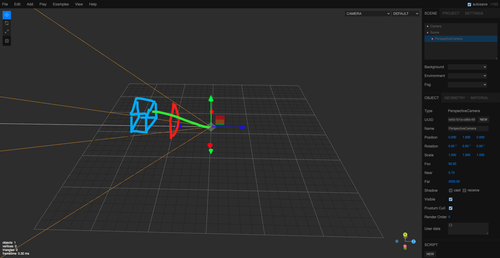

# 18. 光线投射实现3D场景交互事件

3D的场景交互和普通的DOM元素交互不同.DOM元素的交互,是可以给DOM元素加事件监听器的;而3D场景中的物体,都是绘制在canvas画布上的,画布本身是一个整体,无法给画布上的某个物体单独添加事件监听器.
因此3D场景的交互,需要通过光线投射(Raycaster)来实现.



如图所示,红色方框为屏幕,蓝色正方体为3D场景中的物体,绿色射线为从摄像机位置发出的光线,这里以鼠标事件为例.鼠标移动到绿色射线与屏幕的交点处时,
检测绿色射线是否与3D场景中的物体相交:

- 若不相交,则表示鼠标没有移动到3D场景中的物体上,不触发任何交互事件
- 若相交,则表示鼠标移动到了3D场景中的物体上,触发相应的交互事件

案例: 创建3个球体,鼠标点击哪个球体,哪个球体变色.

先解释一下坐标的归一化:

```javascript
window.addEventListener('click', (event) => {
    console.log(event.clientX, event.clientY)
})
```


这里的坐标是以浏览器左上角为原点(0,0),X轴向右递增,Y轴向下递增的坐标系.具体数值是以浏览器的视口(viewport)大小为参考的.
简单理解就是浏览器越宽,则X轴的最大值越大;浏览器越高,Y轴的最大值越大.

而归一化坐标系(Normalized Device Coordinates, NDC)是以画布(canvas)的中心为原点(0,0),X轴向右递增,Y轴向上递增的坐标系.具体数值是固定在-1到1之间的.
如下图示:


所以需要把浏览器坐标系的坐标,转换为归一化坐标系的坐标.转换公式如下:

```javascript
// 假设 event.clientX 和 event.clientY 分别为鼠标点击时的浏览器坐标
// (鼠标坐标 / 窗口宽高) * 2是因为X轴有正负2个范围,每个范围各一半
// 也就是说NDC坐标系的X轴范围是-1到1,总共2个单位;而从NDC坐标的原点到最右边是1个单位,所以这里要乘以2
// 换言之 (鼠标坐标 / 窗口宽高) * 2的值∈ [0, 2]
// 再减去1之后这个值的范围就变成了[-1, 1],正好符合NDC坐标系的范围
const ndcX = (event.clientX / window.innerWidth) * 2 - 1

// 这里计算NDC坐标系的Y轴时要取反 是因为浏览器的坐标系Y轴是向下为正,而NDC坐标系Y轴是向上为正
const ndcY = -(event.clientY / window.innerHeight) * 2 + 1
```

- step1. 创建射线和表示鼠标位置的二维向量

```javascript
// 创建3个球体
const sphereGeometry1 = new THREE.SphereGeometry(0.5, 32, 32)
const sphereMaterial1 = new THREE.MeshBasicMaterial({ color: 0x00ff00 })
const sphere1 = new THREE.Mesh(sphereGeometry1, sphereMaterial1)
sphere1.position.x = -3
scene.add(sphere1)

const sphereGeometry2 = new THREE.SphereGeometry(0.5, 32, 32)
const sphereMaterial2 = new THREE.MeshBasicMaterial({ color: 0x0000ff })
const sphere2 = new THREE.Mesh(sphereGeometry2, sphereMaterial2)
sphere2.position.x = 0
scene.add(sphere2)

const sphereGeometry3 = new THREE.SphereGeometry(0.5, 32, 32)
const sphereMaterial3 = new THREE.MeshBasicMaterial({ color: 0xff00ff })
const sphere3 = new THREE.Mesh(sphereGeometry3, sphereMaterial3)
sphere3.position.x = 3
scene.add(sphere3)

// 创建射线
// 0.180+的版本中,创建射线对象时,这4个参数可以都不传
// origin: 射线起点,类型为THREE.Vector3,默认值为(0,0,0)
// direction: 射线方向,类型为THREE.Vector3,默认值为(0,0,-1)
// near: 最近检测距离,比这个距离近的物体不会被检测到,默认值为0
// far: 最远检测距离,比这个距离远的物体不会被检测到,默认值为Infinity
const raycaster = new THREE.Raycaster(  new THREE.Vector3(0, 0, 0),
    new THREE.Vector3(0, 0, -1).normalize(),
    0,
    Infinity)
// 创建一个二维向量 该向量表示鼠标在屏幕上的位置
const mouse = new THREE.Vector2()
```

- step2. 监听鼠标点击事件,更新二维向量的值,并发射射线进行检测

```javascript
window.addEventListener('click', (event) => {
    console.log(event.clientX, event.clientY)

    // (鼠标坐标 / 窗口宽高) * 2是因为X轴有正负2个范围,每个范围各一半
    // 也就是说NDC坐标系的X轴范围是-1到1,总共2个单位;而从NDC坐标的原点到最右边是1个单位,所以这里要乘以2
    // 换言之 (鼠标坐标 / 窗口宽高) * 2的值∈ [0, 2]
    // 再减去1之后这个值的范围就变成了[-1, 1],正好符合NDC坐标系的范围
    const ndcX = (event.clientX / window.innerWidth) * 2 - 1

    // 这里计算NDC坐标系的Y轴时要取反是因为浏览器的坐标系Y轴是向下为正,而NDC坐标系Y轴是向上为正
    const ndcY = -(event.clientY / window.innerHeight) * 2 + 1

    // 更新表示鼠标NDC坐标系的二维向量
    mouse.x = ndcX
    mouse.y = ndcY

    // 根据相机和鼠标的位置 更新射线
    raycaster.setFromCamera(mouse, camera)

    // 在给定的物体中检测哪些物体与射线相交
    // 这里要注意: 不能写 scene.children
    // 因为此时场景中除了有3个球体之外 还有一个辅助坐标系
    const intersects = raycaster.intersectObjects([sphere1, sphere2, sphere3])
    for (const intersect of intersects) {
        console.log(intersect)
    }
})
```


- distance: 相机到被点击物体的距离
- point: 被点击物体的交点坐标
- face: 被点击物体的面信息
- faceIndex: 被点击物体的面索引
- normal: 射线射中物体的点处的法线向量
- object: 被点击的物体

然后修改被点击的物体的材质的颜色即可:

```javascript
// 创建射线
// 0.180+的版本中,创建射线对象时,这4个参数可以都不传
// origin: 射线起点,类型为THREE.Vector3,默认值为(0,0,0)
// direction: 射线方向,类型为THREE.Vector3,默认值为(0,0,-1)
// near: 最近检测距离,比这个距离近的物体不会被检测到,默认值为0
// far: 最远检测距离,比这个距离远的物体不会被检测到,默认值为Infinity
const raycaster = new THREE.Raycaster(  new THREE.Vector3(0, 0, 0),
    new THREE.Vector3(0, 0, -1).normalize(),
    0,
    Infinity)
// 创建一个二维向量 该向量表示鼠标在屏幕上的位置
const mouse = new THREE.Vector2()

window.addEventListener('click', (event) => {
    // console.log(event.clientX, event.clientY)

    // (鼠标坐标 / 窗口宽高) * 2是因为X轴有正负2个范围,每个范围各一半
    // 也就是说NDC坐标系的X轴范围是-1到1,总共2个单位;而从NDC坐标的原点到最右边是1个单位,所以这里要乘以2
    // 换言之 (鼠标坐标 / 窗口宽高) * 2的值∈ [0, 2]
    // 再减去1之后这个值的范围就变成了[-1, 1],正好符合NDC坐标系的范围
    const ndcX = (event.clientX / window.innerWidth) * 2 - 1

    // 这里计算NDC坐标系的Y轴时要取反是因为浏览器的坐标系Y轴是向下为正,而NDC坐标系Y轴是向上为正
    const ndcY = -(event.clientY / window.innerHeight) * 2 + 1

    // 更新表示鼠标NDC坐标系的二维向量
    mouse.x = ndcX
    mouse.y = ndcY

    // 根据相机和鼠标的位置 更新射线
    // 第1个参数: 鼠标的NDC坐标系位置
    // 第2个参数: 相机
    raycaster.setFromCamera(mouse, camera)

    // 在给定的物体中检测哪些物体与射线相交
    // 这里要注意: 不能写 scene.children
    // 因为此时场景中除了有3个球体之外 还有一个辅助坐标系
    const intersects = raycaster.intersectObjects([sphere1, sphere2, sphere3])
    for (const intersect of intersects) {
        // 若物体已经被选中过 则恢复原来的颜色 并跳过本次循环
        if (intersect.object._isSelected) {
            console.log(intersect.object._originColor)
            intersect.object.material.color = intersect.object._originColor
            intersect.object._isSelected = false
            continue
        }

        // 先记录物体的选中状态和修改前的颜色
        // 注意: 这2个属性是自定义的
        intersect.object._isSelected = true
        // 注意这里要克隆原来的颜色 否则会因为intersect.object.material.color是引用类型
        // 导致后面修改颜色时_originColor也已经是修改后的颜色了
        intersect.object._originColor = intersect.object.material.color.clone()

        // 在修改被点击的物体的材质的颜色
        intersect.object.material.color.set(0xff0000)
    }
})
```
