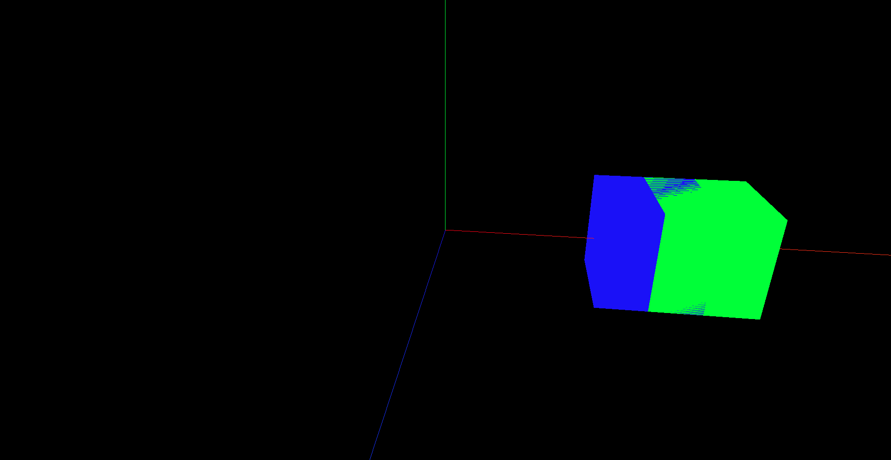

# 5. 物体位移与父子元素

- `Mesh.position`: 表示对象的局部位置,是一个`Vector3`对象,包含x/y/z这3个分量
  - 若对象的父元素是整个场景,则局部位置等同于全局位置
  - 若对象的父元素是另一个对象,则局部位置是相对于父对象的位置

- `Mesh.position.set(x, y, z)`: 设置对象的局部位置
  - 这里说的位置指的是几何体中心点的位置
  - 大部分Three.js提供的默认几何体,其中心点都在几何体的几何中心,也就是视觉的中心点

相对父对象的位置: 即子元素以父元素的位置为原点

```javascript
// 创建父正方体
const parentGeometry = new THREE.BoxGeometry(1, 1, 1)
const parentMaterial = new THREE.MeshBasicMaterial({ color: 0x0000ff })
const parentCube = new THREE.Mesh(parentGeometry, parentMaterial)

parentCube.position.set(2, 0, 0)

scene.add(parentCube)

// 创建子正方体
const sonGeometry = new THREE.BoxGeometry(1, 1, 1)
const sonMaterial = new THREE.MeshBasicMaterial({ color: 0x00ff00 })
const sonCube = new THREE.Mesh(sonGeometry, sonMaterial)

// 相对父元素向左移动0.5个单位
sonCube.position.set(0.5, 0, 0)
parentCube.add(sonCube)
```


