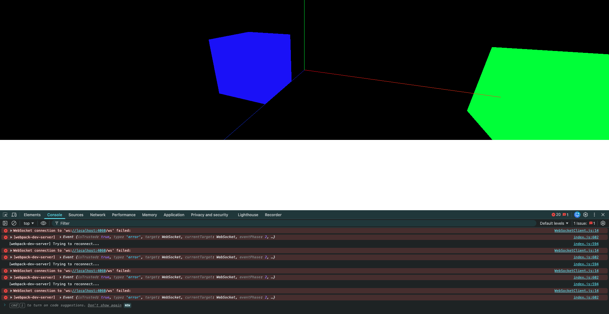
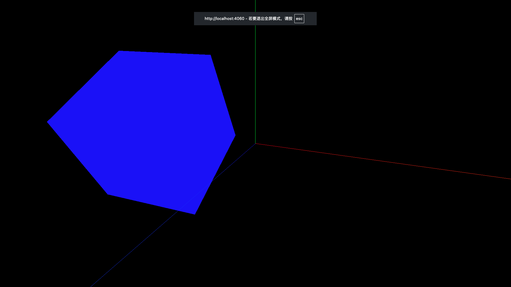

# 7. 设置响应式画布与全屏控制

假如是在开启了控制台的情况下访问页面,变化控制台大小后,会出现这样的情况:



解决方法: 设置响应式画布

```javascript
// 监听窗口变化
function resizeHandle() {
    // 重置渲染器宽高比
    renderer.setSize(window.innerWidth, window.innerHeight)

    // 重置相机宽高比(就是创建相机对象时的第2个参数)
    camera.aspect = window.innerWidth / window.innerHeight

    // 更新相机投影矩阵
    camera.updateProjectionMatrix()
}

window.addEventListener('resize', resizeHandle)
```

全屏控制:

```javascript
const btn = document.createElement('button')
btn.innerHTML = '点击全屏'
btn.style.position = 'absolute'
btn.style.top = '20px'
btn.style.left = '20px'
btn.style.zIndex = '999'

function btnClickHandle() {
    // renderer.domElement本身就是个dom元素对象
    // requestFullscreen()是浏览器提供的全屏API
    renderer.domElement.requestFullscreen().
    then().
    catch()
}

btn.onclick = btnClickHandle

document.body.appendChild(btn)
```

全屏控制时按ESC退出全屏

注意: `renderer.domElement`本身就是个dom元素对象,`requestFullscreen()`是浏览器提供的全屏API

注意: 如果想要实现全屏控制,轨道控制器必须绑定到`renderer.domElement`上,不能绑定在`document.body`上,否则全屏控制将失效

```javascript
const controls = new OrbitControls(camera, renderer.domElement)
```

退出全屏:

```javascript
// 退出全屏按钮
const exitBtn = document.createElement('button')
exitBtn.innerHTML = '退出全屏'
exitBtn.style.position = 'absolute'
exitBtn.style.top = '60px'
exitBtn.style.left = '20px'
exitBtn.style.zIndex = '999'

function exitBtnClickHandle() {
    document.exitFullscreen().then().catch()
}

exitBtn.onclick = exitBtnClickHandle
document.body.appendChild(exitBtn)
```

注意退出全屏的API是`document.exitFullscreen()`,而不是`renderer.domElement.exitFullscreen()`

但是这样有一个问题: 画布全屏了,按键就看不到了.



解决方法: 让body全屏

```javascript
function btnClickHandle() {
    document.body.requestFullscreen().
    then().
    catch()
}
```
