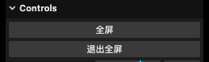
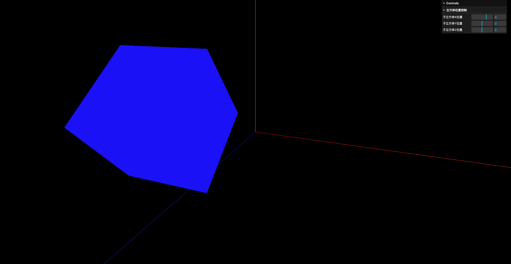

# 8. 应用`lil-GUI`调试开发3D效果

- [lil-GUI](https://github.com/georgealways/lil-gui): 用于调试3D效果的轻量级GUI库

- 当属性类型为方法时,lil-GUI则自动创建按钮

```javascript
let eventObj = {
    fullScreen: fullScreenHandle,
    exitFullScreen: exitFullScreenHandle,
}

// 创建GUI
const gui = new GUI()
// 第1个参数是对象 第2个参数是对象中的属性名称 如果属性是一个方法 那么这个控件就是一个按钮
// name方法是给控件添加一个名字 这个名字就是按钮的文本内容
gui.add(eventObj, 'fullScreen').name('全屏')
gui.add(eventObj, 'exitFullScreen').name('退出全屏')
```



- 当属性类型为数值时,lil-GUI则自动创建滑动条

```javascript
// 创建GUI
const gui = new GUI()

// 控制立方体在3个轴上的位置
// 数值类的属性 则在GUI上的表现是一个滑动条
gui.add(sonCube.position, 'x').min(-10).max(10).step(0.1).name('子立方体X位置')
gui.add(sonCube.position, 'y').min(-8).max(8).step(0.2).name('子立方体Y位置')
gui.add(sonCube.position, 'z').min(-6).max(6).step(0.3).name('子立方体Z位置')
```


- 可以创建分组

```javascript
// 创建GUI
const gui = new GUI()

// 创建分组
const folder = gui.addFolder('立方体位置控制')
// 默认打开分组
folder.open()

// 控制立方体在3个轴上的位置
// 数值类的属性 则在GUI上的表现是一个滑动条
folder.add(sonCube.position, 'x').min(-10).max(10).step(0.1).name('子立方体X位置')
folder.add(sonCube.position, 'y').min(-8).max(8).step(0.2).name('子立方体Y位置')
folder.add(sonCube.position, 'z').min(-6).max(6).step(0.3).name('子立方体Z位置')
```



- 可以控制属性变化时的回调

```javascript
// 创建GUI
const gui = new GUI()

// 创建分组
const folder = gui.addFolder('立方体位置控制')
// 默认打开分组
folder.open()

// 控制立方体在3个轴上的位置
// 数值类的属性 则在GUI上的表现是一个滑动条
folder.add(sonCube.position, 'x').min(-10).max(10).step(0.1).name('子立方体X位置').onChange(changeValueHandle)
folder.add(sonCube.position, 'y').min(-8).max(8).step(0.2).name('子立方体Y位置').onChange(changeValueHandle)
folder.add(sonCube.position, 'z').min(-6).max(6).step(0.3).name('子立方体Z位置').onChange(changeValueHandle)

function changeValueHandle(value) {
    console.log(value)
}
```

- 也可以控制当数值变化(也就是滑动条拖动)完成后的回调

```javascript
// 创建GUI
const gui = new GUI()

// 创建分组
const folder = gui.addFolder('立方体位置控制')
// 默认打开分组
folder.open()

// 控制立方体在3个轴上的位置
// 数值类的属性 则在GUI上的表现是一个滑动条
folder.add(sonCube.position, 'x').min(-10).max(10).step(0.1).name('子立方体X位置').onChange(changeValueHandle)
folder.add(sonCube.position, 'y').min(-8).max(8).step(0.2).name('子立方体Y位置').onFinishChange(changeValueFinishHandle)
folder.add(sonCube.position, 'z').min(-6).max(6).step(0.3).name('子立方体Z位置').onChange(changeValueHandle)

function changeValueHandle(value) {
    console.log("拖动了滑动条")
    console.log(value)
}

function changeValueFinishHandle(value) {
    console.log("停止拖动了")
    console.log(value)
}
```

注: 似乎不执行`npm i --save-dev @types/three`的话,代码补全是不全的

注: 网格对象的材质可以使用线框模式

```javascript
// 创建父正方体
const parentGeometry = new THREE.BoxGeometry(1, 1, 1)
const parentMaterial = new THREE.MeshBasicMaterial({ color: 0x0000ff })
// 启用线框模式
parentMaterial.wireframe = true
const parentCube = new THREE.Mesh(parentGeometry, parentMaterial)

parentCube.position.set(-2, 0, 0)

parentCube.scale.set(2, 2, 2)

scene.add(parentCube)
```


- 若属性为布尔类型,则在GUI上表现为单选框

```javascript
// 布尔值类型的属性 在GUI上表现为一个单选框
gui.add(parentMaterial, 'wireframe').name('父立方体材质是否启用线框模式')
```

- 若属性为颜色类型,则在GUI上表现为颜色选择器

```javascript
const sonCubeColor = {
    color: 0x00ff00,
}

// 颜色类型的属性 在GUI上表现为一个颜色选择器
gui.addColor(sonCubeColor, 'color').name('子立方体颜色').onChange((value) => {
    sonMaterial.color.set(value)
})
```
