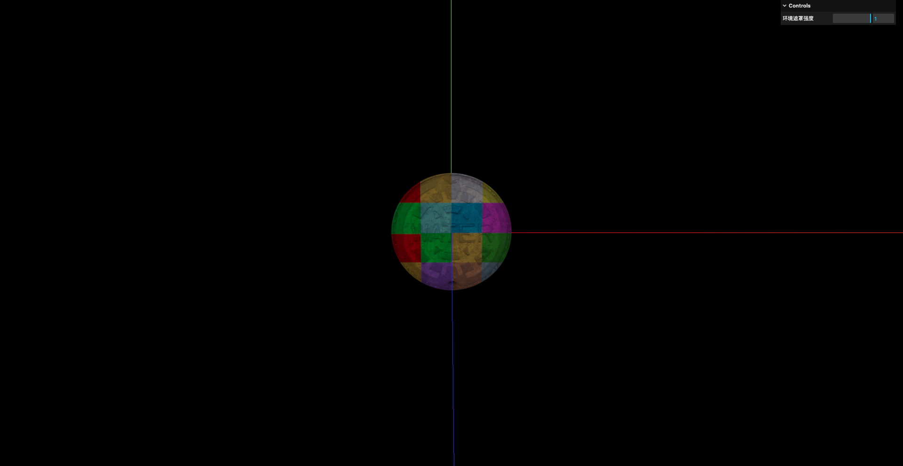
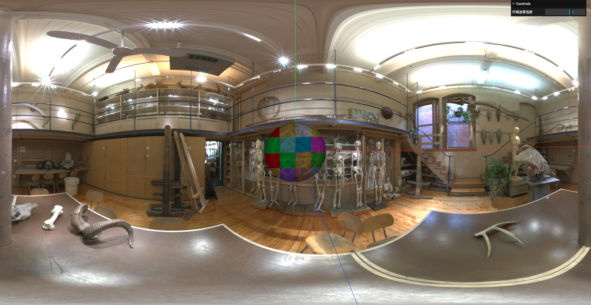
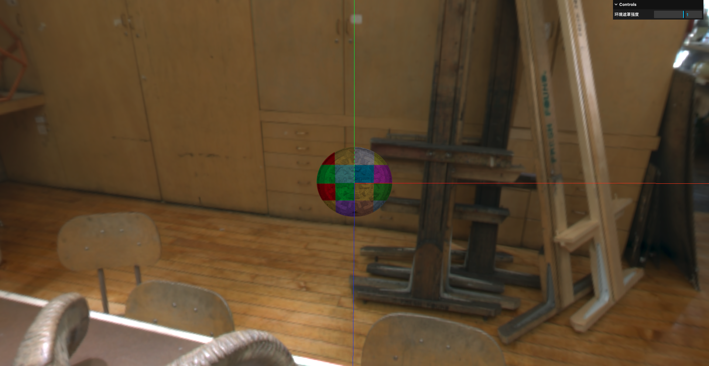
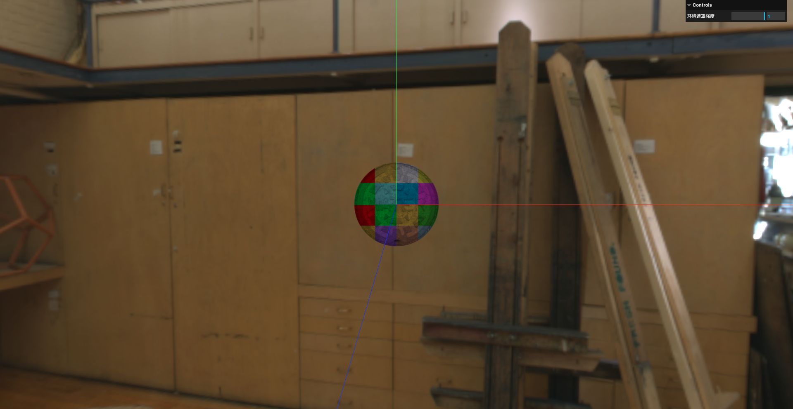
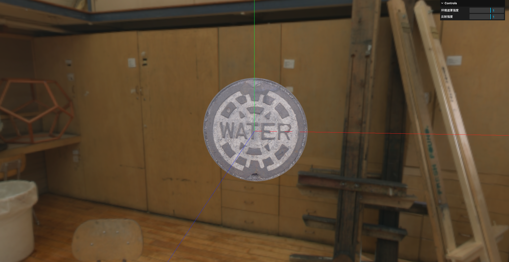

# 14. 透明度贴图-环境贴图加载与高光贴图配置

## 1. 透明度贴图

透明度贴图如下:


设置透明度贴图:

```javascript
// 创建平面几何体
let planeGeometry = new THREE.PlaneGeometry(1, 1)

// 创建纹理加载器
const textureLoader = new THREE.TextureLoader()
const texture = textureLoader.load('../assets/CityNewYork002_COL_VAR1_1K.png')

// 加载环境遮罩贴图(aoMap)
const aoMapTexture = textureLoader.load('../assets/CityNewYork002_AO_1K.jpg')

// 加载透明度贴图(alphaMap)
const alphaTexture = textureLoader.load('../assets/height.jpg')

// 创建材质
const materialParams = {
    color: new THREE.Color(0xffffff),
    // 指定纹理
    map: texture,
    // 允许透明
    transparent: true,
    // 设置环境遮罩贴图
    aoMap: aoMapTexture,
    // 设置透明度贴图
    alphaMap: alphaTexture,
}

// 使用基础材质
let planeMaterial = new THREE.MeshBasicMaterial(materialParams)
let plane = new THREE.Mesh(planeGeometry, planeMaterial)
scene.add(plane)
```


## 2. 光照贴图

光照贴图如下:


设置光照贴图:

```javascript
// 创建平面几何体
let planeGeometry = new THREE.PlaneGeometry(1, 1)

// 创建纹理加载器
const textureLoader = new THREE.TextureLoader()
const texture = textureLoader.load('../assets/CityNewYork002_COL_VAR1_1K.png')

// 加载环境遮罩贴图(aoMap)
const aoMapTexture = textureLoader.load('../assets/CityNewYork002_AO_1K.jpg')

// 加载透明度贴图(alphaMap)
const alphaTexture = textureLoader.load('../assets/height.jpg')

// 加载光照贴图
const lightMapTexture = textureLoader.load('../assets/colors.png')

// 创建材质
const materialParams = {
    color: new THREE.Color(0xffffff),
    // 指定纹理
    map: texture,
    // 允许透明
    transparent: true,
    // 设置环境遮罩贴图
    aoMap: aoMapTexture,
    // 设置光照贴图
    lightMap: lightMapTexture,
}

// 使用基础材质
let planeMaterial = new THREE.MeshBasicMaterial(materialParams)
let plane = new THREE.Mesh(planeGeometry, planeMaterial)
scene.add(plane)
```



## 3. 环境贴图

### 3.1 加载环境贴图

环境贴图一般是hdr格式的,相比于png/jpg格式的图片:

- png/jpg格式图片中的每个像素存储的是颜色信息(0-255之间的整数),归一化之后每个颜色通道的值在0-1之间
- hdr格式图片中的每个像素存储的是真实光强(物理亮度),每个颜色通道的值可以是任意浮点数,可以远大于1

而且hdr格式的图片在Three.js中需要使用`HDRLoader`加载(之前的图片都是使用`TextureLoader`加载的)

```javascript
import { HDRLoader } from 'three/examples/jsm/loaders/HDRLoader'

// 创建hdr环境贴图加载器
const hdrLoader = new HDRLoader()

// 加载环境贴图
// 这里回调函数的形参就是加载好的环境贴图
hdrLoader.load('../assets/Alex_Hart-Nature_Lab_Bones_2k.hdr', (envMap) => {
    
})
```

### 3.2 设置环境贴图为场景背景图

```javascript
import { HDRLoader } from 'three/examples/jsm/loaders/HDRLoader'

// 使用基础材质
let planeMaterial = new THREE.MeshBasicMaterial(materialParams)
let plane = new THREE.Mesh(planeGeometry, planeMaterial)

// 创建hdr环境贴图加载器
const hdrLoader = new HDRLoader()

// 加载环境贴图
// 这里回调函数的形参就是加载好的环境贴图
hdrLoader.load('../assets/Alex_Hart-Nature_Lab_Bones_2k.hdr', (envMap) => {
    // 为场景设置背景图
    scene.background = envMap
})
```

### 3.3 环境贴图的球形映射

但此时这张环境贴图就像背景图一样,并没有像一个"球"一样包裹住场景:



这是因为环境贴图需要进行球形映射:

```javascript
import { HDRLoader } from 'three/examples/jsm/loaders/HDRLoader'

// 使用基础材质
let planeMaterial = new THREE.MeshBasicMaterial(materialParams)
let plane = new THREE.Mesh(planeGeometry, planeMaterial)

// 创建hdr环境贴图加载器
const hdrLoader = new HDRLoader()

// 加载环境贴图
// 这里回调函数的形参就是加载好的环境贴图
hdrLoader.load('../assets/Alex_Hart-Nature_Lab_Bones_2k.hdr', (envMap) => {
    // 设置环境贴图的映射方式
    envMap.mapping = THREE.EquirectangularReflectionMapping

    // 为场景设置背景图
    scene.background = envMap
})
```



### 3.4 设置环境贴图为场景环境光源

这里要注意: `scene.background`和`scene.environment`是不同的属性:

- `scene.background`只是将环境贴图作为场景的背景图,不会对场景中的物体产生光照影响
- `scene.environment`会将环境贴图作为场景的环境光源,对场景中的物体产生光照影响,但不会作为背景图显示出来

```javascript
// 加载环境贴图
hdrLoader.load('../assets/Alex_Hart-Nature_Lab_Bones_2k.hdr', (envMap) => {
    // 设置环境贴图的映射方式
    envMap.mapping = THREE.EquirectangularReflectionMapping

    // 为场景设置背景图
    scene.background = envMap

    // 为场景设置环境贴图
    scene.environment = envMap
})
```

此时的效果如下:



可以看到环境光源并没有对物体产生影响,这是因为物体的材质并没有配置环境贴图

### 3.5 为物体材质配置环境贴图

- `MeshBasicMaterial`/`MeshLambertMaterial`/`MeshPhongMaterial`材质是不受`scene.environment`影响的,所以需要设置它们的`envMap`属性来指定环境贴图,才能达到环境光照效果
- `MeshStandardMaterial`/`MeshPhysicalMaterial`材质会自动使用`scene.environment`作为环境贴图,不需要手动设置`envMap`属性

```javascript
// 加载环境贴图
// 这里回调函数的形参就是加载好的环境贴图
hdrLoader.load('../assets/Alex_Hart-Nature_Lab_Bones_2k.hdr', (envMap) => {
    // 设置环境贴图的映射方式
    envMap.mapping = THREE.EquirectangularReflectionMapping

    // 为场景设置背景图
    scene.background = envMap

    // 为场景设置环境贴图
    scene.environment = envMap

    // 为平面设置环境贴图
    planeMaterial.envMap = envMap
})
```


为物体设置环境贴图后,能够透过物体看到环境贴图的反射效果

## 4. 高光贴图

高光贴图用于控制材质的每一部分反射多少光的强度:

```javascript
// 加载高光贴图
const specularMapTexture = textureLoader.load('../assets/CityNewYork002_GLOSS_1K.jpg')

// 创建材质
const materialParams = {
    color: new THREE.Color(0xffffff),
    // 指定纹理
    map: texture,
    // 允许透明
    transparent: true,
    // 设置环境遮罩贴图
    aoMap: aoMapTexture,
    // 设置光照贴图
    // lightMap: lightMapTexture,
    // 设置高光贴图
    specularMap: specularMapTexture,
}
```

