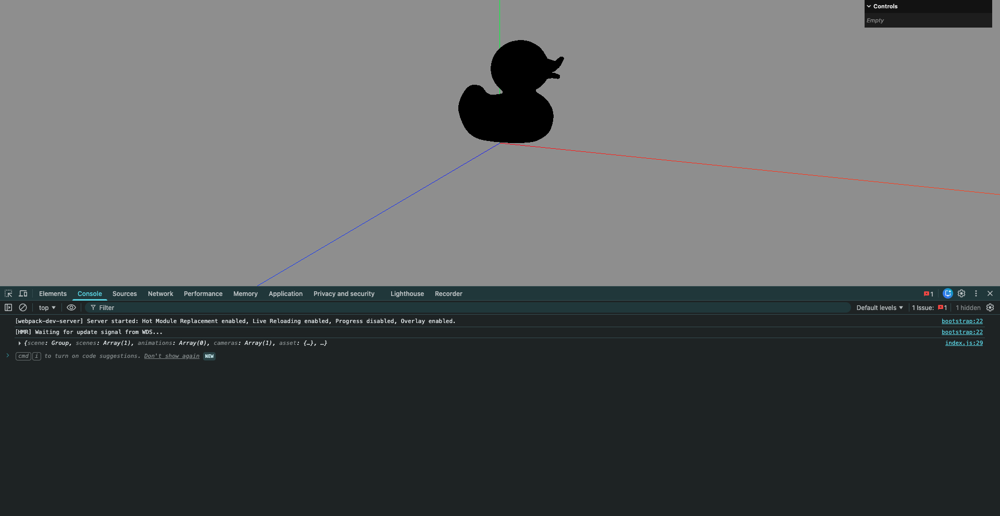
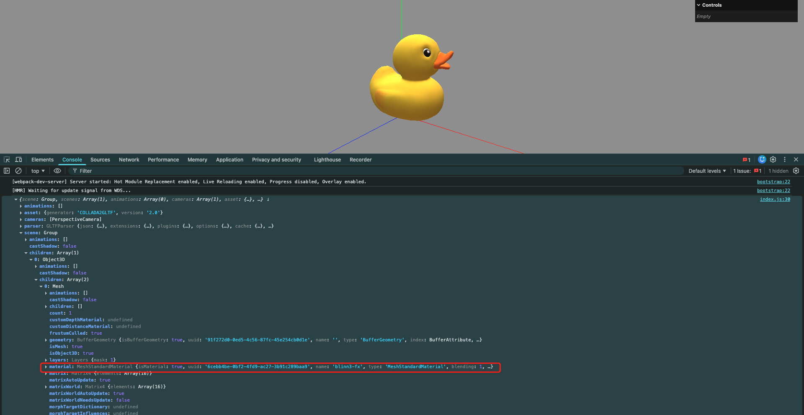
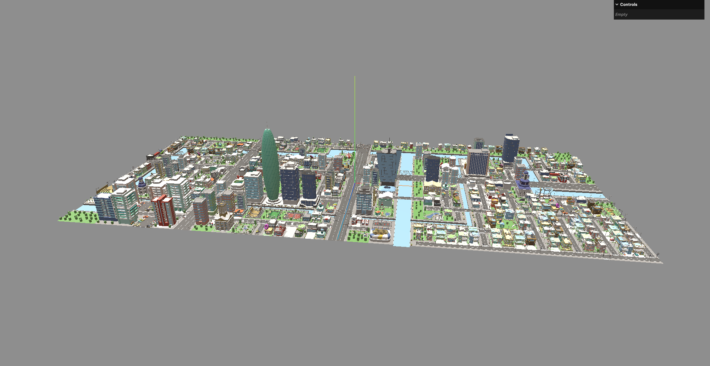

# 17. 加载gltf模型和加载压缩过的模型

glTF(gl传输格式)是一种开放格式的规范(open format specification),用于更高效地传输/加载3D内容.
该类文件以JSON(.gltf)格式或二进制(.glb)格式提供,外部文件存储贴图(.jpg/.png)和额外的二进制数据(.bin).
一个glTF组件可传输一个或多个场景,包括网格/材质/贴图/蒙皮/骨架/变形目标/动画/灯光以及摄像机.

- gltf: JSON格式的模型数据
- glb: 二进制格式的模型数据

## 1. 加载模型

```javascript
import { GLTFLoader } from 'three/addons/loaders/GLTFLoader'

// 实例化GLTF加载器
const gltfLoader = new GLTFLoader()

// 加载GLTF模型
// glb: 二进制格式的模型文件
// gltf: JSON格式的模型文件
// 第1个参数: 模型文件的路径
// 第2个参数: 模型加载完成后的回调函数
gltfLoader.load('../assets/Duck.glb', (gltf) => {
    console.log(gltf)
})
```


- animations: 动画
- asset: 资源
- cameras: 相机
- parser: 解析器数据
- scene: 当前场景
- scenes: 场景列表
- userData: 用户数据

此时场景中没有任何内容,因为尚未把模型的场景添加到Three.js的场景中.

```javascript
gltfLoader.load('../assets/Duck.glb', (gltf) => {
    console.log(gltf)

    scene.background = new THREE.Color(0x999999)
    // 将模型的场景添加到当前场景中
    scene.add(gltf.scene)
})
```



这里鸭子是黑色的,是因为没有光源或者环境贴图

```javascript
// 实例化GLTF加载器
const gltfLoader = new GLTFLoader()

// 加载GLTF模型
// glb: 二进制格式的模型文件
// gltf: JSON格式的模型文件
// 第1个参数: 模型文件的路径
// 第2个参数: 模型加载完成后的回调函数
gltfLoader.load('../assets/Duck.glb', (gltf) => {
    console.log(gltf)

    scene.background = new THREE.Color(0x999999)
    // 将模型的场景添加到当前场景中
    scene.add(gltf.scene)
})

// 加载环境贴图使鸭子亮起来
// 加载环境贴图
const hdrLoader = new HDRLoader()
hdrLoader.load('../assets/Alex_Hart-Nature_Lab_Bones_2k.hdr', (envMap) => {
    // 设置环境贴图的映射方式
    envMap.mapping = THREE.EquirectangularReflectionMapping

    // 为场景设置环境贴图
    scene.environment = envMap
})
```

这里由于材质是标准材质的,所以不需要再给材质添加环境贴图了,只要环境贴图有光源,材质就能反射环境贴图的光源:



## 2. 加载压缩过的模型

将`Duck.glb`替换为`city.glb`,则报错:`No DRACOLoader instance provided.`这是因为模型经过了Draco压缩,需要使用Draco解码器进行解码.

这里需要先把Draco解码器文件(`node_modules/three/examples/libs/draco/`这个文件夹)放到项目的某个目录下,然后在代码中指定解码器路径:

```javascript
import { GLTFLoader } from 'three/addons/loaders/GLTFLoader'
import { HDRLoader } from 'three/examples/jsm/loaders/HDRLoader'
import { DRACOLoader } from 'three/addons/loaders/DRACOLoader'

// 实例化GLTF加载器
const gltfLoader = new GLTFLoader()

// 加载GLTF模型
// glb: 二进制格式的模型文件
// gltf: JSON格式的模型文件
// 第1个参数: 模型文件的路径
// 第2个参数: 模型加载完成后的回调函数
gltfLoader.load('../assets/city.glb', (gltf) => {
    console.log(gltf)

    scene.background = new THREE.Color(0x999999)
    // 将模型的场景添加到当前场景中
    scene.add(gltf.scene)
})

// 实例化DRACO加载器
const dracoLoader = new DRACOLoader()
// 设置解码器路径
// 这里的路径就是复制`node_modules/three/examples/js/libs/draco/`文件夹到`public/assets/`目录下后的路径
dracoLoader.setDecoderPath('../assets/draco/')
// 将DRACO加载器传递给GLTF加载器
gltfLoader.setDRACOLoader(dracoLoader)

// 加载环境贴图
const hdrLoader = new HDRLoader()
hdrLoader.load('../assets/Alex_Hart-Nature_Lab_Bones_2k.hdr', (envMap) => {
    // 设置环境贴图的映射方式
    envMap.mapping = THREE.EquirectangularReflectionMapping

    // 为场景设置环境贴图
    scene.environment = envMap
})
```


