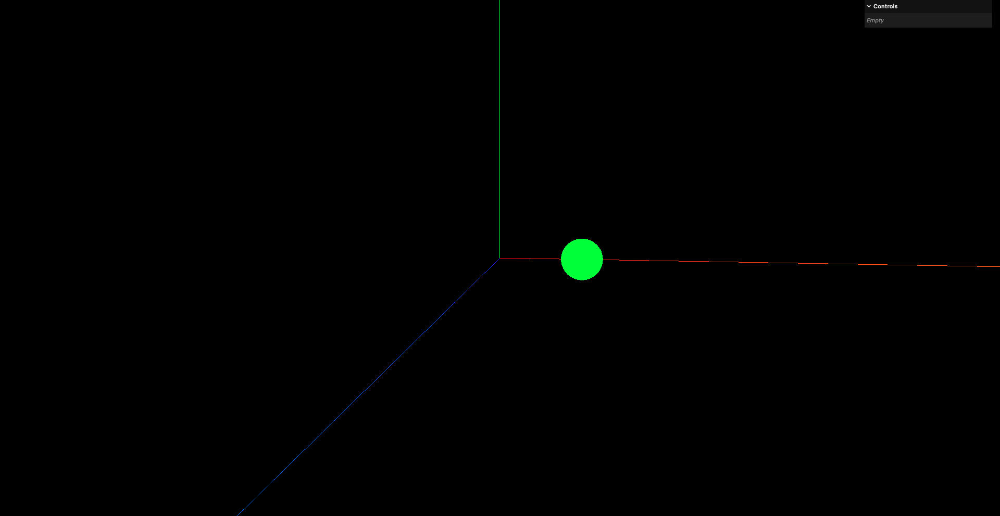
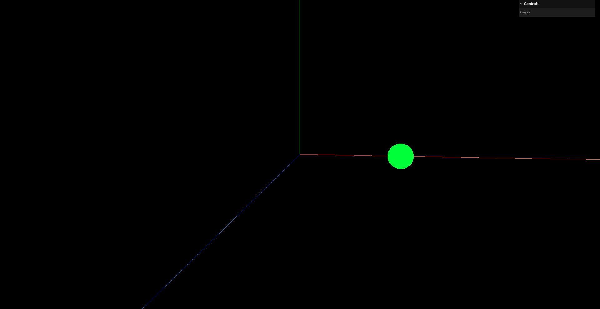
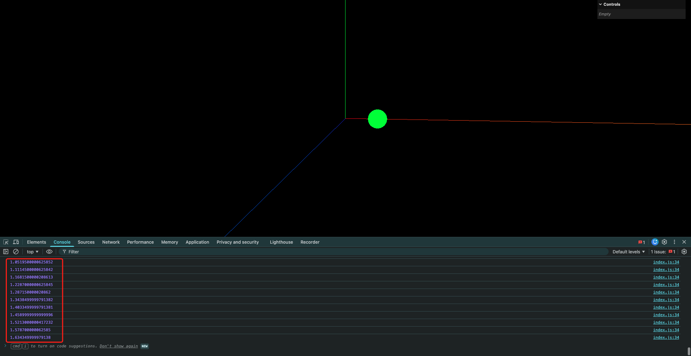

# 19. 补间动画Tween应用

补间动画: Tween是一种在一定时间内平滑过渡属性值的动画技术(three.js里自带了这个库,`three/examples/jsm/libs/tween.module.js`),广泛应用于游戏开发和用户界面设计中.通过补间动画,可以实现对象位置/大小/颜色等属性的渐变效果,使动画更加流畅和自然

简单理解就是: 告诉这个库物体的起点和终点,以及动画持续的时间,然后这个库会帮你计算出在这段时间内物体每一帧的位置变化

## 1. 基本使用

不建议直接使用three.js自带的TWEEN,虽然都是一个库,但是有可能three.js自带的版本无法及时更新

```
npm i @tweenjs/tween.js
```

```javascript
import TWEEN from '@tweenjs/tween.js'

// 创建1个球体
const sphereGeometry = new THREE.SphereGeometry(0.5, 32, 32)
const sphereMaterial = new THREE.MeshBasicMaterial({ color: 0x00ff00 })
const sphere = new THREE.Mesh(sphereGeometry, sphereMaterial)
sphere.position.x = -3
scene.add(sphere)

// 创建补间动画对象
// 构造参数为需要改变的属性 本例中就是球体的位置
const tween = new TWEEN.Tween(sphere.position)

// 设置补间动画的目标位置和持续时间
// 持续时间的单位为ms
tween.to({x: 4}, 2000)

// 启动补间动画
tween.start()
```

在此之后,还需要更新补间动画,通常是在渲染循环中调用`TWEEN.update()`方法

```javascript
function animate() {
    controls.update()

    requestAnimationFrame(animate)

    renderer.render(scene, camera)

    // 更新补间动画
    TWEEN.update()
}

animate()
```





## 2. 设置补间动画的播放次数

```javascript
// 创建补间动画对象
// 构造参数为需要改变的属性 本例中就是球体的位置
const tween = new TWEEN.Tween(sphere.position)

// 设置补间动画的目标位置和持续时间
// 持续时间的单位为ms
tween.to({x: 4}, 2000)

// 设置补间动画的重复次数
tween.repeat(Infinity)

// 启动补间动画
tween.start()
```

## 3. 补间动画的回调函数

```javascript
// 创建补间动画对象
// 构造参数为需要改变的属性 本例中就是球体的位置
const tween = new TWEEN.Tween(sphere.position)

// 设置补间动画的目标位置和持续时间
// 持续时间的单位为ms
tween.to({x: 4}, 2000)

// 设置补间动画的回调函数
tween.onUpdate(() => {
    // 每次更新位置时打印球体的位置
    console.log(sphere.position.x)
})

// 启动补间动画
tween.start()
```



## 4. 设置补间动画往返运动

```javascript
// 创建补间动画对象
// 构造参数为需要改变的属性 本例中就是球体的位置
const tween = new TWEEN.Tween(sphere.position)

// 设置补间动画的目标位置和持续时间
// 持续时间的单位为ms
tween.to({x: 4}, 2000)

// 设置补间动画的往返运动
tween.yoyo(true)

// 启动补间动画
tween.start()
```

这里就会出现一个问题: 当小球运动到`x=4`的位置时,在`x=-3`处会突然闪现一个小球出现(太快了我截图不出来).这是TWEEN这个库在`tween.repeat(Inifity)`和`tween.yoyo(true)`配合使用时的一个bug
解决方案: 使用2个补间动画,一个负责从`x=-3`运动到`x=4`,另一个负责从`x=4`运动到`x=-3`,然后在每个补间动画结束后调用另一个补间动画

注意导入有变化

```javascript
import { Tween, Group } from '@tweenjs/tween.js'

// 创建补间动画组 (用于更新所有补间动画)
const tweenGroup = new Group()

// 创建补间动画对象
// 第1个参数为需要改变的属性 本例中就是球体的位置
// 第2个参数为补间动画所属的补间动画组
const forward = new Tween(sphere.position, tweenGroup)

// 设置补间动画的目标位置和持续时间
// 持续时间的单位为ms
forward.to({x: 4}, 2000)

const backward = new Tween(sphere.position, tweenGroup)
backward.to({x: -3}, 2000)

// 设置2个补间动画的循环往复
// chain()方法: 用于设置一个补间动画完成后,连接另一个补间动画
forward.chain(backward)
backward.chain(forward)

let started = false

function animate(time) {
    requestAnimationFrame(animate)

    if (!started) {
        forward.start(time)
        started = true
    }

    controls.update()

    tweenGroup.update(time)

    renderer.render(scene, camera)
}

animate(performance.now())
```

注意: 新版本的TWEEN在更新补间动画时,需要使用补间动画组来更新

## 5. 补间动画的延迟时间设置

```javascript
// 创建补间动画组 (用于更新所有补间动画)
const tweenGroup = new Group()

// 创建补间动画对象
// 第1个参数为需要改变的属性 本例中就是球体的位置
// 第2个参数为补间动画所属的补间动画组
const forward = new Tween(sphere.position, tweenGroup)

// 设置补间动画的目标位置和持续时间
// 持续时间的单位为ms
forward.to({x: 4}, 2000)

// 设置补间动画的延迟时间
forward.delay(1000)

const backward = new Tween(sphere.position, tweenGroup)
backward.to({x: -3}, 2000)
backward.delay(1000)

// 设置2个补间动画的循环往复
// chain()方法: 用于设置一个补间动画完成后,连接另一个补间动画
forward.chain(backward)
backward.chain(forward)
```

## 6. 补间动画的缓动函数设置

[缓动函数效果](https://tweenjs.github.io/tween.js/examples/03_graphs.html)

```javascript
import { Tween, Group, Easing } from '@tweenjs/tween.js'

// 创建补间动画组 (用于更新所有补间动画)
const tweenGroup = new Group()

// 创建补间动画对象
// 第1个参数为需要改变的属性 本例中就是球体的位置
// 第2个参数为补间动画所属的补间动画组
const forward = new Tween(sphere.position, tweenGroup)

// 设置补间动画的目标位置和持续时间
// 持续时间的单位为ms
forward.to({x: 4}, 2000)

// 设置补间动画的延迟时间
forward.delay(1000)

// 设置缓动函数
forward.easing(Easing.Quadratic.In)

const backward = new Tween(sphere.position, tweenGroup)
backward.to({x: -3}, 2000)
backward.delay(1000)
backward.easing(Easing.Quadratic.Out)

// 设置2个补间动画的循环往复
// chain()方法: 用于设置一个补间动画完成后,连接另一个补间动画
forward.chain(backward)
backward.chain(forward)
```

## 7. 其他回调函数

- `onStart`: 补间动画开始时调用
- `onComplete`: 补间动画完成时调用
- `onStop`: 补间动画被停止时调用