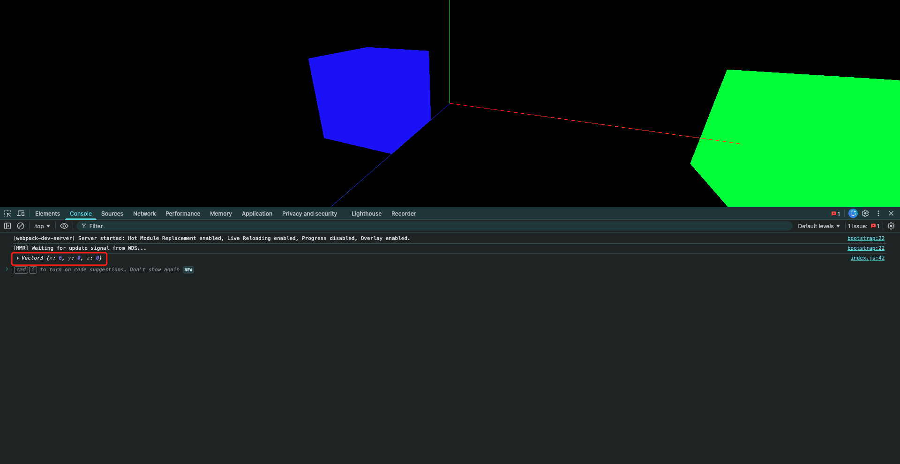

# 6. 物体的缩放与旋转

- `Mesh.scale`: 本质上也是一个`Vector3`，表示物体局部上在三个轴向的缩放比例.默认值为`(1, 1, 1)`,表示不进行缩放.
  - 将其设置为其他值可以实现物体的放大或缩小
  - 例如: 设置为`(2, 2, 2)`会使物体在所有方向上放大一倍
  - 设置为`(0.5, 0.5, 0.5)`则会使物体缩小一半
  - 默认是`(1, 1, 1)`,表示不进行缩放

```javascript
// 创建正方体
const geometry = new THREE.BoxGeometry(1, 1, 1)
const material = new THREE.MeshBasicMaterial({ color: 0x00ff00 })
const cube = new THREE.Mesh(geometry, material)

// 相对场景向右移动1单位(其实就是相对世界坐标向右移动0.5单位)
cube.position.set(1, 0, 0)

// 设置放大2倍(默认值是(1, 1, 1)表示1倍,也就是不放大)
cube.scale.set(2, 2, 2)

scene.add(cube)
```

- 所谓的"局部上",指的是物体是相对于父几何体进行缩放的
  - 父几何体放大/缩小,则子几何体也会相应放大/缩小
  - 子几何体的局部位移也受父几何体的缩放影响

```javascript
// 创建父正方体
const parentGeometry = new THREE.BoxGeometry(1, 1, 1)
const parentMaterial = new THREE.MeshBasicMaterial({ color: 0x0000ff })
const parentCube = new THREE.Mesh(parentGeometry, parentMaterial)

parentCube.position.set(-2, 0, 0)

// 父元素放大2倍 会影响到子元素一起放大 且会影响到子几何体的局部位移
parentCube.scale.set(2, 2, 2)

scene.add(parentCube)

// 创建子正方体
const sonGeometry = new THREE.BoxGeometry(1, 1, 1)
const sonMaterial = new THREE.MeshBasicMaterial({ color: 0x00ff00 })
const sonCube = new THREE.Mesh(sonGeometry, sonMaterial)

// 相对父元素向左移动4个单位
sonCube.position.set(4, 0, 0)
parentCube.add(sonCube)

// 打印结果为 Vector3 {x: 6, y: 0, z: 0} 而不是 Vector3 {x: 2, y: 0, z: 0}
// 这是因为子几何体的局部位置受父几何体的缩放作用影响
// 子几何体的世界坐标 = 父几何体的世界坐标 + (子几何体的局部坐标 * 父几何体的缩放比例)
console.log(sonCube.getWorldPosition(new THREE.Vector3()))
```




- `Mesh.rotation`: 本质是一个`Euler`对象,表示物体在局部坐标系下绕三个轴的旋转角度.默认值为`(0, 0, 0)`,表示不进行旋转.
  - 旋转角度的单位是弧度(rad),而不是度(degree)
  - 例如: 设置为`(Math.PI / 2, 0, 0)`会使物体绕X轴旋转90度
  - 设置为`(0, Math.PI, 0)`则会使物体绕Y轴旋转180度
  - 但是该方法实际上有4个参数:`rotation.set(x, y, z, order)`,第四个参数`order`表示旋转的顺序,默认值为`'XYZ'`(注意这里的字母必须都大写)
    - 旋转顺序决定了物体绕各轴旋转时的先后顺序,会影响最终的旋转结果
    - 常见的旋转顺序有`'XYZ'`, `'YXZ'`, `'ZXY'`, `'ZYX'`, `'YZX'`, `'XZY'`
    - 例如: `rotation.set(Math.PI / 2, Math.PI / 2, 0, 'XYZ')`与`rotation.set(Math.PI / 2, Math.PI / 2, 0, 'ZYX')`会得到不同的旋转结果

```javascript
function animate() {
    controls.update()

    if (parentCube.rotation.x === Math.PI * 2) {
        parentCube.rotation.x = 0
    }

    // 父元素的旋转也同样会影响到子元素
    parentCube.rotation.x += 0.01

    requestAnimationFrame(animate)

    renderer.render(scene, camera)
}
```

注意: 父元素的旋转同样会影响到子元素