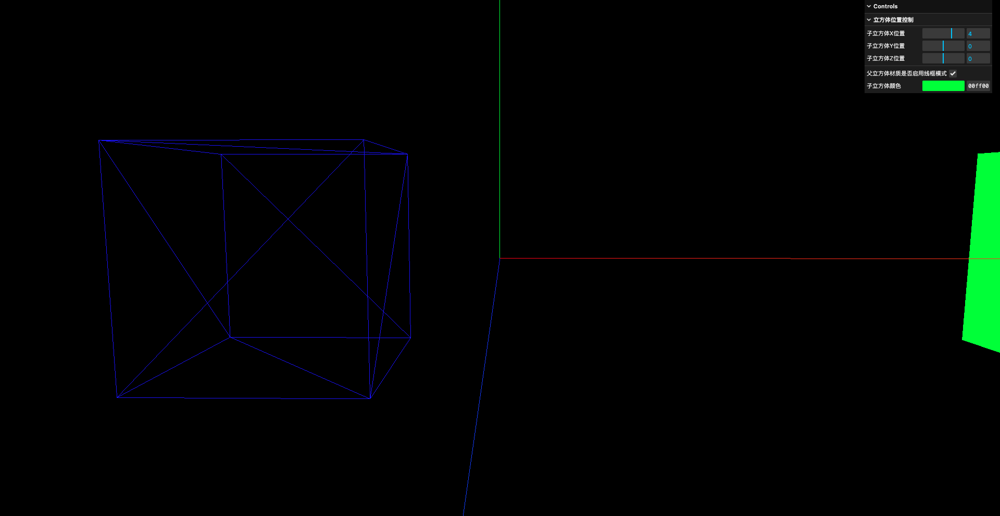
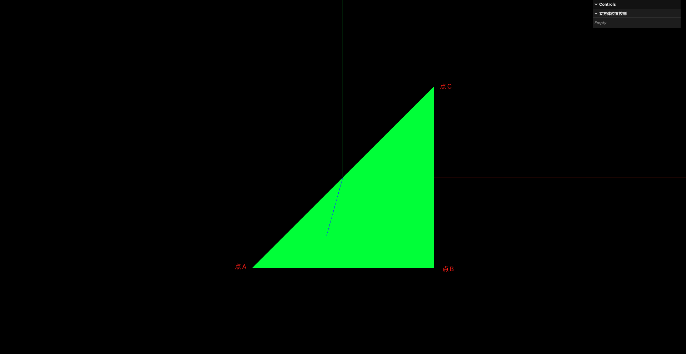
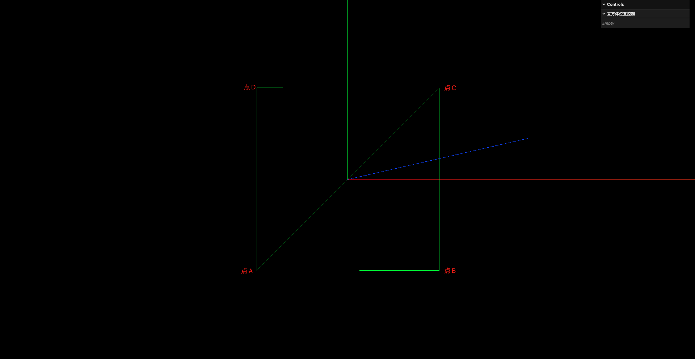

# 9. 几何体-顶点-索引-面

## 1. 几何体

在`Three.js`中,所有`Mesh`类型的几何体都是由三角形组成的,即使是一个正方形,它也是由两个三角形拼接而成的



## 2. 顶点

```javascript
// 创建父正方体
const parentGeometry = new THREE.BoxGeometry(1, 1, 1)
const parentMaterial = new THREE.MeshBasicMaterial({ color: 0x0000ff })
// 启用线框模式
parentMaterial.wireframe = true
const parentCube = new THREE.Mesh(parentGeometry, parentMaterial)

parentCube.position.set(-2, 0, 0)

parentCube.scale.set(2, 2, 2)

scene.add(parentCube)
console.log(parentGeometry)
```

这里打印几何体,观察`BoxGeometry.attributes.position.count`属性:


可以看到,正方体的顶点数量是24个,而不是8个.这是因为`Three.js`中的顶点,指的并不是几何角点,而是渲染顶点.

渲染顶点包括:

- 位置(position)
- 法线(normal)
- 纹理坐标(uv)
- 颜色(color)
- 切线(tangent)
- 等

对于同一个空间点,在不同的面上:

- 法线方向不同
- 纹理坐标不同

因此,即使是同一个空间点,位于不同的面上,也会被当作不同的渲染顶点来处理.

这也就是为什么正方体的顶点是24个而不是8个的原因.

## 3. 面

```javascript
// 创建三角形平面
const geometry = new THREE.BufferGeometry()

// 设置顶点数据
const vertices = new Float32Array([
    -1.0, -1.0, 1.0,    // 点A
    1.0, -1.0, 1.0,     // 点B
    1.0, 1.0, 1.0,      // 点C
])

// 设置顶点的位置属性
// 这里的第1个参数表示设置的是位置属性 位置属性的类型是BufferAttribute
// 第2个参数中的3表示在vertices这个一维数组中 每3个数表示1个顶点的位置(x, y, z)
// 实际上这个3就是 BufferAttribute.itemSize 也就是 geometry.attributes.position.itemSize
geometry.setAttribute( 'position', new THREE.BufferAttribute(vertices, 3))

// 创建材质
const material = new THREE.MeshBasicMaterial( {color: 0x00ff00})

// 创建网格模型
const mesh = new THREE.Mesh(geometry, material)
scene.add(mesh)
```

上面的代码创建了一个三角形平面,并将其添加到场景中



但是,如果在设置顶点时,将顶点的顺序改为顺时针:

```javascript
// 创建三角形平面
const geometry = new THREE.BufferGeometry()

// 设置顶点数据
const vertices = new Float32Array([
    -1.0, -1.0, 1.0,    // 点A
    1.0, 1.0, 1.0,      // 点C
    1.0, -1.0, 1.0,     // 点B
])

// 设置顶点的位置属性
// 这里的第1个参数表示设置的是位置属性 位置属性的类型是BufferAttribute
// 第2个参数中的3表示在vertices这个一维数组中 每3个数表示1个顶点的位置(x, y, z)
// 实际上这个3就是 BufferAttribute.itemSize 也就是 geometry.attributes.position.itemSize
geometry.setAttribute( 'position', new THREE.BufferAttribute(vertices, 3))

// 创建材质
const material = new THREE.MeshBasicMaterial( {color: 0x00ff00})

// 创建网格模型
const mesh = new THREE.Mesh(geometry, material)
scene.add(mesh)
```


这是因为WebGL的规则:

- 顶点按逆时针方向排列,则该平面被认为是正面朝向摄像机的
- 顶点按顺时针方向排列,则该平面被认为是背面朝向摄像机的

Three.js默认启用了背面剔除,即只渲染正面朝向摄像机的面,而不渲染背面朝向摄像机的面.因此,当顶点按顺时针方向排列时,该平面被认为是背面朝向摄像机的,所以不会被渲染出来.

如果想要让顺时针排列的面也能被渲染出来,可以通过设置材质的`side`属性来实现:

```javascript
// 创建三角形平面
const geometry = new THREE.BufferGeometry()

// 设置顶点数据
const vertices = new Float32Array([
    -1.0, -1.0, 1.0,    // 点A
    1.0, 1.0, 1.0,      // 点C
    1.0, -1.0, 1.0,     // 点B
])

// 设置顶点的位置属性
// 这里的第1个参数表示设置的是位置属性 位置属性的类型是BufferAttribute
// 第2个参数中的3表示在vertices这个一维数组中 每3个数表示1个顶点的位置(x, y, z)
// 实际上这个3就是 BufferAttribute.itemSize 也就是 geometry.attributes.position.itemSize
geometry.setAttribute( 'position', new THREE.BufferAttribute(vertices, 3))

// 创建材质
const material = new THREE.MeshBasicMaterial( {color: 0x00ff00})
// 设置材质双面渲染
material.side = THREE.DoubleSide

// 创建网格模型
const mesh = new THREE.Mesh(geometry, material)
scene.add(mesh)
```

**这也侧面证明了一个问题: 即使是一个"平面",在WebGL的领域也分为"正面"和"背面"**

创建正方形平面:

```javascript
// 创建四边形平面
const geometry = new THREE.BufferGeometry()

// 设置顶点数据
const vertices = new Float32Array([
    -1.0, -1.0, 1.0,    // 点A
    1.0, -1.0, 1.0,     // 点B
    1.0, 1.0, 1.0,      // 点C

    1.0, 1.0, 1.0,      // 点C
    -1.0, 1.0, 1.0,     // 点D
    -1.0, -1.0, 1.0     // 点A
])

// 设置顶点的位置属性
// 这里的第1个参数表示设置的是位置属性 位置属性的类型是BufferAttribute
// 第2个参数中的3表示在vertices这个一维数组中 每3个数表示1个顶点的位置(x, y, z)
// 实际上这个3就是 BufferAttribute.itemSize 也就是 geometry.attributes.position.itemSize
geometry.setAttribute( 'position', new THREE.BufferAttribute(vertices, 3))

// 创建材质
const material = new THREE.MeshBasicMaterial( {color: 0x00ff00})
material.wireframe = true

// 创建网格模型
const mesh = new THREE.Mesh(geometry, material)
scene.add(mesh)
```



注意这个正方形是6个顶点组成的,而非4个顶点

## 4. 索引

这里就有个问题: 1个正方形有6个顶点,但是1个正方体却是24个顶点(而非36个顶点,1个正方形6个顶点,1个正方体6个面,6*6=36),为什么?

```javascript
// 创建四边形平面
const geometry = new THREE.BufferGeometry()

// 设置顶点数据
// 注意这里只有4个顶点 不再是6个顶点了
const vertices = new Float32Array([
    -1.0, -1.0, 1.0,    // 点A
    1.0, -1.0, 1.0,     // 点B
    1.0, 1.0, 1.0,      // 点C
    -1.0, 1.0, 1.0,     // 点D
])

// 设置顶点的位置属性
// 这里的第1个参数表示设置的是位置属性 位置属性的类型是BufferAttribute
// 第2个参数中的3表示在vertices这个一维数组中 每3个数表示1个顶点的位置(x, y, z)
// 实际上这个3就是 BufferAttribute.itemSize 也就是 geometry.attributes.position.itemSize
geometry.setAttribute( 'position', new THREE.BufferAttribute(vertices, 3))

// 使用索引绘制
const indices = new Uint16Array([
    // 这里的 0 1 2 表示使用第0个顶点 第1个顶点 第2个顶点组成一个三角形
    0, 1, 2,
    // 这里的 2 3 0 表示使用第2个顶点 第3个顶点 第0个顶点组成一个三角形
    // 也就是说 2个三角形共用了 第2个顶点 和 第3个顶点
    2, 3, 0,
])
// 这里1这个参数的含义其实和设置position时的功能是一样的
// 只不过设置position时 每3个数表示1个顶点的位置
// 而设置索引时 每1个数表示1个顶点的索引
geometry.setIndex(new THREE.BufferAttribute(indices, 1))

// 创建材质
const material = new THREE.MeshBasicMaterial( {color: 0x00ff00})
material.wireframe = true

// 创建网格模型
const mesh = new THREE.Mesh(geometry, material)
scene.add(mesh)
```


这样一来,每个正方形只需要4个顶点,而不是6个顶点.因此,1个正方体只需要24个顶点,而不是36个顶点.