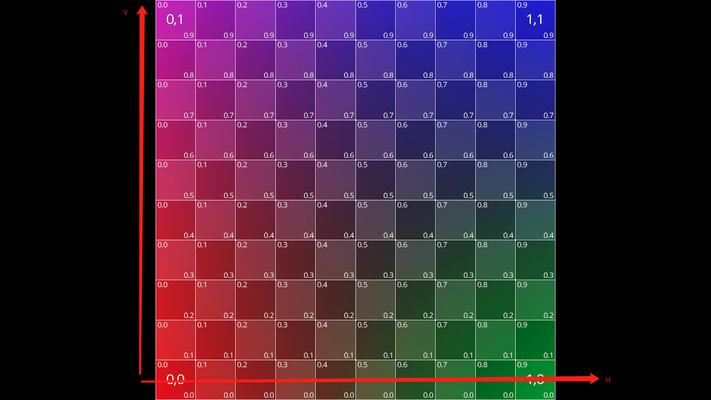
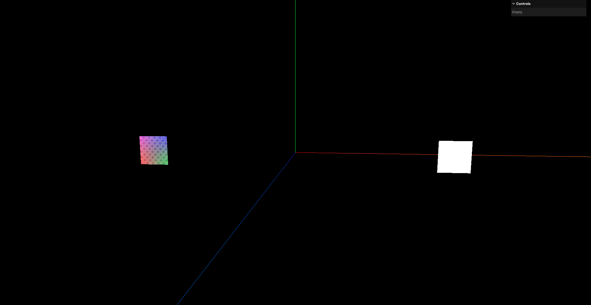
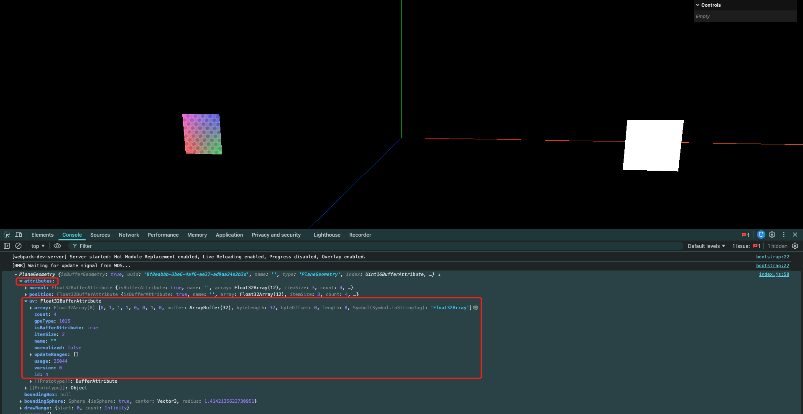
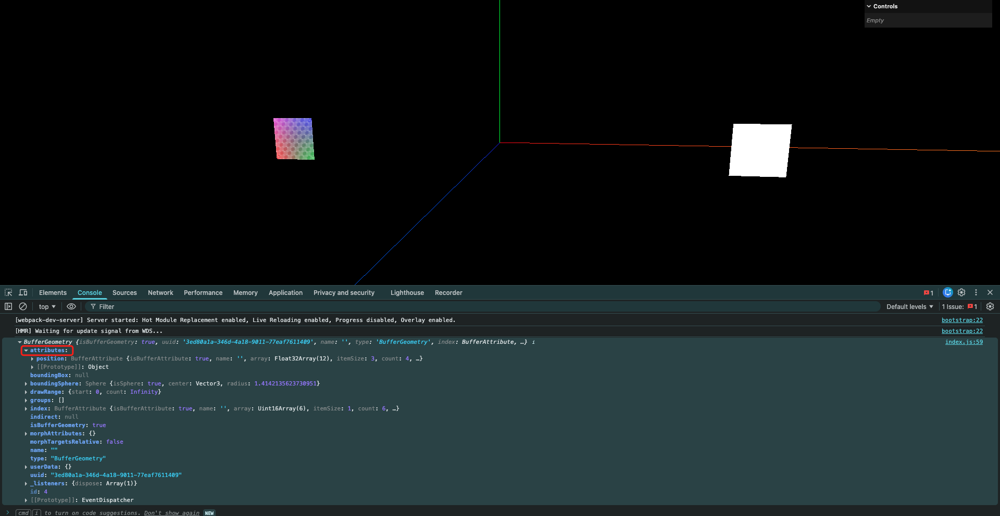
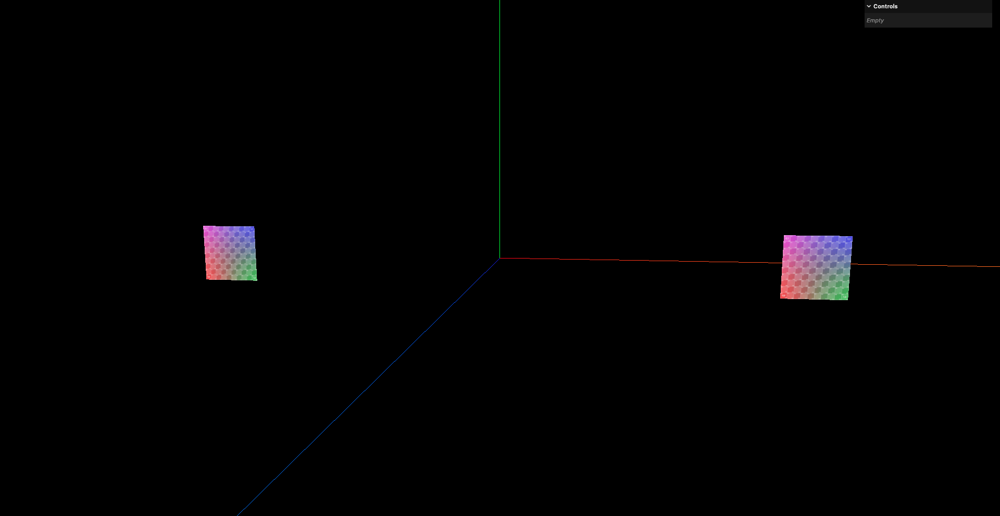
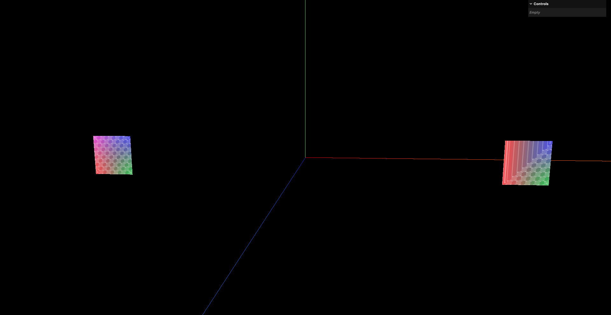

# 1. UV与应用

UV: 3维空间中的物体上,每个顶点除了有x/y/z的位置坐标外,还有u/v的纹理坐标.表示该顶点在纹理图片上的位置.



这里使用Three.js自带的平面几何体和根据顶点自行绘制的平面来演示UV:

```javascript
const loader = new THREE.TextureLoader()
const uvTexture = loader.load('../assets/uv_grid_opengl.jpg')

// 创建1个平面几何体
const planeGeometry = new THREE.PlaneGeometry(2, 2)
const planeMaterial = new THREE.MeshBasicMaterial({
    map: uvTexture,
})

const plane = new THREE.Mesh(planeGeometry, planeMaterial)
plane.position.x = -10
scene.add(plane)

// 使用顶点创建平面
const geometry = new THREE.BufferGeometry()
const vertices = new Float32Array([
    -1.0, -1.0, 1.0,    // 点A
    1.0, -1.0, 1.0,     // 点B
    1.0, 1.0, 1.0,      // 点C
    -1.0, 1.0, 1.0,     // 点D
])
geometry.setAttribute( 'position', new THREE.BufferAttribute(vertices, 3))

// 使用索引绘制
const indices = new Uint16Array([
    0, 1, 2,
    2, 3, 0,
])
geometry.setIndex(new THREE.BufferAttribute(indices, 1))

// 创建材质
const material = new THREE.MeshBasicMaterial( {
    map: uvTexture,
})

// 创建网格模型
const mesh = new THREE.Mesh(geometry, material)
mesh.position.x = 10
scene.add(mesh)
```



出现这种情况是因为,几何体自带了UV坐标,而自行绘制的平面没有UV坐标,所以贴图无法正确显示





为自行绘制的几何体设置UV坐标:

```javascript
// 使用顶点创建平面
const geometry = new THREE.BufferGeometry()
const vertices = new Float32Array([
    -1.0, -1.0, 1.0,    // 点A
    1.0, -1.0, 1.0,     // 点B
    1.0, 1.0, 1.0,      // 点C
    -1.0, 1.0, 1.0,     // 点D
])
geometry.setAttribute( 'position', new THREE.BufferAttribute(vertices, 3))

// 使用索引绘制
const indices = new Uint16Array([
    0, 1, 2,
    2, 3, 0,
])
geometry.setIndex(new THREE.BufferAttribute(indices, 1))

// 设置UV坐标
// UV的坐标是2维的,每个顶点对应一个UV坐标
const uv = new Float32Array([
    0, 0,  // 点A的UV
    1, 0,  // 点B的UV
    1, 1,  // 点C的UV
    0, 1,  // 点D的UV
])
// uv是每2个元素为一组数据
geometry.setAttribute('uv', new THREE.BufferAttribute(uv, 2))


// 创建材质
const material = new THREE.MeshBasicMaterial( {
    map: uvTexture,
})

// 创建网格模型
const mesh = new THREE.Mesh(geometry, material)
mesh.position.x = 10
scene.add(mesh)
```



如果设置了错误的UV坐标,比如:

```javascript
// 设置UV坐标
// UV的坐标是2维的,每个顶点对应一个UV坐标
const uv = new Float32Array([
    0, 0,  // 点A的UV
    1, 0,  // 点B的UV
    1, 1,  // 点C的UV
    0, 0,  // 点D的UV
])
```

那么采样时,点D的UV坐标会和点A的UV坐标重合,导致贴图拉伸变形:


