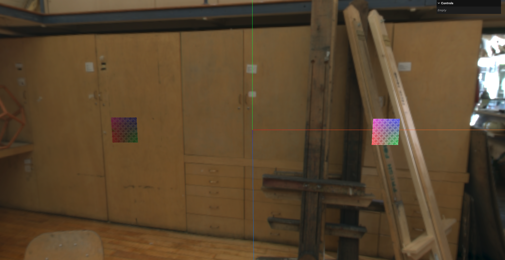
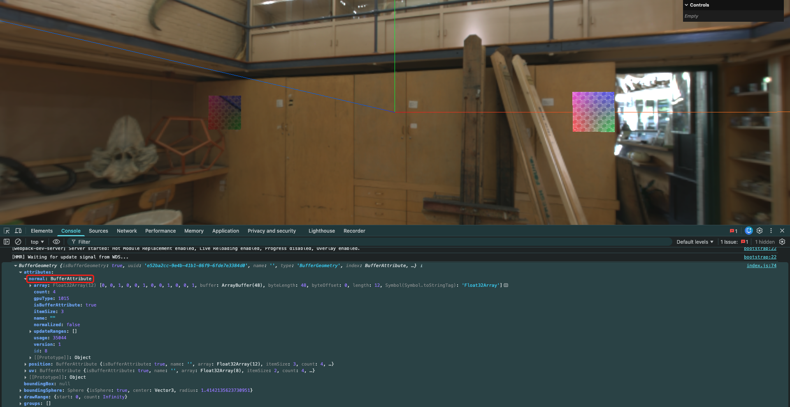
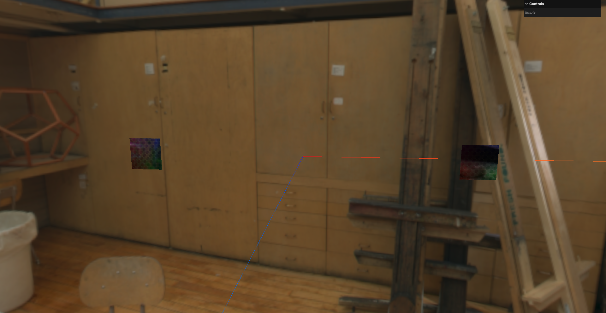

# 2. 法向量属性应用与法向量辅助器

## 1. 法向量

法向量: 在顶点位置处,垂直于平面的向量.用于确定表面的朝向和光照效果(即:`geometry.attributes.normal`)



计算法向量:

```javascript
// 使用顶点创建平面
const geometry = new THREE.BufferGeometry()
const vertices = new Float32Array([
    -1.0, -1.0, 1.0,    // 点A
    1.0, -1.0, 1.0,     // 点B
    1.0, 1.0, 1.0,      // 点C
    -1.0, 1.0, 1.0,     // 点D
])
geometry.setAttribute( 'position', new THREE.BufferAttribute(vertices, 3))

// 使用索引绘制
const indices = new Uint16Array([
    0, 1, 2,
    2, 3, 0,
])
geometry.setIndex(new THREE.BufferAttribute(indices, 1))

// 设置UV坐标
// UV的坐标是2维的,每个顶点对应一个UV坐标
const uv = new Float32Array([
    0, 0,  // 点A的UV
    1, 0,  // 点B的UV
    1, 1,  // 点C的UV
    0, 1,  // 点D的UV
])
// uv是每2个元素为一组数据
geometry.setAttribute('uv', new THREE.BufferAttribute(uv, 2))

// 设置法向量
geometry.computeVertexNormals()

console.log(geometry)
```



但此时可以看到,还是没有反射效果.这是因为自行绘制的平面使用的材质是`MeshBasicMaterial`,该材质不受光照影响,所以看不到反射效果.
需要为该材质设置环境贴图:

```javascript
// 加载环境贴图
// 创建hdr环境贴图加载器
const hdrLoader = new HDRLoader()

// 这里回调函数的形参就是加载好的环境贴图
hdrLoader.load('../assets/Alex_Hart-Nature_Lab_Bones_2k.hdr', (envMap) => {
    // 设置环境贴图的映射方式
    envMap.mapping = THREE.EquirectangularReflectionMapping

    // 为场景设置背景图
    scene.background = envMap

    // 为场景设置环境贴图
    scene.environment = envMap

    // 为平面设置环境贴图
    planeMaterial.envMap = envMap

    // 为自制平面的材质设置环境贴图
    material.envMap = envMap
})
```



或者也可以手动设置法向量属性:

```javascript
// 手动设置法向量
const normals = new Float32Array([
    0, 0, 1,  // 点A的法向量
    0, 0, 1,  // 点B的法向量
    0, 0, 1,  // 点C的法向量
    0, 0, 1,  // 点D的法向量
])
geometry.setAttribute('normal', new THREE.BufferAttribute(normals, 3))
```

## 2. 法向量辅助器

法向量辅助器: 用于可视化几何体的法向量方向的辅助工具.

新版本的Three.js中已经移除了`FaceNormalsHelper`这个辅助器,因为`BufferGeometry`只有顶点数据,没有面数据,所以无法使用面法向量辅助器.可以使用`VertexNormalsHelper`来显示顶点法向量.

```javascript
import { VertexNormalsHelper } from 'three/addons/helpers/VertexNormalsHelper'

// mesh: 要可视化法线的物体
// size: 法线的长度
// color: 法线的颜色
const helper = new VertexNormalsHelper(mesh, 0.5, 0x00ff00)
scene.add(helper)
```