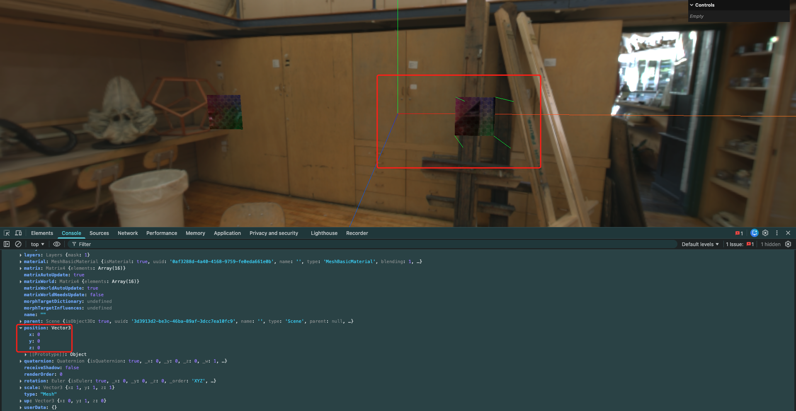
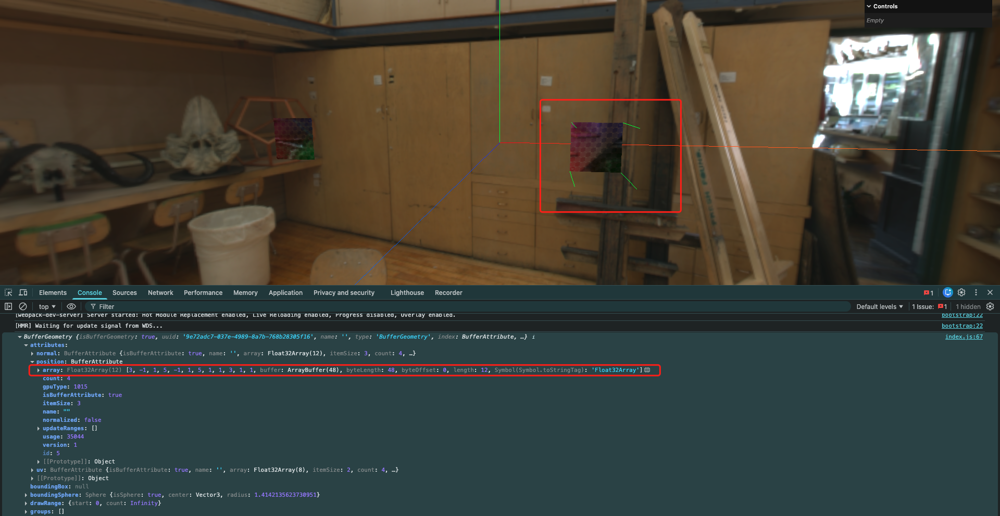
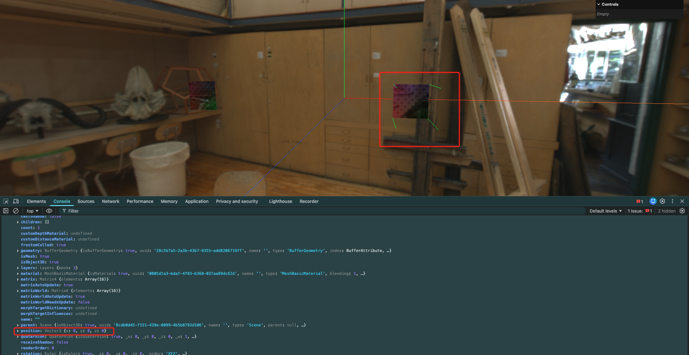
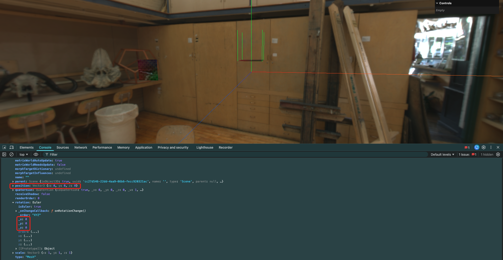
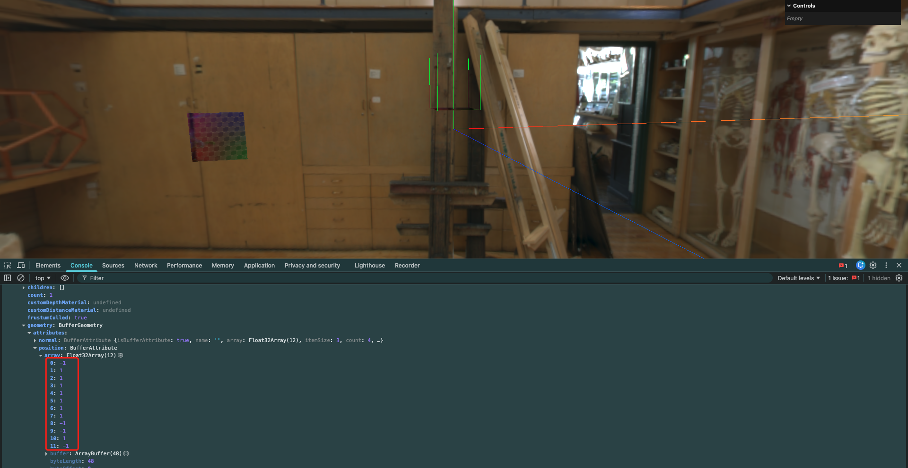
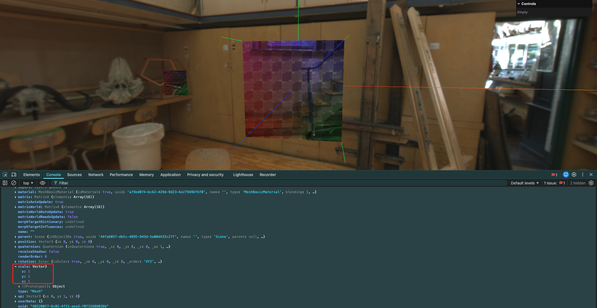

# 3. 几何体顶点转化-顶点位移-旋转-缩放

## 1. 顶点位移

先改变自行绘制的平面的顶点位置,总体向x轴正方向平移4个单位:

```javascript
// 使用顶点创建平面
const geometry = new THREE.BufferGeometry()
const vertices = new Float32Array([
    3.0, -1.0, 1.0,    // 点A
    5.0, -1.0, 1.0,     // 点B
    5.0, 1.0, 1.0,      // 点C
    3, 1.0, 1.0,     // 点D
])
geometry.setAttribute( 'position', new THREE.BufferAttribute(vertices, 3))

// 使用索引绘制
const indices = new Uint16Array([
    0, 1, 2,
    2, 3, 0,
])
geometry.setIndex(new THREE.BufferAttribute(indices, 1))

// 设置UV坐标
// UV的坐标是2维的,每个顶点对应一个UV坐标
const uv = new Float32Array([
    0, 0,  // 点A的UV
    1, 0,  // 点B的UV
    1, 1,  // 点C的UV
    0, 1,  // 点D的UV
])
// uv是每2个元素为一组数据
geometry.setAttribute('uv', new THREE.BufferAttribute(uv, 2))

// 设置法向量
geometry.computeVertexNormals()

// 创建材质
const material = new THREE.MeshBasicMaterial( {
    map: uvTexture,
})

// 创建网格模型
const mesh = new THREE.Mesh(geometry, material)
scene.add(mesh)
```



通过移动顶点的方式,虽然视觉上几何体移动了,但实际上该几何体的位置并没有发生变化,仍在原点位置

- `BufferGeometry.translate()`: 平移几何体顶点

```javascript
// 使用顶点创建平面
const geometry = new THREE.BufferGeometry()
const vertices = new Float32Array([
    -1.0, -1.0, 1.0,    // 点A
    1.0, -1.0, 1.0,     // 点B
    1.0, 1.0, 1.0,      // 点C
    -1.0, 1.0, 1.0,     // 点D
])
geometry.setAttribute( 'position', new THREE.BufferAttribute(vertices, 3))

// 使用索引绘制
const indices = new Uint16Array([
    0, 1, 2,
    2, 3, 0,
])
geometry.setIndex(new THREE.BufferAttribute(indices, 1))

// 设置UV坐标
// UV的坐标是2维的,每个顶点对应一个UV坐标
const uv = new Float32Array([
    0, 0,  // 点A的UV
    1, 0,  // 点B的UV
    1, 1,  // 点C的UV
    0, 1,  // 点D的UV
])
// uv是每2个元素为一组数据
geometry.setAttribute('uv', new THREE.BufferAttribute(uv, 2))

// 设置法向量
geometry.computeVertexNormals()

// 平移几何体的顶点
geometry.translate(4, 0, 0)
console.log(geometry)

// 创建材质
const material = new THREE.MeshBasicMaterial( {
    map: uvTexture,
})

// 创建网格模型
const mesh = new THREE.Mesh(geometry, material)
scene.add(mesh)
```



但是,这同样不会影响到几何体的位置属性,仍然在原点位置:



通常情况下,都是通过修改几何体的位置属性来移动几何体,而不是直接修改顶点位置.因为修改顶点位置可能会导致几何体在视觉上看起来的位置和实际逻辑上的位置不同,然后产生一些奇怪的问题
只有在顶点偏离原始位置时,才会考虑修改顶点位置

## 2. 几何体旋转

```javascript
// 使用顶点创建平面
const geometry = new THREE.BufferGeometry()
const vertices = new Float32Array([
    -1.0, -1.0, 1.0,    // 点A
    1.0, -1.0, 1.0,     // 点B
    1.0, 1.0, 1.0,      // 点C
    -1.0, 1.0, 1.0,     // 点D
])
geometry.setAttribute( 'position', new THREE.BufferAttribute(vertices, 3))

// 使用索引绘制
const indices = new Uint16Array([
    0, 1, 2,
    2, 3, 0,
])
geometry.setIndex(new THREE.BufferAttribute(indices, 1))

// 设置UV坐标
// UV的坐标是2维的,每个顶点对应一个UV坐标
const uv = new Float32Array([
    0, 0,  // 点A的UV
    1, 0,  // 点B的UV
    1, 1,  // 点C的UV
    0, 1,  // 点D的UV
])
// uv是每2个元素为一组数据
geometry.setAttribute('uv', new THREE.BufferAttribute(uv, 2))

// 设置法向量
geometry.computeVertexNormals()

// 平移几何体的顶点
// geometry.translate(4, 0, 0)

// 旋转几何体
geometry.rotateX(-Math.PI / 2)

// 创建材质
const material = new THREE.MeshBasicMaterial( {
    map: uvTexture,
    side: THREE.DoubleSide,
})

// 创建网格模型
const mesh = new THREE.Mesh(geometry, material)
scene.add(mesh)

console.log(mesh)
```

但同样还是上面的问题,直接给几何体设置旋转,也会出现几何体在视觉上和逻辑上的位置不一致的问题:



而且从Mesh对象的rotation属性上看,几何体也没有发生旋转.但对几何体设置旋转,会影响顶点的位置:



## 3. 几何体缩放

`BufferGeometry.scale(x, y, z)`: 按照指定的缩放比例缩放几何体顶点

```javascript
// 使用顶点创建平面
const geometry = new THREE.BufferGeometry()
const vertices = new Float32Array([
    -1.0, -1.0, 1.0,    // 点A
    1.0, -1.0, 1.0,     // 点B
    1.0, 1.0, 1.0,      // 点C
    -1.0, 1.0, 1.0,     // 点D
])
geometry.setAttribute( 'position', new THREE.BufferAttribute(vertices, 3))

// 使用索引绘制
const indices = new Uint16Array([
    0, 1, 2,
    2, 3, 0,
])
geometry.setIndex(new THREE.BufferAttribute(indices, 1))

// 设置UV坐标
// UV的坐标是2维的,每个顶点对应一个UV坐标
const uv = new Float32Array([
    0, 0,  // 点A的UV
    1, 0,  // 点B的UV
    1, 1,  // 点C的UV
    0, 1,  // 点D的UV
])
// uv是每2个元素为一组数据
geometry.setAttribute('uv', new THREE.BufferAttribute(uv, 2))

// 设置法向量
geometry.computeVertexNormals()

// 平移几何体的顶点
// geometry.translate(4, 0, 0)

// 旋转几何体
// geometry.rotateX(-Math.PI / 2)

// 缩放几何体
geometry.scale(3, 3, 3)

// 创建材质
const material = new THREE.MeshBasicMaterial( {
    map: uvTexture,
    side: THREE.DoubleSide,
})

// 创建网格模型
const mesh = new THREE.Mesh(geometry, material)
scene.add(mesh)
```


同样的,在Mesh对象上是看不到缩放属性的:


