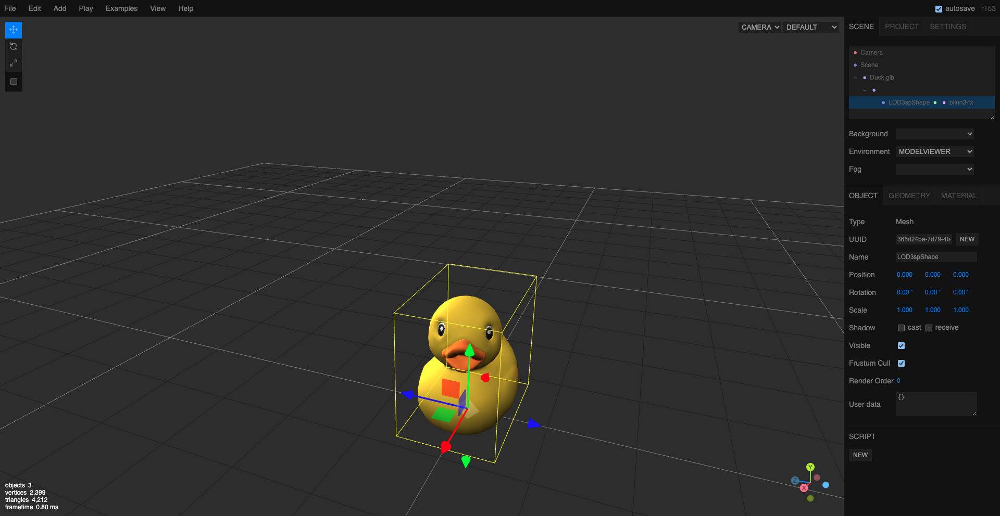
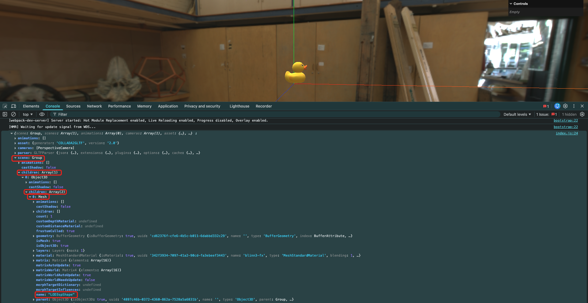
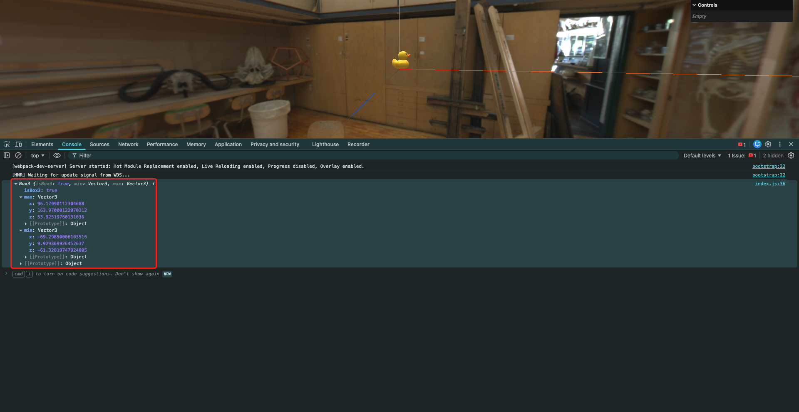
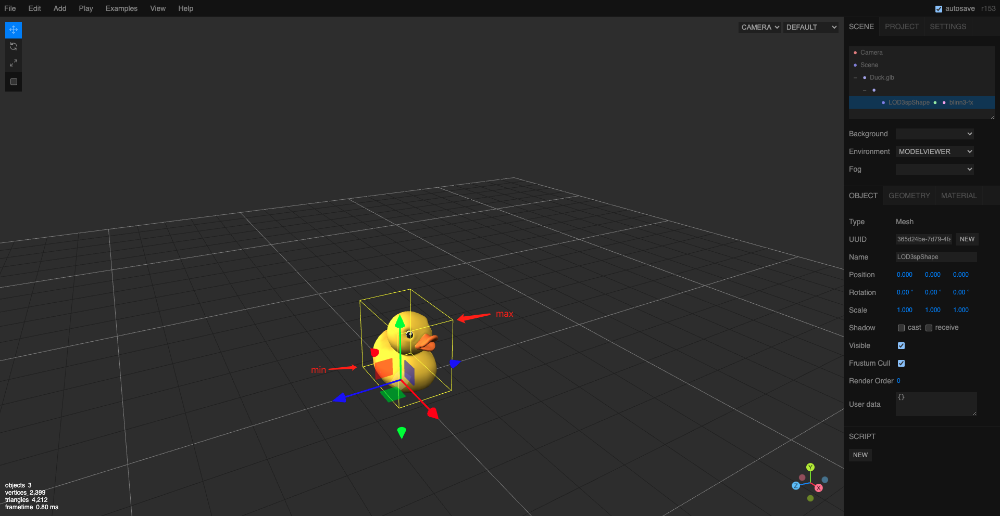
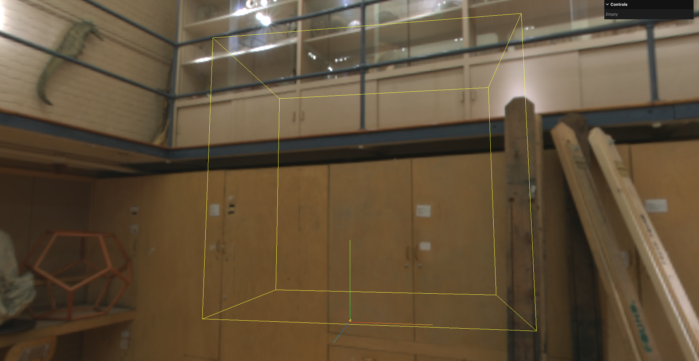
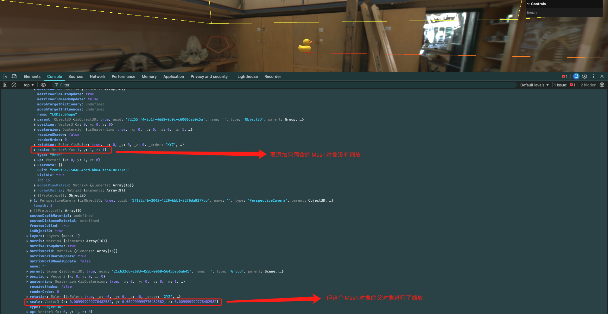
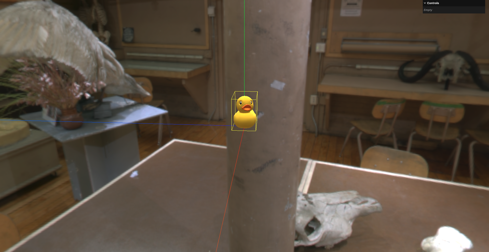

# 4. 包围盒使用与世界矩阵转换



包围盒: 是指用一个简单的几何形状(通常是矩形或立方体)来包围复杂的3D模型,以便进行碰撞检测/视锥体剔除等操作.包围盒可以大大简化计算,提高性能

- `BufferGeometry.boundingBox`: 即几何体的包围盒
- `BufferGeometry.computeBoundingBox()`: 计算几何体的包围盒

```javascript
const gltfLoader = new GLTFLoader()
gltfLoader.load('../assets/Duck.glb', (gltf) => {
    console.log(gltf)
    console.log(gltf.scene.children[0].children[0].name) // 网格模型对象
    // 将模型的场景添加到当前场景中
    scene.add(gltf.scene)
    
    
})

```



要想给鸭子绘制包围盒,需要先获取鸭子的几何体对象.通过打印gltf对象,可以看到鸭子的网格模型对象名称为`"LOD3spShape"`,因此可以通过`scene.getObjectByName('LOD3spShape')`来获取该对象:

注: 其实`getObjectByName()`方法是`Object3D`类的方法,所有继承自`Object3D`的类(如`Scene`,`Mesh`等)都可以使用该方法.

```javascript
const gltfLoader = new GLTFLoader()
gltfLoader.load('../assets/Duck.glb', (gltf) => {
    // console.log(gltf)
    // console.log(gltf.scene.children[0].children[0].name) // 网格模型对象
    // 将模型的场景添加到当前场景中
    scene.add(gltf.scene)

    const duckMesh = scene.getObjectByName('LOD3spShape')
    console.log(duckMesh)
})
```

然后再取该Mesh对象的几何体,求该几何体的包围盒即可:

```javascript
const gltfLoader = new GLTFLoader()
gltfLoader.load('../assets/Duck.glb', (gltf) => {
    // console.log(gltf)
    // console.log(gltf.scene.children[0].children[0].name) // 网格模型对象
    // 将模型的场景添加到当前场景中
    scene.add(gltf.scene)

    const duckMesh = scene.getObjectByName('LOD3spShape')
    const duckGeometry = duckMesh.geometry

    duckGeometry.computeBoundingBox()

    // 获取包围盒信息
    const duckBox = duckGeometry.boundingBox
    console.log(duckBox)
})
```



这里的`min`和`max`实际上是点的坐标,因为包围盒是非常规整的长方体,所以它的:

- 长平行于Y轴
- 宽平行于X轴
- 高平行于Z轴

因此,只需要知道2个对角点的坐标,就可以确定这个包围盒



使用包围盒辅助器创建包围盒:

```javascript
const gltfLoader = new GLTFLoader()
gltfLoader.load('../assets/Duck.glb', (gltf) => {
    // console.log(gltf)
    // console.log(gltf.scene.children[0].children[0].name) // 网格模型对象
    // 将模型的场景添加到当前场景中
    scene.add(gltf.scene)

    const duckMesh = scene.getObjectByName('LOD3spShape')
    const duckGeometry = duckMesh.geometry

    duckGeometry.computeBoundingBox()

    // 获取包围盒信息
    const duckBox = duckGeometry.boundingBox

    // 创建包围盒辅助器
    // 第1个参数: 包围盒对象
    // 第2个参数: 辅助器颜色
    const boxHelper = new THREE.Box3Helper(duckBox, 0xffff00)
    scene.add(boxHelper)
})
```



这是因为模型的场景经过了缩放,但是模型本身没有经过缩放:



因此,需要将局部的缩放转换成世界矩阵,然后再计算包围盒

- `Object3D.updateWorldMatrix()`: 更新几何体的世界矩阵.用于将几何体局部的变换应用到世界矩阵中
  - 在本例中这个`Object3D`对象实际上就是`duckMesh`对象
- `BufferGeometry.applyMatrix4()`: 将一个矩阵应用到几何体上.用于将世界矩阵应用到几何体上

```javascript
const gltfLoader = new GLTFLoader()
gltfLoader.load('../assets/Duck.glb', (gltf) => {
    console.log(gltf)
    // console.log(gltf.scene.children[0].children[0].name) // 网格模型对象
    // 将模型的场景添加到当前场景中
    scene.add(gltf.scene)

    const duckMesh = scene.getObjectByName('LOD3spShape')
    const duckGeometry = duckMesh.geometry

    // 计算包围盒
    duckGeometry.computeBoundingBox()
    // 更新世界矩阵
    duckMesh.updateWorldMatrix(true, true)
    // 将包围盒转换到世界坐标系中
    // matrixWorld属性表示Mesh对象的世界矩阵
    duckGeometry.boundingBox.applyMatrix4(duckMesh.matrixWorld)

    // 获取包围盒信息
    const duckBox = duckGeometry.boundingBox

    // 创建包围盒辅助器
    // 第1个参数: 包围盒对象
    // 第2个参数: 辅助器颜色
    const boxHelper = new THREE.Box3Helper(duckBox, 0xffff00)
    scene.add(boxHelper)
})
```

