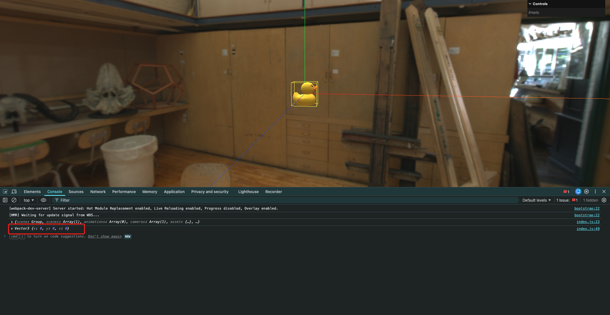
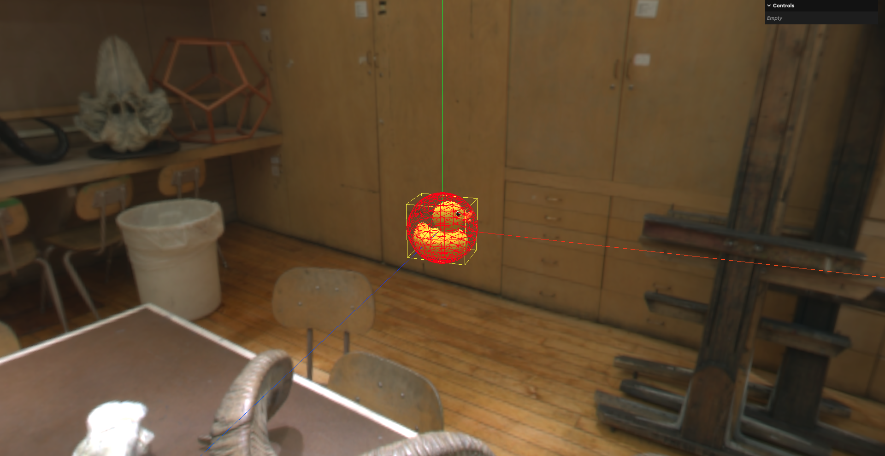

# 5. 几何体居中与获取几何体中心

## 1. 几何体居中

就是让包围盒的中心点位于坐标系的原点处

当然更精准的办法是取几何体上所有顶点的平均值,作为几何体的质心,但这种方式需要消耗大量计算资源,所以通常是以包围盒的中心点作为几何体的中心点

```javascript
const gltfLoader = new GLTFLoader()
gltfLoader.load('../assets/Duck.glb', (gltf) => {
    console.log(gltf)
    // console.log(gltf.scene.children[0].children[0].name) // 网格模型对象
    // 将模型的场景添加到当前场景中
    scene.add(gltf.scene)

    const duckMesh = scene.getObjectByName('LOD3spShape')
    const duckGeometry = duckMesh.geometry

    // 计算包围盒
    duckGeometry.computeBoundingBox()

    // 设置几何体居中
    duckGeometry.center()

    // 更新世界矩阵
    duckMesh.updateWorldMatrix(true, true)
    // 将包围盒转换到世界坐标系中
    // matrixWorld属性表示Mesh对象的世界矩阵
    duckGeometry.boundingBox.applyMatrix4(duckMesh.matrixWorld)

    // 获取包围盒信息
    const duckBox = duckGeometry.boundingBox

    // 创建包围盒辅助器
    // 第1个参数: 包围盒对象
    // 第2个参数: 辅助器颜色
    const boxHelper = new THREE.Box3Helper(duckBox, 0xffff00)
    scene.add(boxHelper)
})
```

其实就是在计算包围盒之后,调用`BufferGeometry.center()`方法即可.该方法用于根据包围盒将几何体居中

## 2. 获取几何体中心

在更新包围盒的世界坐标系位置之后,可以通过包围盒(`Box3`)的`getCenter()`方法获取几何体的中心点位置:

```javascript
const gltfLoader = new GLTFLoader()
gltfLoader.load('../assets/Duck.glb', (gltf) => {
    console.log(gltf)
    // console.log(gltf.scene.children[0].children[0].name) // 网格模型对象
    // 将模型的场景添加到当前场景中
    scene.add(gltf.scene)

    const duckMesh = scene.getObjectByName('LOD3spShape')
    const duckGeometry = duckMesh.geometry

    // 计算包围盒
    duckGeometry.computeBoundingBox()

    // 设置几何体居中
    duckGeometry.center()

    // 更新世界矩阵
    duckMesh.updateWorldMatrix(true, true)
    // 将包围盒转换到世界坐标系中
    // matrixWorld属性表示Mesh对象的世界矩阵
    duckGeometry.boundingBox.applyMatrix4(duckMesh.matrixWorld)

    // 获取包围盒信息
    const duckBox = duckGeometry.boundingBox

    // 获取包围盒的中心点
    // getCenter()方法需要传入一个Vector3对象作为参数 表示计算出的中心点存放的位置
    const center = duckBox.getCenter(new THREE.Vector3())
    console.log(center)

    // 创建包围盒辅助器
    // 第1个参数: 包围盒对象
    // 第2个参数: 辅助器颜色
    const boxHelper = new THREE.Box3Helper(duckBox, 0xffff00)
    scene.add(boxHelper)
})
```



## 3. 获取包围球

在Three.js v0.180+的版本中,不再提供包围球辅助器`SphereHelper`,但仍然可以通过几何体的`boundingSphere`属性获取包围球信息,然后自己封装一个包围球辅助器:

```javascript
const gltfLoader = new GLTFLoader()
gltfLoader.load('../assets/Duck.glb', (gltf) => {
    console.log(gltf)
    // console.log(gltf.scene.children[0].children[0].name) // 网格模型对象
    // 将模型的场景添加到当前场景中
    scene.add(gltf.scene)

    const duckMesh = scene.getObjectByName('LOD3spShape')
    const duckGeometry = duckMesh.geometry

    // 计算包围盒
    duckGeometry.computeBoundingBox()

    // 设置几何体居中
    duckGeometry.center()

    // 更新世界矩阵
    duckMesh.updateWorldMatrix(true, true)
    // 将包围盒转换到世界坐标系中
    // matrixWorld属性表示Mesh对象的世界矩阵
    duckGeometry.boundingBox.applyMatrix4(duckMesh.matrixWorld)

    // 获取包围盒信息
    const duckBox = duckGeometry.boundingBox

    // 获取包围盒的中心点
    // getCenter()方法需要传入一个Vector3对象作为参数 表示计算出的中心点存放的位置
    const center = duckBox.getCenter(new THREE.Vector3())
    console.log(center)

    // 创建包围盒辅助器
    // 第1个参数: 包围盒对象
    // 第2个参数: 辅助器颜色
    const boxHelper = new THREE.Box3Helper(duckBox, 0xffff00)
    scene.add(boxHelper)

    // 计算包围球
    duckGeometry.computeBoundingSphere()

    // 获取包围球信息
    const duckSphere = duckGeometry.boundingSphere
    // 将包围球转换为世界坐标系
    duckSphere.applyMatrix4(duckMesh.matrixWorld)

    // 自行封装一个包围球辅助器
    const sphereHelper = new THREE.Mesh(
        new THREE.SphereGeometry(duckSphere.radius, 16, 16),
        new THREE.MeshBasicMaterial({
            color: 0xff0000,
            wireframe: true,
            // 不可被遮挡 因为一般包围球都是用来检测碰撞的 所以需要一直可见
            depthTest: false,
        })
    )

    // 将包围球辅助器放到包围球的中心
    sphereHelper.position.copy(duckSphere.center)
    scene.add(sphereHelper)
})
```

