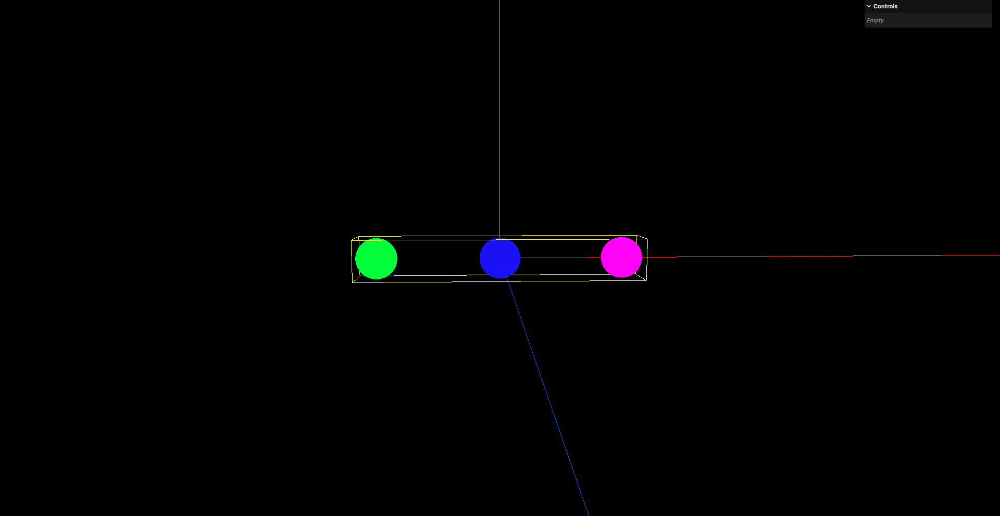

# 6. 获取多个物体包围盒

想要获取多个物体的包围盒,需要遍历每个物体,分别获取它们的包围盒,然后将这些包围盒合并成一个总的包围盒

- `Box3.union(box: Box3): Box3`：将当前包围盒与传入的包围盒合并,返回合并后的包围盒

```javascript
let multiBoundingBox = null

// 递归遍历整个场景树中的每一个Object3D对象
// 注意此时还没有向场景中添加AxesHelper对象和Box3Helper对象
// 所以此时的遍历只会遍历到场景和3个球体
scene.traverse((child) => {
    if (child.type === 'Scene') {
        return
    }

    // 获取几何体
    const childGeometry = child.geometry

    // 计算包围盒
    childGeometry.computeBoundingBox()

    // 更新世界矩阵 (实际上这一步在本例中用不到,因为本例中所有的几何体都是直接添加到场景中的,没有嵌套)
    child.updateWorldMatrix(true, true)

    // 将包围盒转换到世界坐标系中
    childGeometry.boundingBox.applyMatrix4(child.matrixWorld)

    // 合并包围盒
    if (multiBoundingBox === null) {
        multiBoundingBox = childGeometry.boundingBox
        return
    }

    multiBoundingBox = multiBoundingBox.union(childGeometry.boundingBox)
})

const boxHelper = new THREE.Box3Helper(multiBoundingBox, 0xffff00)
scene.add(boxHelper)
```



- `Box3.setFromObject(object: Object3D): Box3`：通过传入一个Object3D对象,自动计算该对象及其子对象的包围盒,返回计算后的包围盒

所以也可以先计算出来3个球体的包围盒,然后再通过`Box3.union()`方法合并

```javascript
const box1 = new THREE.Box3()
box1.setFromObject(sphere1)

const box2 = new THREE.Box3()
box2.setFromObject(sphere2)

const box3 = new THREE.Box3()
box3.setFromObject(sphere3)

// 计算包含所有球体的包围盒
const multiBoundingBox = box1.union(box2).union(box3)

const boxHelper = new THREE.Box3Helper(multiBoundingBox, 0xffff00)
scene.add(boxHelper)
```

效果也是等价的
