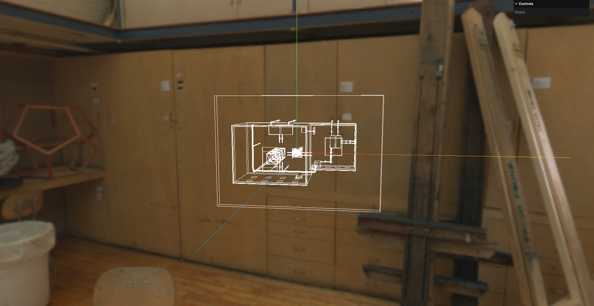
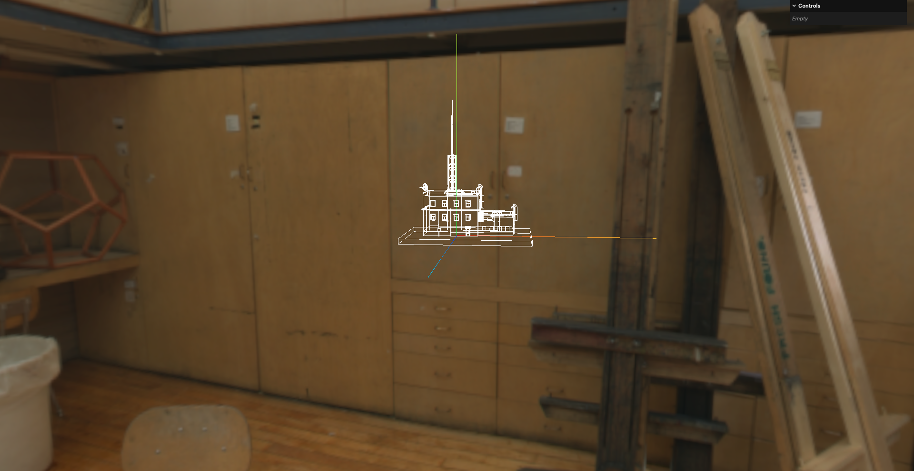
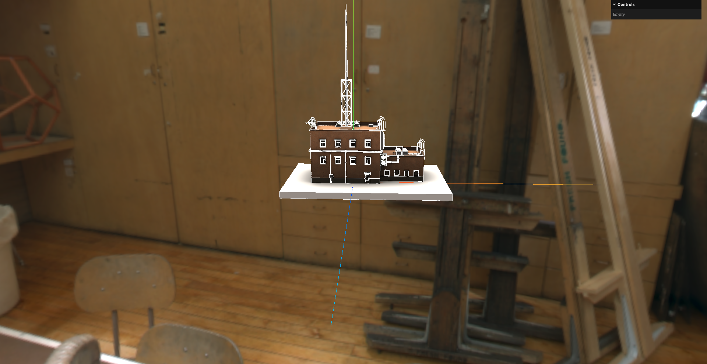
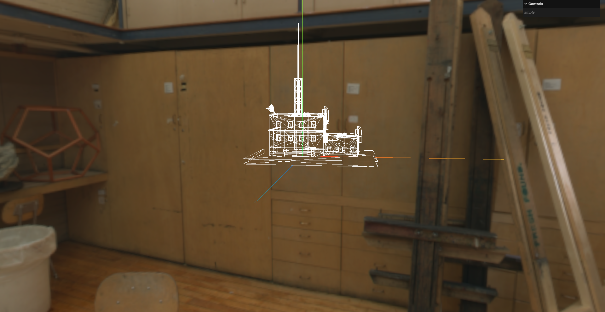

# 7. 边缘几何体与线框几何体

- `WireframeGeometry`：线框几何体,用于显示几何体的边缘线条,这种和对材质设置`wireframe: true`视觉效果类似,但`WireframeGeometry`是一个独立的几何体对象,可以单独控制和操作
  - 显示的是几何体的三角形的面
- `EdgesGeometry`：边缘几何体,用于提取几何体的边缘线条,生成一个新的几何体对象,只包含边缘线条的信息,适合用于创建轮廓效果
  - 显示的是几何体的平面

- `LineSegments`: 用于渲染线段的对象,可以与`WireframeGeometry`或`EdgesGeometry`结合使用,创建线框或边缘效果的渲染对象

## 1. 边缘几何体

```javascript
// 实例化GLTF加载器
const gltfLoader = new GLTFLoader()
// 实例化DRACO解码器
const dracoLoader = new DRACOLoader()
dracoLoader.setDecoderPath('../assets/draco/')
// 将DRACO解码器传递给GLTF加载器
gltfLoader.setDRACOLoader(dracoLoader)

// 加载GLTF模型
gltfLoader.load('../assets/futuristic_building.glb', (gltf) => {
    const root = gltf.scene

    root.traverse((child) => {
        if (child.isMesh) {
            // 创建边缘几何体
            const edgesGeometry = new THREE.EdgesGeometry(child.geometry)

            // 创建边缘线材质
            const edgesMaterial = new THREE.LineBasicMaterial({
                color: 0xffffff,
            })

            // 创建边缘线网格
            const edgesLine = new THREE.LineSegments(
                edgesGeometry,
                edgesMaterial
            )

            // 将边缘线网格添加到场景中
            scene.add(edgesLine)
        }
    })
})
```

这里由于我没有原模型,是从[开源模型网站](https://sketchfab.com/feed)下的,所以在获取几何体时,无法像课程中的代码一样直接获取到模型的几何体,而是需要遍历场景中的所有子对象,找到网格对象后,再获取其几何体



更新世界转换矩阵后即可:

```javascript
// 实例化GLTF加载器
const gltfLoader = new GLTFLoader()
// 实例化DRACO解码器
const dracoLoader = new DRACOLoader()
dracoLoader.setDecoderPath('../assets/draco/')
// 将DRACO解码器传递给GLTF加载器
gltfLoader.setDRACOLoader(dracoLoader)

// 加载GLTF模型
gltfLoader.load('../assets/futuristic_building.glb', (gltf) => {
    const root = gltf.scene

    root.traverse((child) => {
        if (child.isMesh) {
            // 创建边缘几何体
            const edgesGeometry = new THREE.EdgesGeometry(child.geometry)

            // 创建边缘线材质
            const edgesMaterial = new THREE.LineBasicMaterial({
                color: 0xffffff,
            })

            // 创建边缘线网格
            const edgesLine = new THREE.LineSegments(
                edgesGeometry,
                edgesMaterial
            )

            // 获取子网格的世界变换矩阵
            child.updateWorldMatrix(true, false)
            const worldMatrix = child.matrixWorld

            // 将边缘线网格应用子网格的世界变换矩阵
            edgesLine.applyMatrix4(worldMatrix)

            // 解构位置 旋转和缩放
            // quaternion: 用于表示旋转的四元数
            edgesLine.matrix.decompose(edgesLine.position, edgesLine.quaternion, edgesLine.scale)

            // 将边缘线网格添加到场景中
            scene.add(edgesLine)
        }
    })

    scene.add(root)
})
```





## 2. 线框几何体

就是把边缘几何体对象换成线框几何体对象即可

```javascript
// 加载GLTF模型
gltfLoader.load('../assets/futuristic_building.glb', (gltf) => {
    const root = gltf.scene

    root.traverse((child) => {
        if (child.isMesh) {
            // 创建线框几何体
            const wireGeometry = new THREE.WireframeGeometry(child.geometry)

            // 创建线框线材质
            const wireMaterial = new THREE.LineBasicMaterial({
                color: 0xffffff,
            })

            // 创建线框线网格
            const wiresLine = new THREE.LineSegments(
                wireGeometry,
                wireMaterial
            )

            // 获取子网格的世界变换矩阵
            child.updateWorldMatrix(true, false)
            const worldMatrix = child.matrixWorld

            // 将线框线网格应用子网格的世界变换矩阵
            wiresLine.applyMatrix4(worldMatrix)

            // 解构位置 旋转和缩放
            // quaternion: 用于表示旋转的四元数
            wiresLine.matrix.decompose(wiresLine.position, wiresLine.quaternion, wiresLine.scale)

            // 将边缘线网格添加到场景中
            scene.add(wiresLine)
        }
    })

    // scene.add(root)
})
```

