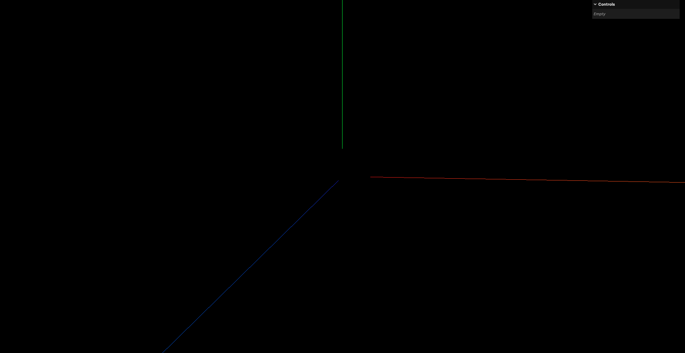
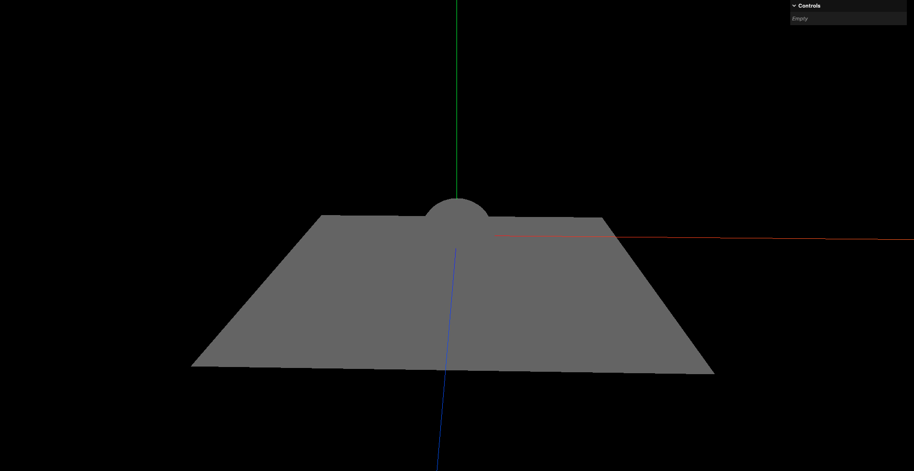
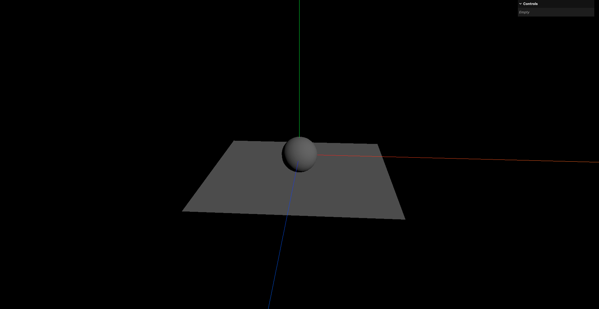
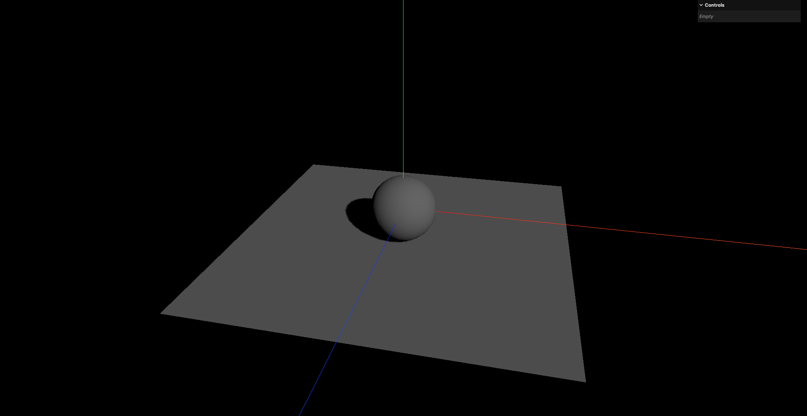

# 1. 灯光与阴影的关系与设置

- `AmbientLight`: 环境光,无法产生阴影,因为环境光是均匀分布在场景中的,不会有特定的光源方向
- `DirectionalLight`: 平行光,可以产生阴影,因为平行光有明确的光源方向,可以投射阴影
- `PointLight`: 点光源,可以产生阴影,因为点光源从一个点向各个方向发射光线,可以投射阴影
- `SpotLight`: 聚光灯,可以产生阴影,因为聚光灯有一个特定的方向和范围,可以投射阴影
- `HemisphereLight`: 半球光,无法产生阴影,因为半球光是从天空和地面发射的光线,没有明确的光源方向,因此无法投射阴影
- `RectAreaLight`: 矩形区域光,无法产生阴影,因为矩形区域光的光线是从一个平面区域发射的,没有明确的光源方向,因此无法投射阴影

材质对光源的支持:

- `MeshBasicMaterial`: 不受光照影响,无法产生阴影
- `MeshStandardMaterial`: 受光照影响,可以产生阴影
- `MeshLambertMaterial`: 受光照影响,可以产生阴影,是一种非光泽材质,没有镜面反射的效果.一般用于模拟木材/石材
- `MeshPhongMaterial`: 受光照影响,可以产生阴影,是一种光泽材质,具有镜面反射的效果.一般用于模拟金属/塑料
- `MeshPhysicalMaterial`: 受光照影响,可以产生阴影,是一种高级材质,具有更多的物理属性,如粗糙度/金属度,比`MeshStandardMaterial`更复杂,渲染出来效果更真实,但同样地,也会更消耗性能
- `MeshToonMaterial`: 受光照影响,可以产生阴影,是一种卡通材质,具有分明的阴影和高光效果,适合用于卡通风格的渲染

```javascript
// 创建一个球体
const sphereGeometry = new THREE.SphereGeometry(1, 20, 20)
// 注意这里使用的是标准材质而不是之前用过的基础材质
const sphereMaterial = new THREE.MeshStandardMaterial({})

const sphere = new THREE.Mesh(sphereGeometry, sphereMaterial)
scene.add(sphere)

// 创建一个平面
const planeGeometry = new THREE.PlaneGeometry(10, 10)
const planeMaterial = new THREE.MeshStandardMaterial({})
const plane = new THREE.Mesh(planeGeometry, planeMaterial)
plane.position.set(0, -1, 0)
plane.rotation.x = -Math.PI / 2
scene.add(plane)
```

此时只能看到这个球体的轮廓,因为场景中没有光源:



在场景中添加一个环境光:

```javascript
// 创建一个球体
const sphereGeometry = new THREE.SphereGeometry(1, 20, 20)
// 注意这里使用的是标准材质而不是之前用过的基础材质
const sphereMaterial = new THREE.MeshStandardMaterial({})

const sphere = new THREE.Mesh(sphereGeometry, sphereMaterial)
scene.add(sphere)

// 创建一个平面
const planeGeometry = new THREE.PlaneGeometry(10, 10)
const planeMaterial = new THREE.MeshStandardMaterial({})
const plane = new THREE.Mesh(planeGeometry, planeMaterial)
plane.position.set(0, -1, 0)
plane.rotation.x = -Math.PI / 2
scene.add(plane)

// 添加环境光
// 第1个参数是光的颜色
// 第二个参数是光的强度
const ambientLight = new THREE.AmbientLight(0xffffff, 0.5)
scene.add(ambientLight)
```



可以看到此时虽然能够看到物体,但是没有任何阴影效果,这是因为环境光是均匀分布在场景中的,不会有特定的光源方向,因此无法产生阴影效果.

将环境光替换为平行光:

```javascript
// 创建一个球体
const sphereGeometry = new THREE.SphereGeometry(1, 20, 20)
// 注意这里使用的是标准材质而不是之前用过的基础材质
const sphereMaterial = new THREE.MeshStandardMaterial({})

const sphere = new THREE.Mesh(sphereGeometry, sphereMaterial)
scene.add(sphere)

// 创建一个平面
const planeGeometry = new THREE.PlaneGeometry(10, 10)
const planeMaterial = new THREE.MeshStandardMaterial({})
const plane = new THREE.Mesh(planeGeometry, planeMaterial)
plane.position.set(0, -1, 0)
plane.rotation.x = -Math.PI / 2
scene.add(plane)

// 添加平行光
const directionalLight = new THREE.DirectionalLight(0xffffff, 0.5)
// 设置光源位置
directionalLight.position.set(10, 10, 10)
scene.add(directionalLight)
```



可以看到,还是没有阴影的效果,这是因为虽然平行光可以产生阴影,但是还没有启用阴影相关的设置.

- step1. 设置渲染器开启阴影计算

```javascript
const renderer = new THREE.WebGLRenderer()
// 开启阴影贴图
renderer.shadowMap.enabled = true
```

- step2. 设置光源投射阴影

```javascript
// 添加平行光
const directionalLight = new THREE.DirectionalLight(0xffffff, 0.5)
// 设置光源位置
directionalLight.position.set(10, 10, 10)
// 开启光源投射阴影
directionalLight.castShadow = true
```

注: 由于环境光无法产生阴影,所以不需要给环境光开启阴影设置

- step3. 设置物体投射阴影

很明显本例中是想让球体的阴影投射到平面上,所以应该为球体开启投射阴影的设置

```javascript
// 创建一个球体
const sphereGeometry = new THREE.SphereGeometry(1, 20, 20)
// 注意这里使用的是标准材质而不是之前用过的基础材质
const sphereMaterial = new THREE.MeshStandardMaterial({})
const sphere = new THREE.Mesh(sphereGeometry, sphereMaterial)

// 开启投射阴影
sphere.castShadow = true

scene.add(sphere)
```

- step4. 设置物体接收阴影

平面需要接收球体投射下来的阴影,所以需要为平面开启接收阴影的设置

```javascript
// 创建一个平面
const planeGeometry = new THREE.PlaneGeometry(10, 10)
const planeMaterial = new THREE.MeshStandardMaterial({})
const plane = new THREE.Mesh(planeGeometry, planeMaterial)
plane.position.set(0, -1, 0)
plane.rotation.x = -Math.PI / 2

// 开启接收阴影
plane.receiveShadow = true

scene.add(plane)
```


