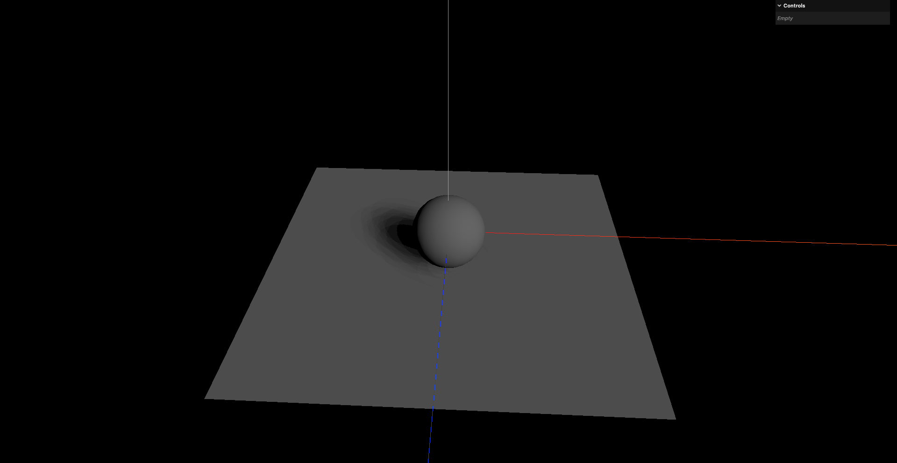
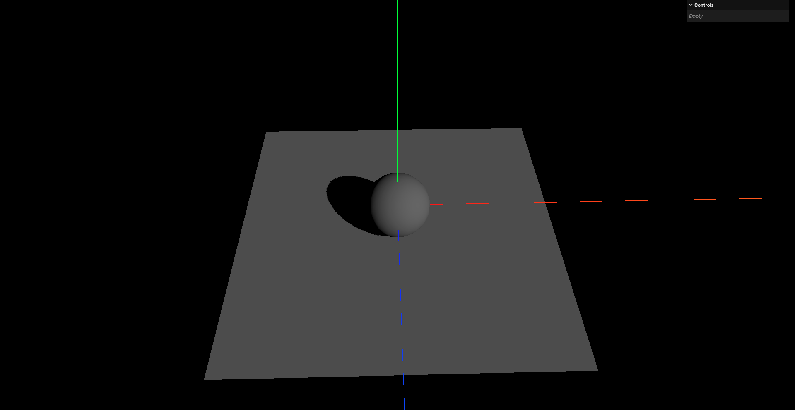
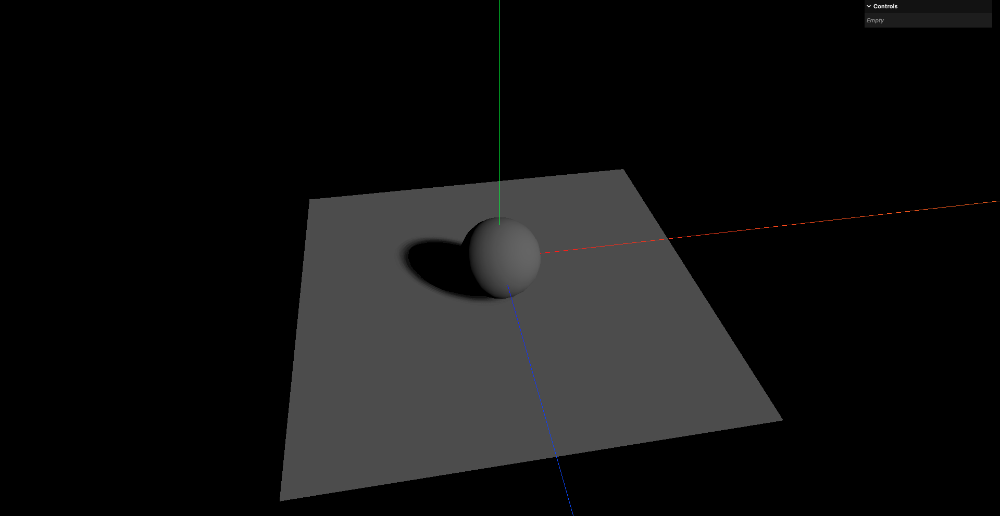
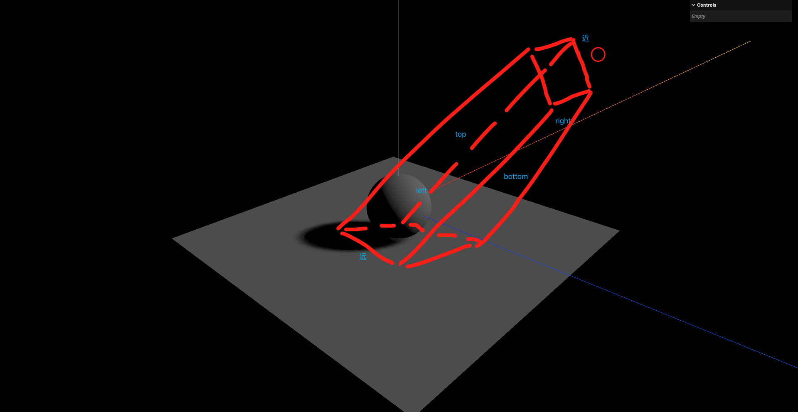
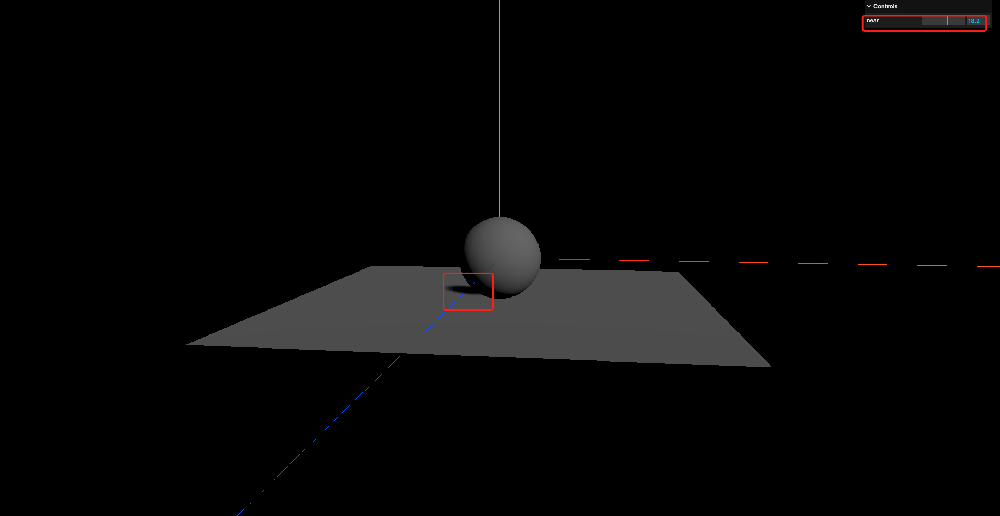

# 2. 平行光阴影属性与阴影相机原理

## 1. 阴影模糊度

- `LightShadow`: 是阴影类的基类
- `LightShadow.radius`: 控制阴影的模糊度,值越大,阴影越模糊

```javascript
// 添加平行光
const directionalLight = new THREE.DirectionalLight(0xffffff, 0.5)
// 设置光源位置
directionalLight.position.set(10, 10, 10)
// 开启光源投射阴影
directionalLight.castShadow = true
// 设置阴影模糊度
directionalLight.shadow.radius = 0.2
```





## 2. 阴影分辨率

- `LightShadow.mapSize`: 控制阴影贴图的分辨率,值越大,阴影越清晰,默认值为`512x512`

```javascript
// 添加平行光
const directionalLight = new THREE.DirectionalLight(0xffffff, 0.5)
// 设置光源位置
directionalLight.position.set(10, 10, 10)
// 开启光源投射阴影
directionalLight.castShadow = true
// 设置阴影模糊度
directionalLight.shadow.radius = 20
// 设置阴影贴图分辨率
directionalLight.shadow.mapSize.width = 2048
directionalLight.shadow.mapSize.height = 2048
```



可以看到,在相同的模糊度下,提高阴影贴图分辨率可以让阴影变得更加清晰

## 3. 阴影相机属性

- `LightShadow.camera`: 该属性定义了光的范围,在范围内的物体会投射阴影,范围外的物体不会投射阴影



物体超出光源范围后,将不会投射阴影

平行光的阴影相机是一个正交相机(`OrthographicCamera`),可以通过以下属性来设置阴影相机的范围:

- `LightShadow.camera.left`: 阴影相机左侧边界
- `LightShadow.camera.right`: 阴影相机右侧边界
- `LightShadow.camera.top`: 阴影相机上侧边界
- `LightShadow.camera.bottom`: 阴影相机下侧边界
- `LightShadow.camera.near`: 阴影相机近裁剪面
- `LightShadow.camera.far`: 阴影相机远裁剪面


这里的上下左右,指的是一个长方体盒子,因为正交相机不是椎体(不像透视相机),而是一个长方体盒子

```
           top
            ↑
            │
 left ←─────┼─────→ right
            │
            ↓
         bottom

```

所以这里的`left`/`right`/`top`/`bottom`是指这个长方体盒子的边界位置

```javascript
// 添加平行光
const directionalLight = new THREE.DirectionalLight(0xffffff, 0.5)
// 设置光源位置
directionalLight.position.set(10, 10, 10)
// 开启光源投射阴影
directionalLight.castShadow = true
// 设置阴影模糊度
directionalLight.shadow.radius = 20
// 设置阴影贴图分辨率
directionalLight.shadow.mapSize.width = 2048
directionalLight.shadow.mapSize.height = 2048

// 调整平行光的投射阴影相机属性
directionalLight.shadow.camera.near = 0.5
directionalLight.shadow.camera.far = 500
directionalLight.shadow.camera.left = -5
directionalLight.shadow.camera.right = 5
directionalLight.shadow.camera.top = 5
directionalLight.shadow.camera.bottom = -5

// 创建GUI
const gui = new GUI()
gui.add(directionalLight.shadow.camera, 'near').min(0).max(30).step(0.1).onChange(() => {
    // 在相机的属性改变后 需要调用updateProjectionMatrix()方法才能使属性变更生效
    directionalLight.shadow.camera.updateProjectionMatrix()
})
```


