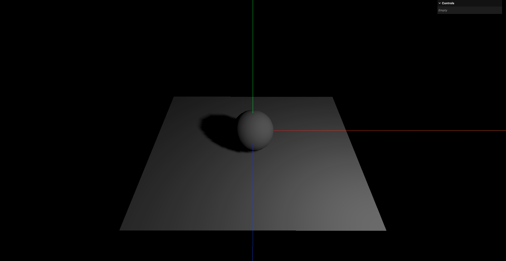
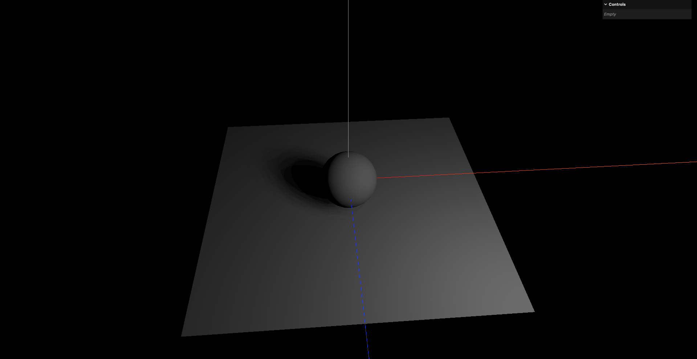
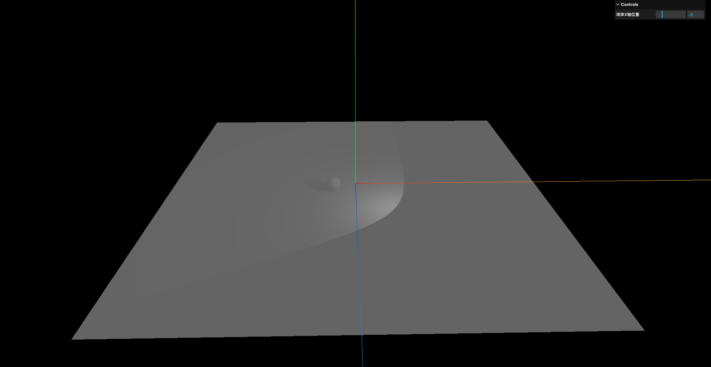
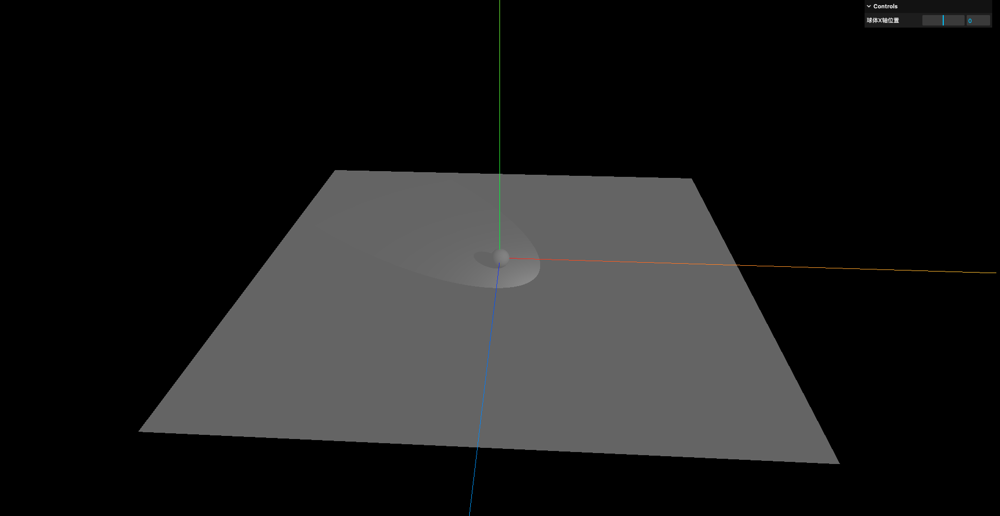
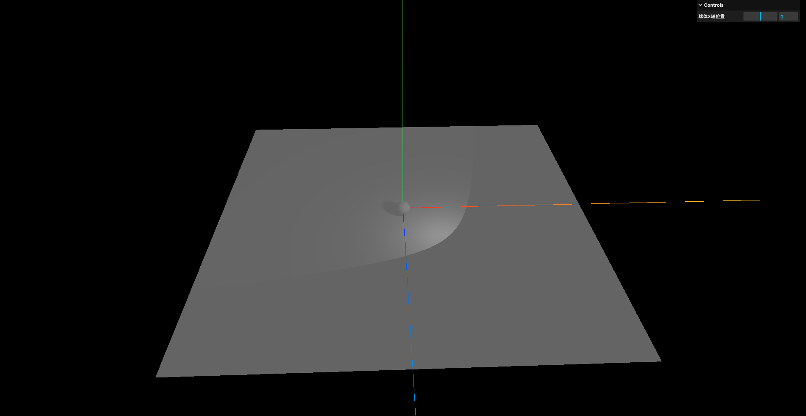
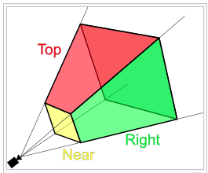
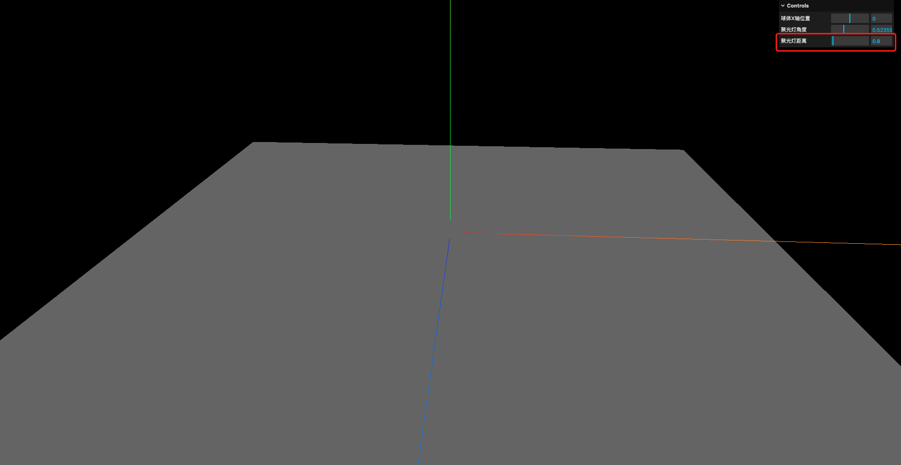
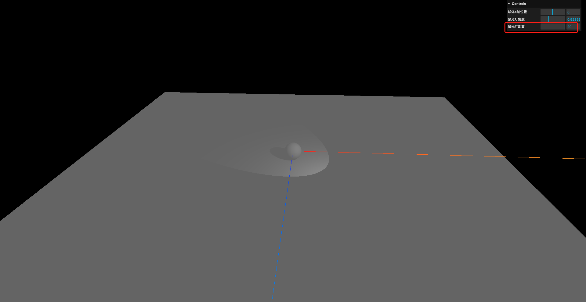
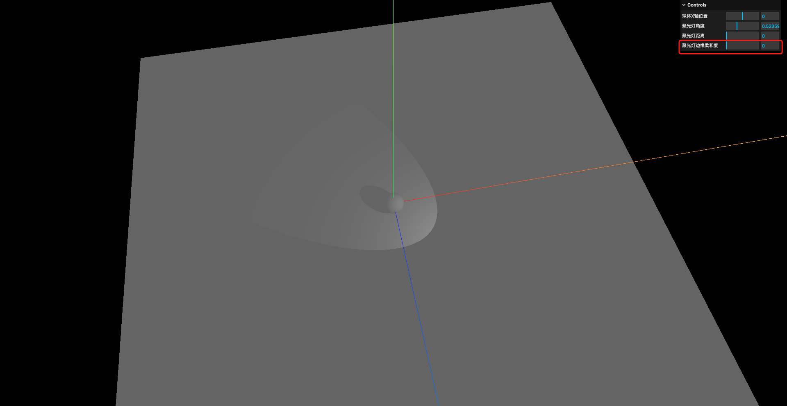
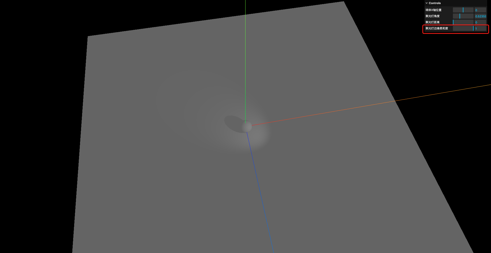

# 3. 聚光灯的各种属性与应用

## 1. 基本使用

- `SpotLight`: 从一个点向某个方向发散的锥型聚光灯,通常用于模拟路灯/手电筒等效果

和`DirectionalLight`不同的地方在于:

- `DirectionalLight`是平行光,光线是平行的,而`SpotLight`是从一个点发散出去的,光线是汇聚在一点的
- `DirectionalLight`不用关注位置,只关注方向;而`SpotLight`既要关注位置,也要关注方向

```javascript
// 添加聚光灯
const spotLight = new THREE.SpotLight(0xffffff, 20)
spotLight.position.set(5, 5, 5)
spotLight.castShadow = true

scene.add(spotLight)
```

注: 这里聚光灯的光强如果写的太小,看起来就像场景里没有光源一样,所以这里设置了一个比较大的值



## 2. 模糊度和阴影贴图分辨率

```javascript
// 添加聚光灯
const spotLight = new THREE.SpotLight(0xffffff, 20)
spotLight.position.set(5, 5, 5)
spotLight.castShadow = true

// 设置阴影贴图模糊度
spotLight.shadow.radius = 20
// 设置阴影贴图分辨率
spotLight.shadow.mapSize.width = 2048
spotLight.shadow.mapSize.height = 2048
```

和平行光类似,聚光灯的阴影贴图分辨率和模糊度也可以进行设置



## 3. 聚光灯的目标

- `SpotLight.target`: 聚光灯的目标对象,聚光灯会照射到这个目标对象上

以手电筒为例,`SpotLight.position`描述的是手电筒的位置;`SpotLight.target`描述的是手电筒照向哪个物体

将平面调大一些,并开启环境光后,观察聚光灯照射的位置:

```javascript
// 创建一个球体
const sphereGeometry = new THREE.SphereGeometry(1, 20, 20)
// 注意这里使用的是标准材质而不是之前用过的基础材质
const sphereMaterial = new THREE.MeshStandardMaterial({})
const sphere = new THREE.Mesh(sphereGeometry, sphereMaterial)

// 开启投射阴影
sphere.castShadow = true

scene.add(sphere)

// 创建一个平面
const planeGeometry = new THREE.PlaneGeometry(50, 50)
const planeMaterial = new THREE.MeshStandardMaterial({})
const plane = new THREE.Mesh(planeGeometry, planeMaterial)
plane.position.set(0, -1, 0)
plane.rotation.x = -Math.PI / 2

// 开启接收阴影
plane.receiveShadow = true

scene.add(plane)

// 添加环境光
// 第1个参数是光的颜色
// 第二个参数是光的强度
const ambientLight = new THREE.AmbientLight(0xffffff, 0.5)
scene.add(ambientLight)

// 添加聚光灯
const spotLight = new THREE.SpotLight(0xffffff, 20)
spotLight.position.set(5, 5, 5)
spotLight.castShadow = true

// 设置聚光灯照向的物体
spotLight.target = sphere

scene.add(spotLight)

// 创建GUI
const gui = new GUI()
gui.add(sphere.position, 'x').min(-5).max(5).step(0.1).name('球体X轴位置')
```

可以看到和平行光不同,无论球体移动到什么位置,阴影的角度始终不变,因为聚光灯始终照向球体



## 4. 聚光灯的角度

- `SpotLight.angle`: 光线照射范围的角度,默认值为`Math.PI/3`(60度),单位为弧度,该值不应设置超过`Math.PI/2`(90度)

```javascript
// 添加聚光灯
const spotLight = new THREE.SpotLight(0xffffff, 20)
spotLight.position.set(5, 5, 5)
spotLight.castShadow = true

// 设置聚光灯照向的物体
spotLight.target = sphere

// 设置聚光灯的角度
spotLight.angle = Math.PI / 6
```





可以看到,角度设置的越大,照射范围也就越大

## 5. 聚光灯的阴影相机

- `SpotLight.shadow.camera`: 聚光灯的阴影相机,用于控制阴影的投射范围.聚光灯的阴影相机和平行光的阴影相机不同,聚光灯的阴影相机是一个透视相机(`PerspectiveCamera`),而不是正交相机(`OrthographicCamera`)



## 6. 聚光灯的距离

- `SpotLight.distance`: 聚光灯的最大照射距离,超过该距离后光线将不再衰减,默认值为`0`,表示无限远(也就是不衰减)

```javascript
// 添加聚光灯
const spotLight = new THREE.SpotLight(0xffffff, 20)
spotLight.position.set(5, 5, 5)
spotLight.castShadow = true

// 设置聚光灯照向的物体
spotLight.target = sphere

// 设置聚光灯的角度
spotLight.angle = Math.PI / 6

// 设置聚光灯的距离
spotLight.distance = 0

// 创建GUI
const gui = new GUI()
gui.add(spotLight, 'distance').min(0).max(20).step(0.1).name('聚光灯距离')
```



这是因为聚光灯的衰减距离太小了,还没有照射到任何物体就已经衰减完了,所以场景里看起来和没有聚光灯的效果一样



## 7. 聚光灯的边缘柔和度

- `SpotLight.penumbra`: 聚光灯的边缘柔和度,取值范围为`0`到`1`,默认值为`0`.该属性用于控制聚光灯边缘的柔和程度,值越大边缘越柔和

```javascript
// 添加聚光灯
const spotLight = new THREE.SpotLight(0xffffff, 20)
spotLight.position.set(5, 5, 5)
spotLight.castShadow = true

// 设置聚光灯照向的物体
spotLight.target = sphere

// 设置聚光灯的角度
spotLight.angle = Math.PI / 6

// 设置聚光灯的距离
spotLight.distance = 0

// 设置聚光灯的边缘柔和度
spotLight.penumbra = 0.1

scene.add(spotLight)

// 创建GUI
const gui = new GUI()
gui.add(spotLight, 'penumbra').min(0).max(1).step(0.01).name('聚光灯边缘柔和度')
```





## 8. 沿光照距离的光强衰减

- `SpotLight.decay`: 光线随着距离增加变暗的衰减量,默认值为`1`.值为`2`表示现实世界的光衰减.该属性用于控制聚光灯光强随距离的衰减程度,值越大衰减越快

要观察该效果,需要开启渲染器的物理正确光照模式(`physicallyCorrectLights`)

```javascript
const renderer = new THREE.WebGLRenderer()
// 开启阴影贴图
renderer.shadowMap.enabled = true

// 开启物理上的正确光照模式
renderer.physicallyCorrectLights = true

// 添加聚光灯
const spotLight = new THREE.SpotLight(0xffffff, 20)
spotLight.position.set(5, 5, 5)
spotLight.castShadow = true

// 设置聚光灯照向的物体
spotLight.target = sphere

// 设置聚光灯的角度
spotLight.angle = Math.PI / 6

// 设置聚光灯的距离
spotLight.distance = 0

// 设置聚光灯的边缘柔和度
spotLight.penumbra = 0.1

// 沿光照距离的衰减量
spotLight.decay = 2

scene.add(spotLight)

// 创建GUI
const gui = new GUI()
gui.add(spotLight, 'decay').min(0).max(5).step(0.1).name('聚光灯衰减量')
```


