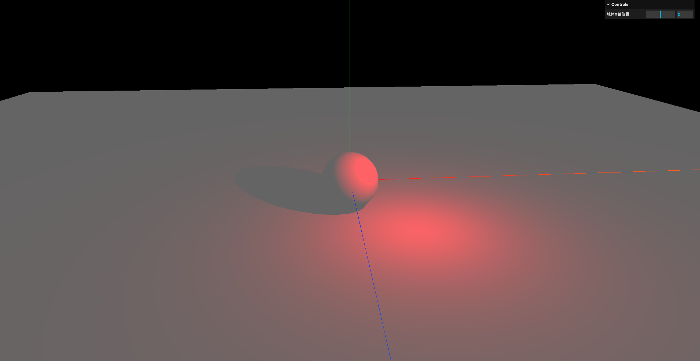
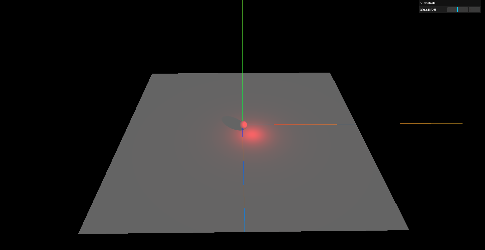
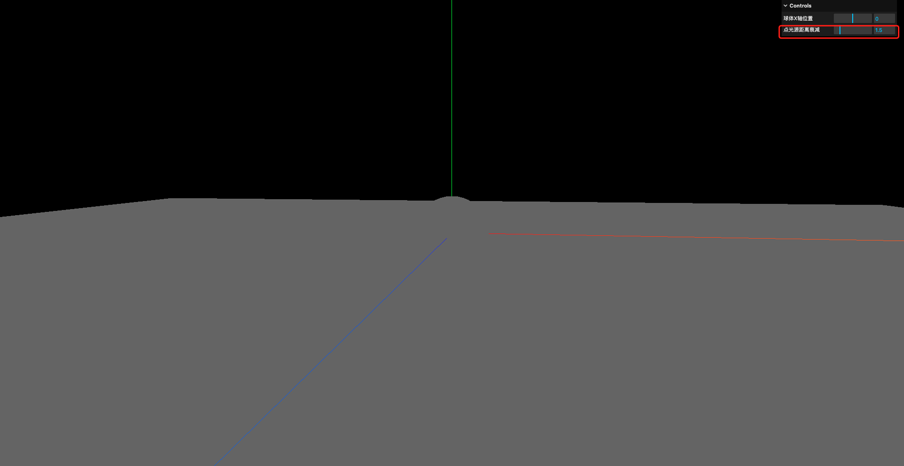
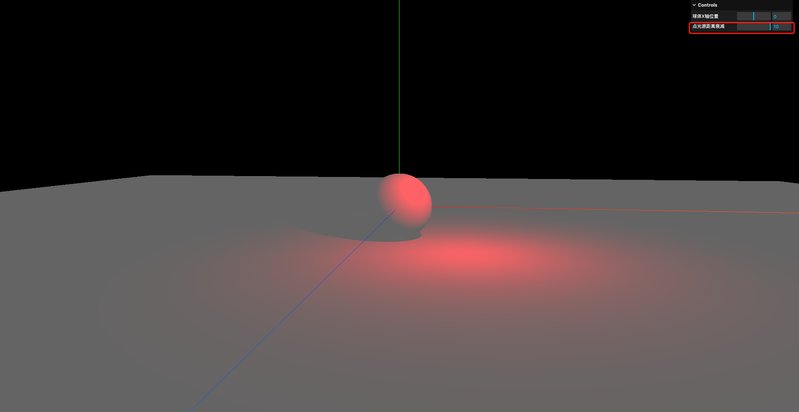
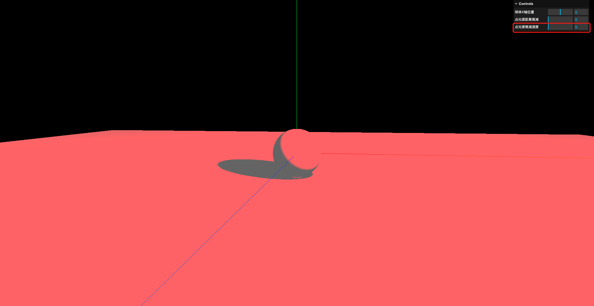
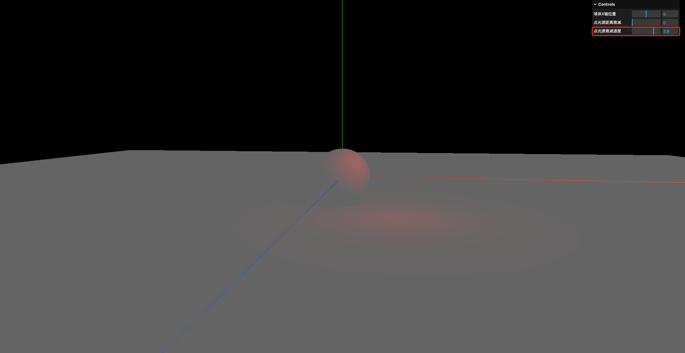
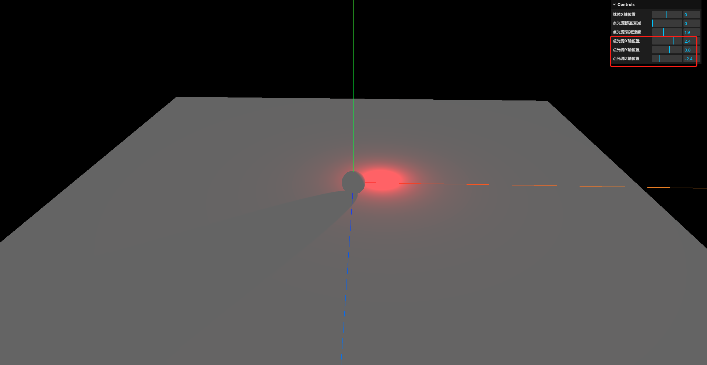
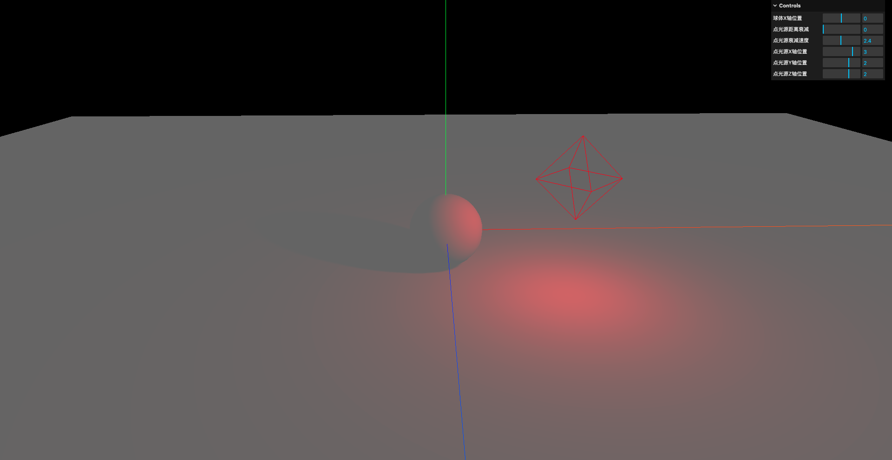
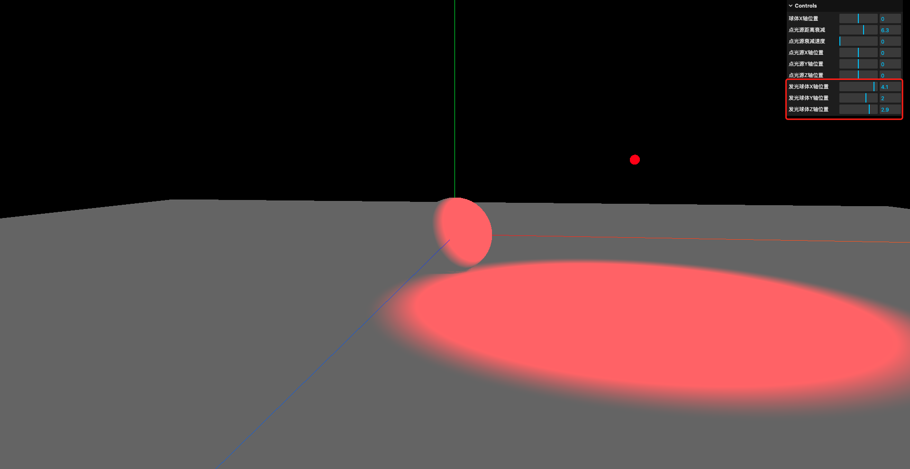

# 4. 点光源属性与应用

- `PointLight`: 点光源,从一个点向各个方向发射的光源,通常用于模拟小范围的光源效果,如灯泡/蜡烛/萤火虫等

## 1. 基本使用

```javascript
// 添加点光源
const pointLight = new THREE.PointLight(0xff0000, 20)
pointLight.position.set(5, 5, 5)
pointLight.castShadow = true
scene.add(pointLight)
```



## 2. 阴影贴图模糊度与分辨率

```javascript
// 添加点光源
const pointLight = new THREE.PointLight(0xff0000, 20)
pointLight.position.set(2, 2, 2)
pointLight.castShadow = true

// 阴影模糊度
pointLight.shadow.radius = 20
// 阴影分辨率
pointLight.shadow.mapSize.width = 2048
pointLight.shadow.mapSize.height = 2048
```



## 3. 衰减距离

点光源的距离衰减和聚光灯的距离衰减一样,0表示无限远,数值越小表示衰减距离越近

(相比于聚光灯,点光源没有照射目标和边缘柔和度的属性)

```javascript
// 添加点光源
const pointLight = new THREE.PointLight(0xff0000, 20)
pointLight.position.set(2, 2, 2)
pointLight.castShadow = true

// 阴影模糊度
pointLight.shadow.radius = 20
// 阴影分辨率
pointLight.shadow.mapSize.width = 2048
pointLight.shadow.mapSize.height = 2048

// 距离衰减
pointLight.distance = 0

scene.add(pointLight)

// 创建GUI
const gui = new GUI()
gui.add(pointLight, 'distance').min(0).max(10).step(0.1).name('点光源距离衰减')
```





## 4. 沿光照距离的光强衰减

也是和聚光灯类似,点光源的光强也会随着距离的增加而衰减,可以通过调整`decay`属性来控制衰减的速度

```javascript
// 添加点光源
const pointLight = new THREE.PointLight(0xff0000, 20)
pointLight.position.set(2, 2, 2)
pointLight.castShadow = true

// 阴影模糊度
pointLight.shadow.radius = 20
// 阴影分辨率
pointLight.shadow.mapSize.width = 2048
pointLight.shadow.mapSize.height = 2048

// 距离衰减
pointLight.distance = 0

// 衰减速度
pointLight.decay = 0

scene.add(pointLight)

// 创建GUI
const gui = new GUI()
gui.add(pointLight, 'decay').min(0).max(5).step(0.1).name('点光源衰减速度')
```





## 5. 点光源的移动

```javascript
// 添加点光源
const pointLight = new THREE.PointLight(0xff0000, 20)
pointLight.position.set(2, 2, 2)
pointLight.castShadow = true

// 阴影模糊度
pointLight.shadow.radius = 20
// 阴影分辨率
pointLight.shadow.mapSize.width = 2048
pointLight.shadow.mapSize.height = 2048

// 距离衰减
pointLight.distance = 0

// 衰减速度
pointLight.decay = 0

scene.add(pointLight)

// 创建GUI
const gui = new GUI()
gui.add(sphere.position, 'x').min(-5).max(5).step(0.1).name('球体X轴位置')
gui.add(pointLight, 'distance').min(0).max(10).step(0.1).name('点光源距离衰减')
gui.add(pointLight, 'decay').min(0).max(5).step(0.1).name('点光源衰减速度')

gui.add(pointLight.position, 'x').min(-5).max(5).step(0.1).name('点光源X轴位置')
gui.add(pointLight.position, 'y').min(-5).max(5).step(0.1).name('点光源Y轴位置')
gui.add(pointLight.position, 'z').min(-5).max(5).step(0.1).name('点光源Z轴位置')
```



## 6. 用球体表示点光源位置

three.js中有内置的`PointLightHelper`类,可以用来可视化点光源的位置和范围,但该类显示出来是一个正八面体

```javascript
// 添加点光源
const pointLight = new THREE.PointLight(0xff0000, 20)
pointLight.position.set(2, 2, 2)
pointLight.castShadow = true

// 阴影模糊度
pointLight.shadow.radius = 20
// 阴影分辨率
pointLight.shadow.mapSize.width = 2048
pointLight.shadow.mapSize.height = 2048

// 距离衰减
pointLight.distance = 0

// 衰减速度
pointLight.decay = 0

scene.add(pointLight)

// 创建一个用于表示点光源位置的辅助对象
const sphereSize = 1
const pointLightHelper = new THREE.PointLightHelper(pointLight, sphereSize)
scene.add(pointLightHelper)
```



如果想要实现的是一个"发光球体"的效果,可以创建一个小球体并放置在点光源的位置,然后给小球体添加一个自发光材质(`MeshBasicMaterial`)

```javascript
// 添加点光源
const pointLight = new THREE.PointLight(0xff0000, 20)
pointLight.castShadow = true

// 阴影模糊度
pointLight.shadow.radius = 20
// 阴影分辨率
pointLight.shadow.mapSize.width = 2048
pointLight.shadow.mapSize.height = 2048

// 距离衰减
pointLight.distance = 0

// 衰减速度
pointLight.decay = 0

// 创建一个用于表示点光源球体
const lightSphereGeometry = new THREE.SphereGeometry(0.1, 20, 20)
const lightSphereMaterial = new THREE.MeshBasicMaterial({ color: 0xff0000 })
const lightSphere = new THREE.Mesh(lightSphereGeometry, lightSphereMaterial)
lightSphere.position.set(2, 2, 2)

// 创建GUI
const gui = new GUI()
gui.add(sphere.position, 'x').min(-5).max(5).step(0.1).name('球体X轴位置')
gui.add(pointLight, 'distance').min(0).max(10).step(0.1).name('点光源距离衰减')
gui.add(pointLight, 'decay').min(0).max(5).step(0.1).name('点光源衰减速度')

gui.add(lightSphere.position, 'x').min(-5).max(5).step(0.1).name('发光球体X轴位置')
gui.add(lightSphere.position, 'y').min(-5).max(5).step(0.1).name('发光球体Y轴位置')
gui.add(lightSphere.position, 'z').min(-5).max(5).step(0.1).name('发光球体Z轴位置')
```

注意: 这里就不需要再给点光源设置位置,也不需要将点光源添加到场景中了.因为将点光源添加到球体时,点光源就和球体的位置绑定在一起了



## 7. 设置小球环绕

`Clock`类: Three.js中为渲染循环/动画系统专门设计的计时器,可以用来跟踪时间的流逝,从而实现基于时间的动画效果

- `Clock.startTime`: 存储时钟最后一次调用`Clock.start()`方法的时间
- `Clock.oldTime`: 存储时钟最后一次调用`Clock.start()`/``Clock.getElapsedTime()`/``Clock.getDelta()`方法的时间
- `Clock.getElapsedTime()`: 获取从时钟启动到当前的总时间(以秒为单位),同时将`Clock.oldTime`更新为当前时间

```javascript
const clock = new THREE.Clock()

function animate(time) {
    requestAnimationFrame(animate)

    const elapsedTime = clock.getElapsedTime()

    // 更新球体位置
    lightSphere.position.x = Math.cos(elapsedTime) * 3
    lightSphere.position.y = Math.cos(elapsedTime) * 3
    lightSphere.position.z = Math.sin(elapsedTime) * 3

    controls.update()

    renderer.render(scene, camera)
}
```