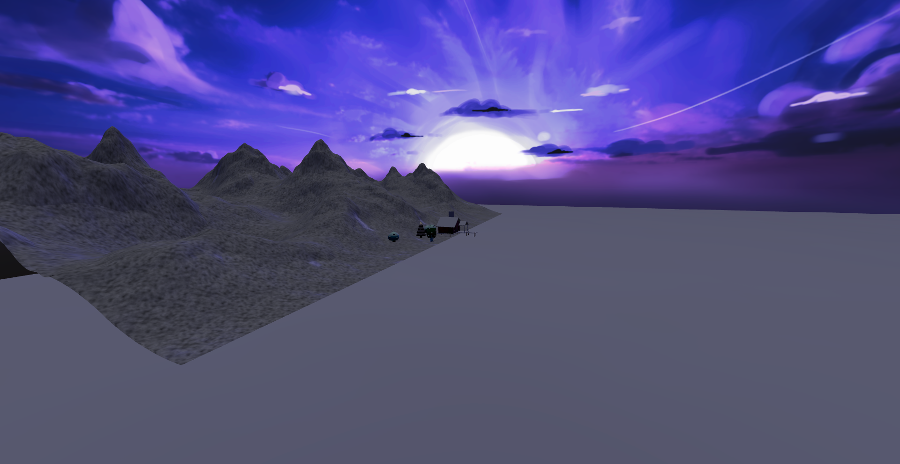
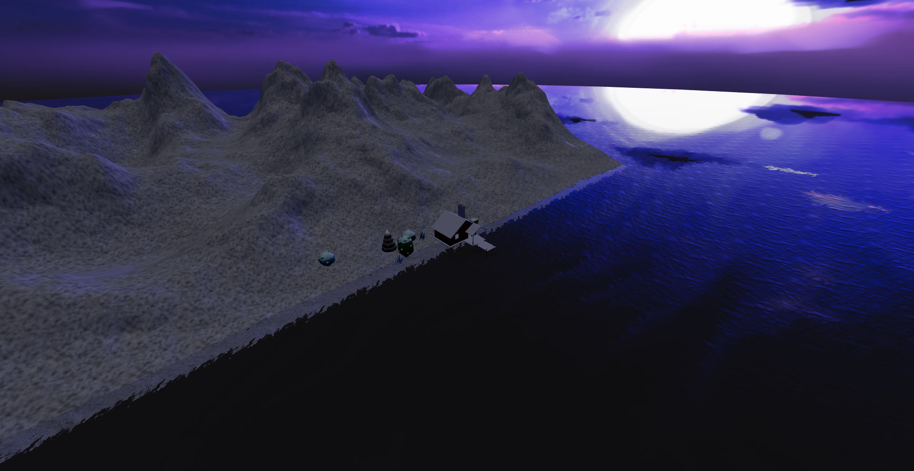

# 2. 天空与水面

## 1. 天空

天空属于环境贴图

```javascript
import { HDRLoader } from 'three/examples/jsm/loaders/HDRLoader'

// 添加环境贴图
const hdrLoader = new HDRLoader()
hdrLoader.load('/textures/sky.hdr', (envMap) => {
    envMap.mapping = THREE.EquirectangularReflectionMapping
    scene.environment = envMap
    scene.background = envMap
})
```

同时还要调整渲染器的色调映射和曝光

```javascript
// 设置输出颜色空间为sRGB
renderer.outputColorSpace = THREE.SRGBColorSpace
// 设置渲染器色调映射
// THREE.ACESFilmicToneMapping: 更加接近电影的色调映射效果
renderer.toneMapping = THREE.ACESFilmicToneMapping
// 设置色调映射曝光度 默认值为1 值越小则越暗
renderer.toneMappingExposure = 0.5
document.body.appendChild(renderer.domElement)
```



## 2. 水面

水面实际上就是把模型中的地面部分隐藏掉,然后自己创建了一个几何体并设置贴图即可:

- 隐藏地面

```javascript
gltfLoader.load('/model/scene.glb', (gltf) => {
    const model = gltf.scene

    // 隐藏地面
    model.traverse((child) => {
        if (child.name === 'Plane') {
            child.visible = false
        }
    })

    scene.add(model)
})
```


