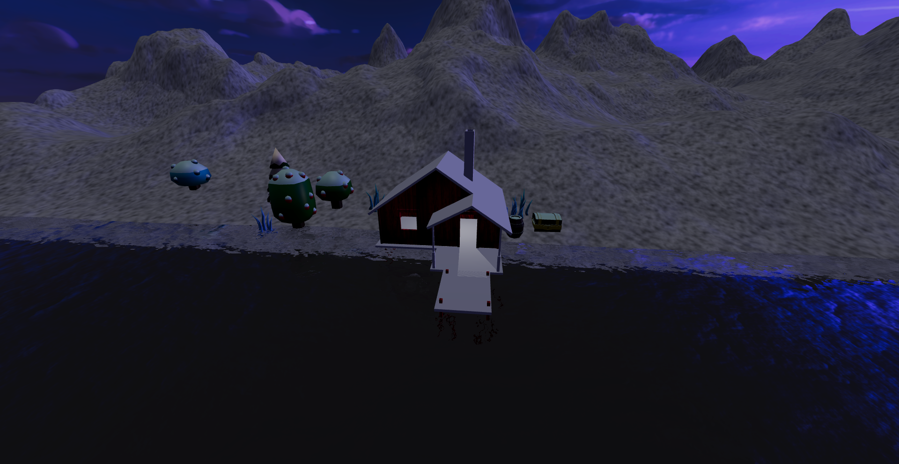
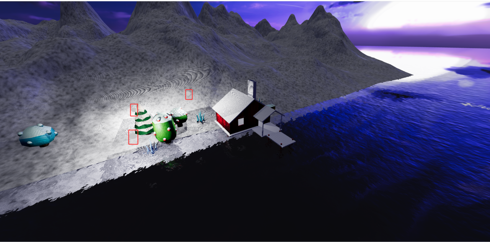
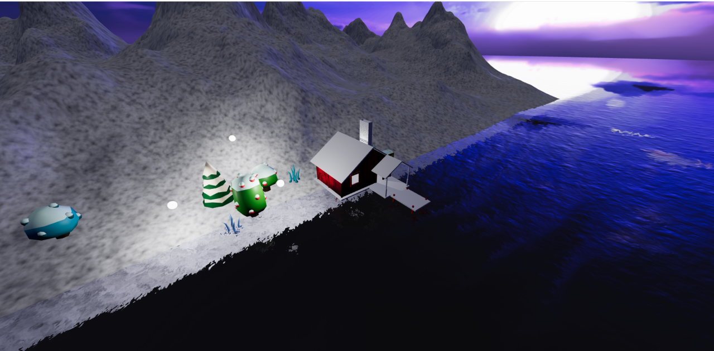

# 3. 光照阴影与幽灵运动的点光源

## 1. 添加房间内的点光源并设置阴影投射

- 添加点光源

```javascript
// 添加房间内的点光源
const pointLight = new THREE.PointLight(0xffffff, 10)
pointLight.position.set(0.5, 2.3, 0)
// 允许投射阴影
pointLight.castShadow = true
scene.add(pointLight)
```

- 设置渲染器允许阴影计算

```javascript
// 允许渲染器进行阴影计算
renderer.shadowMap.enabled = true
```

- 设置网格模型允许投射阴影和接收阴影

```javascript
gltfLoader.load('/model/scene.glb', (gltf) => {
    const model = gltf.scene

    // 隐藏地面
    model.traverse((child) => {
        if (child.name === 'Plane') {
            child.visible = false
        }

        if (child.isMesh) {
            // 允许模型中的每个网格模型都投射阴影
            child.castShadow = true
            // 允许模型中的每个网格模型都接收阴影
            child.receiveShadow = true
        }
    })

    scene.add(model)
})
```



## 2. 添加幽灵运动的点光源

幽灵运动的3个点光源,很明显是绕着圣诞树的.所以给这3个点光源设置一个组

- 添加点光源

```javascript
// 添加幽灵运动的点光源
// 由于有3个点光源 所以创建一个组来管理它们
const ghostSphereGroup = new THREE.Group()

const ghostSphereCollection = []

// 由于3个幽灵运动的点光源都是绕着一个圆柱体运动的
// 所以设置一个半径来统一管理它们的运动轨迹
const radius = 3

for (let i = 0; i < 3; i++) {
    const ghostLight = new THREE.PointLight(0xffffff, 200, 13)
    // ghostLight.castShadow = true

    const ghostSphereGeometry = new THREE.SphereGeometry(0.2, 32, 32)
    const ghostSphereMaterial = new THREE.MeshStandardMaterial({
        color: 0xffffff,
        // 设置自发光颜色
        emissive: 0xffffff,
        // 设置自发光强度
        emissiveIntensity: 10,
    })
    const ghostSphere = new THREE.Mesh(ghostSphereGeometry, ghostSphereMaterial)
    ghostSphere.position.set(
        // 实际上就是画了一个圆 每个点分别在这个圆的1/3处 也就是0度 120度 240度的位置上
        radius * Math.cos(i * Math.PI * 2 / 3),
        Math.cos(i * Math.PI * 2 / 3),
        radius * Math.sin(i * Math.PI * 2 / 3),
    )
    ghostSphere.add(ghostLight)

    ghostSphereGroup.add(ghostSphere)
    ghostSphereCollection.push(ghostSphere)
}

ghostSphereGroup.position.set(-8, 2.5, -1.5)

scene.add(ghostSphereGroup)
```



核心思路还是之前讲过的为网格模型添加点光源的思路

- 使用补间函数让点光源运动

```javascript
// 使用补间函数 设置点光源从0到2π的角度循环运动
let options = {
    angle: 0,
}

gsap.to(options, {
    // 要修改的属性
    angle: Math.PI * 2,
    // 补间动画的播放时长 单位: s
    duration: 10,
    // 补间动画重复次数 -1表示无限循环
    repeat: -1,
    // 补间动画的缓动函数
    ease: "linear",
    // 补间动画更新回调
    onUpdate: () => {
        // 根据当前的角度计算每个幽灵点光源的位置
        ghostSphereGroup.rotation.y = options.angle

        ghostSphereCollection.forEach((ghostSphere, index) => {
            ghostSphere.position.set(
                radius * Math.cos((index * 2 * Math.PI) / 3),
                Math.cos((index * 2 * Math.PI) / 3 + options.angle * 5),
                radius * Math.sin((index * 2 * Math.PI) / 3)
            )
        })
    }
})
```

