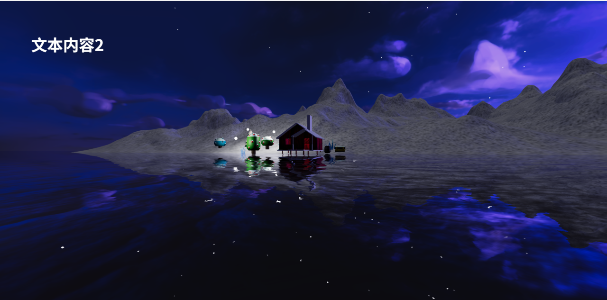
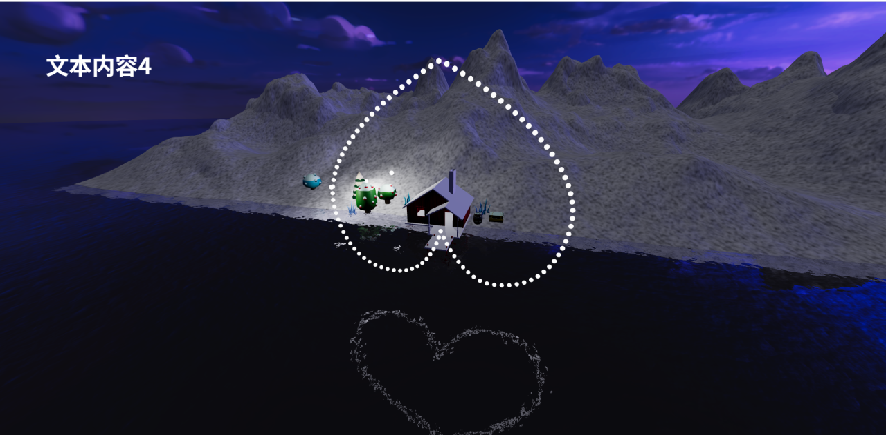

# 5. 星星成为爱心形状

## 1. 创建星星并随机分布

- `THREE.InstancedMesh`：用于创建多个实例化对象,提高渲染性能
  - `new THREE.Mesh`: 创建单个网格对象,创建1个对象GPU就要绘制1次,创建多个对象GPU就要绘制多次,性能开销大
  - `THREE.InstancedMesh(geometry, material, count)`: 创建多个网格对象,只需绘制1次,性能开销小
    - `geometry`: 几何体
    - `material`: 材质
    - `count`: 实例数量

```javascript
// 创建多个星星网格对象
const starGeometry = new THREE.SphereGeometry(0.1, 32, 32)
const starMaterial = new THREE.MeshStandardMaterial({
    color: 0xffffff,
    emissive: 0xffffff,
    emissiveIntensity: 10,
})
const starMeshes = new THREE.InstancedMesh(starGeometry, starMaterial, 100)

// 随机分布后的每个星星位置集合
const initStarPositionCollection = []

// 随机分布星星的初始位置
for (let i = 0; i < 100; i++) {
    const x = Math.random() * 100 - 50
    const y = Math.random() * 100 - 50
    const z = Math.random() * 100 - 50
    initStarPositionCollection.push(new THREE.Vector3(x, y, z))

    // 设置每个星星的初始位置
    const matrix = new THREE.Matrix4()
    matrix.setPosition(x, y, z)
    starMeshes.setMatrixAt(i, matrix)
}

scene.add(starMeshes)
```



- `THREE.Matrix4`: 用于表示和操作4x4矩阵,在3D图形中常用于表示对象的变换(位置/旋转/缩放等)(说实话我也不太明白为什么这个东西可以表示位置)
  - `setPosition(x, y, z)`: 设置矩阵的平移部分,即对象的位置

## 2. 计算每个星星在心形上的位置

```javascript
// 创建心形路径
// Tips: 其实这个Shape类感觉和canvas的路径API很像
const heartShape = new THREE.Shape()
heartShape.moveTo(25, 25)
heartShape.bezierCurveTo(25, 25, 20, 0, 0, 0)
heartShape.bezierCurveTo(- 30, 0, - 30, 35, - 30, 35)
heartShape.bezierCurveTo(- 30, 55, - 10, 77, 25, 95)
heartShape.bezierCurveTo(60, 77, 80, 55, 80, 35)
heartShape.bezierCurveTo(80, 35, 80, 0, 50, 0)
heartShape.bezierCurveTo(35, 0, 25, 25, 25, 25)

// 形成心形后每个星星位置集合
const afterTransformStarPositionCollection = []

// 形成心形后每个星星位置集合
const afterTransformStarPositionCollection = []

// 爱心的中心点
const center = new THREE.Vector3(0, 1, 10)

// 根据路径计算每个点的位置
for (let i = 0; i < 100; i++) {
    const point = heartShape.getPoint(i / 100)

    const pointX = point.x * 0.1 + center.x
    const pointY = point.y * 0.1 + center.y
    // Shape类计算出来的点都是二维的 所以z轴保持不变即可
    const pointZ = center.z

    const pointPosition = new THREE.Vector3(pointX, pointY, pointZ)
    afterTransformStarPositionCollection.push(pointPosition)
}
```

## 3. 使用补间函数让星星从初始位置移动到心形位置

```javascript
/**
 * 本函数用于更新每个星星位置 使其排列成心形
 * 在星星运动的过程中 使用补间函数逐渐修改每个星星的位置矩阵
 * */
function makeHeart() {
    const params = {
        time: 0
    }

    gsap.to(params, {
        time: 1,
        // 动画时长为1s
        duration: 1,
        onUpdate: () => {
            for (let i = 0; i < 100; i++) {
                const startPosition = initStarPositionCollection[i]
                const endPosition = afterTransformStarPositionCollection[i]

                // 根据起始位置和终止位置 计算当前位置
                const currentX = startPosition.x + (endPosition.x - startPosition.x) * params.time
                const currentY = startPosition.y + (endPosition.y - startPosition.y) * params.time
                const currentZ = startPosition.z + (endPosition.z - startPosition.z) * params.time

                const matrix = new THREE.Matrix4()
                matrix.setPosition(currentX, currentY, currentZ)
                starMeshes.setMatrixAt(i, matrix)
                starMeshes.instanceMatrix.needsUpdate = true
            }
        }
    })
}
```

## 4. 调用函数形成爱心

```javascript
let scenes = [
    {
        // 切换场景时显示的文字内容
        text: "文本内容1",
        // 切换场景时执行的回调函数 用于改变相机位置
        callback: () => {
            const cameraPosition = new THREE.Vector3(-3.23, 3, 4.06)
            const controlTarget = new THREE.Vector3(-8, 2, 0)
            moveCamera(cameraPosition, controlTarget)
        },
    },
    {
        text: "文本内容2",
        callback: () => {
            const cameraPosition = new THREE.Vector3(7, 0, 23)
            const controlTarget = new THREE.Vector3(0, 0, 0)
            moveCamera(cameraPosition, controlTarget)
        },
    },
    {
        text: "文本内容3",
        callback: () => {
            const cameraPosition = new THREE.Vector3(10, 3, 0)
            const controlTarget = new THREE.Vector3(5, 2, 0)
            moveCamera(cameraPosition, controlTarget)
        },
    },
    {
        text: "文本内容4",
        callback: () => {
            const cameraPosition = new THREE.Vector3(7, 0, 23)
            const controlTarget = new THREE.Vector3(0, 0, 0)
            moveCamera(cameraPosition, controlTarget)
            makeHeart()
        },
    },
    {
        text: "文本内容5",
        callback: () => {
            const cameraPosition = new THREE.Vector3(-20, 1.3, 6.6)
            const controlTarget = new THREE.Vector3(5, 2, 0)
            moveCamera(cameraPosition, controlTarget)
        },
    },
]
```



## 5. 复原星星的位置

思路和使用补间动画形成心形是一样的,只是起始位置和终止位置互换了

```javascript
/**
 * 本函数用于使用补间动画复原每颗星星的位置
 * */
function restoreStars() {
    const params = {
        time: 0
    }

    gsap.to(params, {
        time: 1,
        duration: 1,
        onUpdate: () => {
            for (let i = 0; i < 100; i++) {
                const startPosition = afterTransformStarPositionCollection[i]
                const endPosition = initStarPositionCollection[i]

                const currentX = startPosition.x + (endPosition.x - startPosition.x) * params.time
                const currentY = startPosition.y + (endPosition.y - startPosition.y) * params.time
                const currentZ = startPosition.z + (endPosition.z - startPosition.z) * params.time

                const matrix = new THREE.Matrix4()
                matrix.setPosition(currentX, currentY, currentZ)
                starMeshes.setMatrixAt(i, matrix)
                starMeshes.instanceMatrix.needsUpdate = true
            }
        }
    })
}
```

然后同样在数组的元素中调用即可
